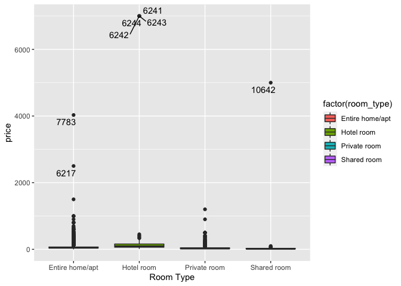
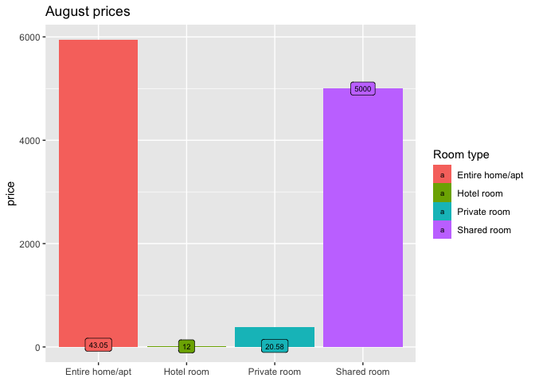

In this document we'll analyze data about  <mark>Airbnb</mark> prices in the city of Athens, Greece. The steps listed in the table of contents, give a quick way to every part of this document.


There's included the code on the chunks above the outputs, and under almost every graph, is a brief interpretation of each one.

# Loading and analyzing data
<div style="text align: justify">Fisrt we have to load the dataset and take a look into it.</dev>


```r
data <- read.csv("/Users/cesarsantos/Documents/00 Airbnb prices/airbnb_athens_data.csv")
summary(data)
```

```
##        X               id               name           description       
##  Min.   :    0   Min.   :   10595   Length:11263       Length:11263      
##  1st Qu.: 2816   1st Qu.:19135036   Class :character   Class :character  
##  Median : 5631   Median :27243219   Mode  :character   Mode  :character  
##  Mean   : 5631   Mean   :25657212                                        
##  3rd Qu.: 8446   3rd Qu.:33867748                                        
##  Max.   :11262   Max.   :40200475                                        
##                                                                          
##     host_id           host_name          host_since         host_about       
##  Min.   :    37177   Length:11263       Length:11263       Length:11263      
##  1st Qu.: 33548769   Class :character   Class :character   Class :character  
##  Median :112527018   Mode  :character   Mode  :character   Mode  :character  
##  Mean   :121777558                                                           
##  3rd Qu.:200014446                                                           
##  Max.   :310470598                                                           
##                                                                              
##  host_response_time host_is_superhost  host_listings_count
##  Length:11263       Length:11263       Min.   :   0.00    
##  Class :character   Class :character   1st Qu.:   1.00    
##  Mode  :character   Mode  :character   Median :   2.00    
##                                        Mean   :  16.65    
##                                        3rd Qu.:   9.00    
##                                        Max.   :1111.00    
##                                        NA's   :2          
##  host_identity_verified    latitude       longitude      room_type        
##  Length:11263           Min.   :37.95   Min.   :23.70   Length:11263      
##  Class :character       1st Qu.:37.97   1st Qu.:23.72   Class :character  
##  Mode  :character       Median :37.98   Median :23.73   Mode  :character  
##                         Mean   :37.98   Mean   :23.73                     
##                         3rd Qu.:37.99   3rd Qu.:23.74                     
##                         Max.   :38.04   Max.   :23.79                     
##                                                                           
##   accommodates      bathrooms         bedrooms           beds       
##  Min.   : 1.000   Min.   : 0.000   Min.   : 0.000   Min.   : 0.000  
##  1st Qu.: 2.000   1st Qu.: 1.000   1st Qu.: 1.000   1st Qu.: 1.000  
##  Median : 4.000   Median : 1.000   Median : 1.000   Median : 2.000  
##  Mean   : 3.991   Mean   : 1.209   Mean   : 1.417   Mean   : 2.192  
##  3rd Qu.: 5.000   3rd Qu.: 1.000   3rd Qu.: 2.000   3rd Qu.: 3.000  
##  Max.   :26.000   Max.   :10.000   Max.   :14.000   Max.   :23.000  
##                                    NA's   :5        NA's   :9       
##   square_feet       price           guests_included  minimum_nights    
##  Min.   :   0    Length:11263       Min.   : 1.000   Min.   :   1.000  
##  1st Qu.: 248    Class :character   1st Qu.: 1.000   1st Qu.:   1.000  
##  Median : 592    Mode  :character   Median : 2.000   Median :   2.000  
##  Mean   : 678                       Mean   : 1.913   Mean   :   3.556  
##  3rd Qu.:1076                       3rd Qu.: 2.000   3rd Qu.:   2.000  
##  Max.   :2790                       Max.   :16.000   Max.   :1000.000  
##  NA's   :11159                                                         
##  maximum_nights    availability_90 number_of_reviews first_review      
##  Min.   :      1   Min.   : 0.00   Min.   :  0.00    Length:11263      
##  1st Qu.:     60   1st Qu.:45.00   1st Qu.:  1.00    Class :character  
##  Median :   1125   Median :73.00   Median : 11.00    Mode  :character  
##  Mean   :   1660   Mean   :60.27   Mean   : 35.72                      
##  3rd Qu.:   1125   3rd Qu.:86.00   3rd Qu.: 44.00                      
##  Max.   :9999999   Max.   :90.00   Max.   :694.00                      
##                                                                        
##  last_review        review_scores_rating review_scores_accuracy
##  Length:11263       Min.   : 20.00       Min.   : 2.000        
##  Class :character   1st Qu.: 94.00       1st Qu.:10.000        
##  Mode  :character   Median : 97.00       Median :10.000        
##                     Mean   : 95.09       Mean   : 9.745        
##                     3rd Qu.:100.00       3rd Qu.:10.000        
##                     Max.   :100.00       Max.   :10.000        
##                     NA's   :2339         NA's   :2342          
##  review_scores_cleanliness review_scores_checkin review_scores_communication
##  Min.   : 2.000            Min.   : 2.00         Min.   : 2.000             
##  1st Qu.: 9.000            1st Qu.:10.00         1st Qu.:10.000             
##  Median :10.000            Median :10.00         Median :10.000             
##  Mean   : 9.644            Mean   : 9.83         Mean   : 9.826             
##  3rd Qu.:10.000            3rd Qu.:10.00         3rd Qu.:10.000             
##  Max.   :10.000            Max.   :10.00         Max.   :10.000             
##  NA's   :2342              NA's   :2344          NA's   :2343               
##  review_scores_location reviews_per_month
##  Min.   : 2.000         Min.   : 0.010   
##  1st Qu.: 9.000         1st Qu.: 0.570   
##  Median :10.000         Median : 1.585   
##  Mean   : 9.534         Mean   : 2.304   
##  3rd Qu.:10.000         3rd Qu.: 3.480   
##  Max.   :10.000         Max.   :16.270   
##  NA's   :2344           NA's   :2273
```

```r
#visualizing a scrolling table of the data
## Character
kable(data[1:50, ]) %>% kable_styling(bootstrap_options = c("condensed", "striped"), full_width = FALSE, font_size = 10) %>% scroll_box(width = "900px", height = "600px")
```

<div style="border: 1px solid #ddd; padding: 0px; overflow-y: scroll; height:600px; overflow-x: scroll; width:900px; "><table class="table table-condensed table-striped" style="font-size: 10px; width: auto !important; margin-left: auto; margin-right: auto;">
 <thead>
  <tr>
   <th style="text-align:right;position: sticky; top:0; background-color: #FFFFFF;"> X </th>
   <th style="text-align:right;position: sticky; top:0; background-color: #FFFFFF;"> id </th>
   <th style="text-align:left;position: sticky; top:0; background-color: #FFFFFF;"> name </th>
   <th style="text-align:left;position: sticky; top:0; background-color: #FFFFFF;"> description </th>
   <th style="text-align:right;position: sticky; top:0; background-color: #FFFFFF;"> host_id </th>
   <th style="text-align:left;position: sticky; top:0; background-color: #FFFFFF;"> host_name </th>
   <th style="text-align:left;position: sticky; top:0; background-color: #FFFFFF;"> host_since </th>
   <th style="text-align:left;position: sticky; top:0; background-color: #FFFFFF;"> host_about </th>
   <th style="text-align:left;position: sticky; top:0; background-color: #FFFFFF;"> host_response_time </th>
   <th style="text-align:left;position: sticky; top:0; background-color: #FFFFFF;"> host_is_superhost </th>
   <th style="text-align:right;position: sticky; top:0; background-color: #FFFFFF;"> host_listings_count </th>
   <th style="text-align:left;position: sticky; top:0; background-color: #FFFFFF;"> host_identity_verified </th>
   <th style="text-align:right;position: sticky; top:0; background-color: #FFFFFF;"> latitude </th>
   <th style="text-align:right;position: sticky; top:0; background-color: #FFFFFF;"> longitude </th>
   <th style="text-align:left;position: sticky; top:0; background-color: #FFFFFF;"> room_type </th>
   <th style="text-align:right;position: sticky; top:0; background-color: #FFFFFF;"> accommodates </th>
   <th style="text-align:right;position: sticky; top:0; background-color: #FFFFFF;"> bathrooms </th>
   <th style="text-align:right;position: sticky; top:0; background-color: #FFFFFF;"> bedrooms </th>
   <th style="text-align:right;position: sticky; top:0; background-color: #FFFFFF;"> beds </th>
   <th style="text-align:right;position: sticky; top:0; background-color: #FFFFFF;"> square_feet </th>
   <th style="text-align:left;position: sticky; top:0; background-color: #FFFFFF;"> price </th>
   <th style="text-align:right;position: sticky; top:0; background-color: #FFFFFF;"> guests_included </th>
   <th style="text-align:right;position: sticky; top:0; background-color: #FFFFFF;"> minimum_nights </th>
   <th style="text-align:right;position: sticky; top:0; background-color: #FFFFFF;"> maximum_nights </th>
   <th style="text-align:right;position: sticky; top:0; background-color: #FFFFFF;"> availability_90 </th>
   <th style="text-align:right;position: sticky; top:0; background-color: #FFFFFF;"> number_of_reviews </th>
   <th style="text-align:left;position: sticky; top:0; background-color: #FFFFFF;"> first_review </th>
   <th style="text-align:left;position: sticky; top:0; background-color: #FFFFFF;"> last_review </th>
   <th style="text-align:right;position: sticky; top:0; background-color: #FFFFFF;"> review_scores_rating </th>
   <th style="text-align:right;position: sticky; top:0; background-color: #FFFFFF;"> review_scores_accuracy </th>
   <th style="text-align:right;position: sticky; top:0; background-color: #FFFFFF;"> review_scores_cleanliness </th>
   <th style="text-align:right;position: sticky; top:0; background-color: #FFFFFF;"> review_scores_checkin </th>
   <th style="text-align:right;position: sticky; top:0; background-color: #FFFFFF;"> review_scores_communication </th>
   <th style="text-align:right;position: sticky; top:0; background-color: #FFFFFF;"> review_scores_location </th>
   <th style="text-align:right;position: sticky; top:0; background-color: #FFFFFF;"> reviews_per_month </th>
  </tr>
 </thead>
<tbody>
  <tr>
   <td style="text-align:right;"> 0 </td>
   <td style="text-align:right;"> 10595 </td>
   <td style="text-align:left;"> 96m2, 3BR, 2BA, Metro, WI-FI etc... </td>
   <td style="text-align:left;"> Athens Furnished Apartment No6 is 3-bedroom apartment with 2-bathrooms -excellent located  -close to metro station,  -lovely,  -very clean  with all the facilities that you will need, nice balcony, excellent Wi-Fi, cable tv, fully air conditioned… Athens Furnished Apartment No6 is an excellent located, close to metro, lovely, very clean 3-bedroom apartment with 2-bathrooms with all the facilities that you will need and balcony. It is on the 2nd floor but do not worry because there is elevator in the building. Fully equipped kitchen with everything you need to prepare your lunch/dinner. Living room to relax and enjoy a movie or a sport event. 2 Clean nice bathrooms. For more than 6 people there is a sofa/bed.  Apartment No6 has everything you will need. 1st Bedroom – Double bed 2nd Bedroom – 2 single beds 3rd Bedroom – 2 single beds -Telephone line for incoming calls or to call us if you need something. -Free fast Wi-Fi from the best internet provider in Greece. You do not share the con </td>
   <td style="text-align:right;"> 37177 </td>
   <td style="text-align:left;"> Emmanouil </td>
   <td style="text-align:left;"> 2009-09-08 </td>
   <td style="text-align:left;"> Athens Quality Apartments is a company started back at 2007 and now we have 8 apartments. Our goal is to offer to travelers beautiful apartments with professional service only in good location and with all the necessary amenities. </td>
   <td style="text-align:left;"> within an hour </td>
   <td style="text-align:left;"> t </td>
   <td style="text-align:right;"> 6 </td>
   <td style="text-align:left;"> t </td>
   <td style="text-align:right;"> 37.98888 </td>
   <td style="text-align:right;"> 23.76431 </td>
   <td style="text-align:left;"> Entire home/apt </td>
   <td style="text-align:right;"> 8 </td>
   <td style="text-align:right;"> 2.0 </td>
   <td style="text-align:right;"> 3 </td>
   <td style="text-align:right;"> 5 </td>
   <td style="text-align:right;"> 1076 </td>
   <td style="text-align:left;"> $80.00 </td>
   <td style="text-align:right;"> 4 </td>
   <td style="text-align:right;"> 1 </td>
   <td style="text-align:right;"> 45 </td>
   <td style="text-align:right;"> 46 </td>
   <td style="text-align:right;"> 22 </td>
   <td style="text-align:left;"> 2011-05-20 </td>
   <td style="text-align:left;"> 2019-08-07 </td>
   <td style="text-align:right;"> 96 </td>
   <td style="text-align:right;"> 10 </td>
   <td style="text-align:right;"> 10 </td>
   <td style="text-align:right;"> 10 </td>
   <td style="text-align:right;"> 10 </td>
   <td style="text-align:right;"> 9 </td>
   <td style="text-align:right;"> 0.21 </td>
  </tr>
  <tr>
   <td style="text-align:right;"> 1 </td>
   <td style="text-align:right;"> 10990 </td>
   <td style="text-align:left;"> 50m2, Metro, WI-FI, cableTV, more </td>
   <td style="text-align:left;"> Athens Furnished Apartment No3 is 1-bedroom apartment (50 square meters)  -excellent located  -close to metro station,  -lovely,  -very clean  with all the facilities that you will need, nice balcony, excellent Wi-Fi, cable tv, fully air conditioned… Athens Furnished Apartment No3 is an excellent located, close to metro, lovely, very clean 1-bedroom apartment (50 square meters) with all the facilities that you will need and a very nice balcony facing the inner garden to enjoy your breakfast in the morning or relax in the evening. Fully equipped kitchen with everything you need to prepare your lunch/dinner. Nice Living room to relax and enjoy a movie or a sport event. Clean nice bathroom. For more than 2 people there is a great double sofa/bed in the living room. Apartment No3 has everything you will need. -Telephone line for incoming calls or to call us if you need something. -Free fast Wi-Fi from the best internet provider in Greece. You do not share the connection with other people. </td>
   <td style="text-align:right;"> 37177 </td>
   <td style="text-align:left;"> Emmanouil </td>
   <td style="text-align:left;"> 2009-09-08 </td>
   <td style="text-align:left;"> Athens Quality Apartments is a company started back at 2007 and now we have 8 apartments. Our goal is to offer to travelers beautiful apartments with professional service only in good location and with all the necessary amenities. </td>
   <td style="text-align:left;"> within an hour </td>
   <td style="text-align:left;"> t </td>
   <td style="text-align:right;"> 6 </td>
   <td style="text-align:left;"> t </td>
   <td style="text-align:right;"> 37.98783 </td>
   <td style="text-align:right;"> 23.76479 </td>
   <td style="text-align:left;"> Entire home/apt </td>
   <td style="text-align:right;"> 4 </td>
   <td style="text-align:right;"> 1.0 </td>
   <td style="text-align:right;"> 1 </td>
   <td style="text-align:right;"> 1 </td>
   <td style="text-align:right;"> NA </td>
   <td style="text-align:left;"> $50.00 </td>
   <td style="text-align:right;"> 2 </td>
   <td style="text-align:right;"> 1 </td>
   <td style="text-align:right;"> 60 </td>
   <td style="text-align:right;"> 79 </td>
   <td style="text-align:right;"> 31 </td>
   <td style="text-align:left;"> 2012-09-06 </td>
   <td style="text-align:left;"> 2019-04-21 </td>
   <td style="text-align:right;"> 97 </td>
   <td style="text-align:right;"> 10 </td>
   <td style="text-align:right;"> 10 </td>
   <td style="text-align:right;"> 10 </td>
   <td style="text-align:right;"> 10 </td>
   <td style="text-align:right;"> 10 </td>
   <td style="text-align:right;"> 0.35 </td>
  </tr>
  <tr>
   <td style="text-align:right;"> 2 </td>
   <td style="text-align:right;"> 10993 </td>
   <td style="text-align:left;"> Athens Quality Apartments - Studio </td>
   <td style="text-align:left;"> The Studio is an  -excellent located  -close to metro station,  -lovely,  -very clean  30 square meter studio with all the facilities that you will need, nice balcony, excellent Wi-Fi, cable tv, air-condition, central heating... AQA No1 is an excellent located, close to metro,  lovely, very clean 30m2 studio with all the facilities that you will need and a very nice balcony facing the inner garden to enjoy your breakfast in the morning or relax in the evening. Kitchen with everything you need to prepare your lunch/dinner (there is no oven).  Clean nice bathroom.  The studio has everything you will need. -Telephone line for incoming calls or to call us if you need something. -Free fast wi-fi from the best internet provider in Greece. You do not share the connection with other people. -32” brand new LG tv  &amp; DVD player -Cable TV with 1) News Channels: BBC, DW, France 24, Aljazeera, RT, Bloomberg, CNBC, Euronews 2) Movies Channels: Ote Cinmea 1, 2, 3, 4, Village Cinema, Sundance Channel, </td>
   <td style="text-align:right;"> 37177 </td>
   <td style="text-align:left;"> Emmanouil </td>
   <td style="text-align:left;"> 2009-09-08 </td>
   <td style="text-align:left;"> Athens Quality Apartments is a company started back at 2007 and now we have 8 apartments. Our goal is to offer to travelers beautiful apartments with professional service only in good location and with all the necessary amenities. </td>
   <td style="text-align:left;"> within an hour </td>
   <td style="text-align:left;"> t </td>
   <td style="text-align:right;"> 6 </td>
   <td style="text-align:left;"> t </td>
   <td style="text-align:right;"> 37.98861 </td>
   <td style="text-align:right;"> 23.76422 </td>
   <td style="text-align:left;"> Entire home/apt </td>
   <td style="text-align:right;"> 2 </td>
   <td style="text-align:right;"> 1.0 </td>
   <td style="text-align:right;"> 0 </td>
   <td style="text-align:right;"> 1 </td>
   <td style="text-align:right;"> NA </td>
   <td style="text-align:left;"> $44.00 </td>
   <td style="text-align:right;"> 2 </td>
   <td style="text-align:right;"> 1 </td>
   <td style="text-align:right;"> 60 </td>
   <td style="text-align:right;"> 75 </td>
   <td style="text-align:right;"> 47 </td>
   <td style="text-align:left;"> 2012-09-24 </td>
   <td style="text-align:left;"> 2019-04-17 </td>
   <td style="text-align:right;"> 97 </td>
   <td style="text-align:right;"> 10 </td>
   <td style="text-align:right;"> 10 </td>
   <td style="text-align:right;"> 10 </td>
   <td style="text-align:right;"> 10 </td>
   <td style="text-align:right;"> 10 </td>
   <td style="text-align:right;"> 0.54 </td>
  </tr>
  <tr>
   <td style="text-align:right;"> 3 </td>
   <td style="text-align:right;"> 10995 </td>
   <td style="text-align:left;"> 47m2, close to metro,cable TV,wi-fi </td>
   <td style="text-align:left;"> AQA No2 is 1-bedroom apartment (47m2)  -excellent located  -close to metro station,  -lovely,  -very clean  with all the facilities that you will need, nice balcony, excellent Wi-Fi, cable tv, fully air conditioned, etc... AQA No2 is an excellent located, close to metro, lovely, very clean 1-bedroom apartment (45 square meters) on the 2nd floor (there is elevator) with all the facilities that you will need and a very nice balcony facing the inner garden to enjoy your breakfast in the morning or relax in the evening. Separated Fully equipped kitchen with everything you need to prepare your lunch/dinner. Nice Living room to relax and enjoy a movie or a sport event. Clean nice bathroom. In case you are more than 2 people there is a sofa/bed in the living room. The studio has everything you will need. -Telephone line for incoming calls or to call us if you need something. -Free fast Wi-Fi from the best internet provider in Greece. You do not share the connection with other people. -32” tv </td>
   <td style="text-align:right;"> 37177 </td>
   <td style="text-align:left;"> Emmanouil </td>
   <td style="text-align:left;"> 2009-09-08 </td>
   <td style="text-align:left;"> Athens Quality Apartments is a company started back at 2007 and now we have 8 apartments. Our goal is to offer to travelers beautiful apartments with professional service only in good location and with all the necessary amenities. </td>
   <td style="text-align:left;"> within an hour </td>
   <td style="text-align:left;"> t </td>
   <td style="text-align:right;"> 6 </td>
   <td style="text-align:left;"> t </td>
   <td style="text-align:right;"> 37.98950 </td>
   <td style="text-align:right;"> 23.76356 </td>
   <td style="text-align:left;"> Entire home/apt </td>
   <td style="text-align:right;"> 4 </td>
   <td style="text-align:right;"> 1.0 </td>
   <td style="text-align:right;"> 1 </td>
   <td style="text-align:right;"> 2 </td>
   <td style="text-align:right;"> NA </td>
   <td style="text-align:left;"> $50.00 </td>
   <td style="text-align:right;"> 2 </td>
   <td style="text-align:right;"> 1 </td>
   <td style="text-align:right;"> 60 </td>
   <td style="text-align:right;"> 85 </td>
   <td style="text-align:right;"> 19 </td>
   <td style="text-align:left;"> 2010-07-08 </td>
   <td style="text-align:left;"> 2019-04-19 </td>
   <td style="text-align:right;"> 96 </td>
   <td style="text-align:right;"> 10 </td>
   <td style="text-align:right;"> 10 </td>
   <td style="text-align:right;"> 10 </td>
   <td style="text-align:right;"> 10 </td>
   <td style="text-align:right;"> 9 </td>
   <td style="text-align:right;"> 0.17 </td>
  </tr>
  <tr>
   <td style="text-align:right;"> 4 </td>
   <td style="text-align:right;"> 27262 </td>
   <td style="text-align:left;"> 54m2, 1-br, cable tv, wi-fi, metro </td>
   <td style="text-align:left;"> Big 1-bedroom apartment that can accommodate 4 people. Queen size bed in the bedroom. Queen size sofa/bed in the living room. OTE TV CABLE TV, fast internet connection, 24 hours check-in. I live 50 meters away so i am here if you need anything. -We have 9 apartments. 8 of them are on the same building/area. We live on the same building area so we provide -24 hours check-in &amp; check-out -24 hours help, problem solution &amp; information -The apartments are excellent located so you can 24 hours access from/to the airport. -We can arrange 24 hours pick-up service by professional taxi driver. (extra charge) Lovable Experience 7 is 1-bedroom fully furnished apartment ( (Phone number hidden by Airbnb) ) which can accommodate up to 4 people. The apartment has 1 bedroom with Queen size bed, air-condition, spacious closets, Living room with 1 triple Queen size sofa/bed, air-condition, fully equipped kitchen, dinner table for 4, bathroom with hot tub and washing machine and balcony. The apartment has </td>
   <td style="text-align:right;"> 37177 </td>
   <td style="text-align:left;"> Emmanouil </td>
   <td style="text-align:left;"> 2009-09-08 </td>
   <td style="text-align:left;"> Athens Quality Apartments is a company started back at 2007 and now we have 8 apartments. Our goal is to offer to travelers beautiful apartments with professional service only in good location and with all the necessary amenities. </td>
   <td style="text-align:left;"> within an hour </td>
   <td style="text-align:left;"> t </td>
   <td style="text-align:right;"> 6 </td>
   <td style="text-align:left;"> t </td>
   <td style="text-align:right;"> 37.98893 </td>
   <td style="text-align:right;"> 23.76475 </td>
   <td style="text-align:left;"> Entire home/apt </td>
   <td style="text-align:right;"> 4 </td>
   <td style="text-align:right;"> 1.0 </td>
   <td style="text-align:right;"> 1 </td>
   <td style="text-align:right;"> 1 </td>
   <td style="text-align:right;"> NA </td>
   <td style="text-align:left;"> $50.00 </td>
   <td style="text-align:right;"> 2 </td>
   <td style="text-align:right;"> 1 </td>
   <td style="text-align:right;"> 30 </td>
   <td style="text-align:right;"> 86 </td>
   <td style="text-align:right;"> 16 </td>
   <td style="text-align:left;"> 2012-09-21 </td>
   <td style="text-align:left;"> 2017-05-15 </td>
   <td style="text-align:right;"> 95 </td>
   <td style="text-align:right;"> 10 </td>
   <td style="text-align:right;"> 10 </td>
   <td style="text-align:right;"> 10 </td>
   <td style="text-align:right;"> 10 </td>
   <td style="text-align:right;"> 9 </td>
   <td style="text-align:right;"> 0.18 </td>
  </tr>
  <tr>
   <td style="text-align:right;"> 5 </td>
   <td style="text-align:right;"> 28186 </td>
   <td style="text-align:left;"> ❤️Deluxe central loft near Acropolis❤️ </td>
   <td style="text-align:left;"> TOP 5 REASONS to stay here ⭐️Don't waste your precious time commuting ⭐️Stay in the most central part of the city ⭐️Walking distance to all attractions &amp; nightlife ⭐️Amazing, spacious, loft style apartment, Netflix, nespresso etc ⭐️Best rated in airbnb Very popular - Book now to avoid disappointment Pls also check my other listing with great Acropolis view  https://www.airbnb.com/rooms/800755 **Put this home on your favourites list by clicking on the ♥ in the upper right corner of the listing** Recently renovated New York style loft, privileged of high ceilings and big windows facing the most central promenade road in Athens.  Amenities: ★Elevator ★Triple glass soundproof windows ★Filter coffee machine ★32' Plasma TV ★Netflix ★Washing machine ★Dish washer  ★Pioneer sound system ★DVD player ★Free reliable stable WIFI ★A/C ★Heating during winter ★Shower cabin with hot water always available  ★Electric kitchen with stove ★Microwave oven ★Water boiler ★Toaster ★Fully equipped kitchen (plat </td>
   <td style="text-align:right;"> 121318 </td>
   <td style="text-align:left;"> Francis - Fotios </td>
   <td style="text-align:left;"> 2010-05-09 </td>
   <td style="text-align:left;"> Hey guys and many thanks for visiting my profile. I was born in Athens and I really love this amazing city. This is the main reason I bought and renovated 2 apartments, right in the most central part of the city. Having travelled a lot as well, I find that the interaction with the locals always give you the right tips and makes the difference in the discovery of a new place. I am looking forward to meeting you personally and share with you the secrets of my city. </td>
   <td style="text-align:left;"> within an hour </td>
   <td style="text-align:left;"> t </td>
   <td style="text-align:right;"> 2 </td>
   <td style="text-align:left;"> f </td>
   <td style="text-align:right;"> 37.97680 </td>
   <td style="text-align:right;"> 23.72924 </td>
   <td style="text-align:left;"> Entire home/apt </td>
   <td style="text-align:right;"> 4 </td>
   <td style="text-align:right;"> 1.0 </td>
   <td style="text-align:right;"> 1 </td>
   <td style="text-align:right;"> 2 </td>
   <td style="text-align:right;"> 646 </td>
   <td style="text-align:left;"> $49.00 </td>
   <td style="text-align:right;"> 2 </td>
   <td style="text-align:right;"> 2 </td>
   <td style="text-align:right;"> 730 </td>
   <td style="text-align:right;"> 86 </td>
   <td style="text-align:right;"> 446 </td>
   <td style="text-align:left;"> 2012-05-21 </td>
   <td style="text-align:left;"> 2019-11-16 </td>
   <td style="text-align:right;"> 96 </td>
   <td style="text-align:right;"> 10 </td>
   <td style="text-align:right;"> 10 </td>
   <td style="text-align:right;"> 10 </td>
   <td style="text-align:right;"> 10 </td>
   <td style="text-align:right;"> 10 </td>
   <td style="text-align:right;"> 4.88 </td>
  </tr>
  <tr>
   <td style="text-align:right;"> 6 </td>
   <td style="text-align:right;"> 31155 </td>
   <td style="text-align:left;"> sleep on sailing boat </td>
   <td style="text-align:left;"> on beautiful island of Aigina, 30 minutes from Athens, live a great adventure to spend the night on a sailing boat.  The boat is a small, 35 feet, canadian flag jeanneau.  Your cabin is the front cabine, you share the bathroom with me, the owner.  Aigina has beautiful beaches, is very picturest, many tavernas.  The cabin has a berth for two persons, I prefer single.  Can give price for more than 3 days.  I have just spent 45 days at sea, I need rest from sailing; this is a great chance for someone who does not really want to sail, but would love the experience of living on boat. I might not be on Aigina, I am not there ALL of the time, sometimes the boat can be on other islands. ALL islands of Greece are wonderful. </td>
   <td style="text-align:right;"> 133845 </td>
   <td style="text-align:left;"> Irene </td>
   <td style="text-align:left;"> 2010-05-28 </td>
   <td style="text-align:left;"> I work for one of Greece's major Charter Company.
I am sailor, love offshore sailing.
I have been "a live aboard" since 10 years.
I am Canadian, lived in France most of my adult live. 
The boat is in Greece, moving to different Islands.  
When you will be on board, the boat will not be moving.
I love cooking, great wine, people, places, stories, all music, opera, walking, swimming, and much more.
GUYS : Please, I am not looking for romance. </td>
   <td style="text-align:left;">  </td>
   <td style="text-align:left;"> f </td>
   <td style="text-align:right;"> 1 </td>
   <td style="text-align:left;"> f </td>
   <td style="text-align:right;"> 37.97962 </td>
   <td style="text-align:right;"> 23.71589 </td>
   <td style="text-align:left;"> Private room </td>
   <td style="text-align:right;"> 1 </td>
   <td style="text-align:right;"> 1.0 </td>
   <td style="text-align:right;"> 1 </td>
   <td style="text-align:right;"> 1 </td>
   <td style="text-align:right;"> NA </td>
   <td style="text-align:left;"> $39.00 </td>
   <td style="text-align:right;"> 1 </td>
   <td style="text-align:right;"> 1 </td>
   <td style="text-align:right;"> 730 </td>
   <td style="text-align:right;"> 90 </td>
   <td style="text-align:right;"> 0 </td>
   <td style="text-align:left;">  </td>
   <td style="text-align:left;">  </td>
   <td style="text-align:right;"> NA </td>
   <td style="text-align:right;"> NA </td>
   <td style="text-align:right;"> NA </td>
   <td style="text-align:right;"> NA </td>
   <td style="text-align:right;"> NA </td>
   <td style="text-align:right;"> NA </td>
   <td style="text-align:right;"> NA </td>
  </tr>
  <tr>
   <td style="text-align:right;"> 7 </td>
   <td style="text-align:right;"> 33704 </td>
   <td style="text-align:left;"> Artist's studio in Athens, safe area, near metro </td>
   <td style="text-align:left;"> Airport metro line (4min walk to station) Safe area. My apt. since 93, tattoo studio from 99 till 05.  This is a home,  I share it when I travel. Sunny, A/C, QUIET, central, great for an afternoon of leisure, a break from the scorching sun. Plumbings, electricity and boiler new, new bed, awning big screen tv, dryer. Hospitals, nightlife, taverns, a big park, police station, farmers market, balcony. ( not a basement apartment). Guest must have recommendations and read conditions. The one room apartment is 35 square meters, SUNNY, with a balcony, a firm mattress on the sofa bed. An extra single airbed is provided. Big bathtub to soak in, newly renovated and enameled. New furniture, new fridge. Electricity fixed, plumbing renewed.  The best part of this little nest, is to drink a cold drink at the balcony, around 22:00 when the city is still alive, but calming down, enough to hear the crickets from the garden below, while facing the mountain in the horizon, and the moon above. Which is wh </td>
   <td style="text-align:right;"> 145728 </td>
   <td style="text-align:left;"> Nicole </td>
   <td style="text-align:left;"> 2010-06-16 </td>
   <td style="text-align:left;"> Hi Guys, I am half French, half Greek, lived in Holland, the Uk,  Denmark. I worked as a journalist, teacher, an artist, a singer, a writer, a therapist.
I travel a lot so this is not a professional, room to let, Bnb, but my home.

My studio is quite an old apartment and I am renovating it little by little, with your help.  I like the rustic feel it has, combined with the artist's living quarters and youthful scent it has lingering. Having lived in several homes in Athens, I like the fact it is different because it is sunny ( no other building in front), in the center but not in a noisy or unsafe area. It needs a bit of TLC, but I bought a new fridge, bed, have a flat Tv to make it as modern, cozy and practical as possible. Unfortunately pets are not allowed ( don't let the picture fool you)
I aspire in making it hygge and warm, and provide a haven for memories, as it did with me. The walls have drawings from the time I was tattooing, and some other pieces randomly chosen. If you like something, do not hesitate to ask a price ;) The main color is white and blue, and I did it alone, enjoying every minute of it. In other words, this is not  a hotel room, it is my home and I am inviting you to share it, to feel the vibe of it, to live like I lived. My co-host is also an artist, a bass player and my friend and helper.

If you like the place, please rate it well and if you have constructive feedback, let me know how I can make your life and consequently mine also, easier. </td>
   <td style="text-align:left;"> within an hour </td>
   <td style="text-align:left;"> t </td>
   <td style="text-align:right;"> 1 </td>
   <td style="text-align:left;"> f </td>
   <td style="text-align:right;"> 37.99052 </td>
   <td style="text-align:right;"> 23.76593 </td>
   <td style="text-align:left;"> Entire home/apt </td>
   <td style="text-align:right;"> 2 </td>
   <td style="text-align:right;"> 1.0 </td>
   <td style="text-align:right;"> 0 </td>
   <td style="text-align:right;"> 1 </td>
   <td style="text-align:right;"> 377 </td>
   <td style="text-align:left;"> $35.00 </td>
   <td style="text-align:right;"> 1 </td>
   <td style="text-align:right;"> 7 </td>
   <td style="text-align:right;"> 27 </td>
   <td style="text-align:right;"> 89 </td>
   <td style="text-align:right;"> 38 </td>
   <td style="text-align:left;"> 2017-08-19 </td>
   <td style="text-align:left;"> 2019-09-26 </td>
   <td style="text-align:right;"> 96 </td>
   <td style="text-align:right;"> 10 </td>
   <td style="text-align:right;"> 10 </td>
   <td style="text-align:right;"> 10 </td>
   <td style="text-align:right;"> 10 </td>
   <td style="text-align:right;"> 10 </td>
   <td style="text-align:right;"> 1.39 </td>
  </tr>
  <tr>
   <td style="text-align:right;"> 8 </td>
   <td style="text-align:right;"> 33945 </td>
   <td style="text-align:left;"> Spacious Cosy aprtm very close to Metro! </td>
   <td style="text-align:left;"> Apartment located near metro station. Safe neighborhood. All amenities included in the apartment, all shops around neiborhood.  Highly recomended from all guests Ideally located in a safe and lively area in the heart of town, with plenty of Super markets, shops, pharmacy, restaurants, coffee places nearby. 3minutes from metro station, just 15 minutes from the world famous ACROPOLIS archaeological site. A fully furnished and equipped apartment, which you'll find absolutely comfortable for you short or long stay. a hole apartment only for you! I always am being supportive to your needs, an advantage for your checking in time and any other need you may have! Neighbourhood is alive all day and safe all day and night the apartment is only 3 minutes from a metro station and has easy access to everywhere!| Quiet and friendly </td>
   <td style="text-align:right;"> 146553 </td>
   <td style="text-align:left;"> Katerina </td>
   <td style="text-align:left;"> 2010-06-17 </td>
   <td style="text-align:left;"> Kind, respectful, generous and giving </td>
   <td style="text-align:left;"> within a day </td>
   <td style="text-align:left;"> f </td>
   <td style="text-align:right;"> 2 </td>
   <td style="text-align:left;"> f </td>
   <td style="text-align:right;"> 38.00853 </td>
   <td style="text-align:right;"> 23.72938 </td>
   <td style="text-align:left;"> Entire home/apt </td>
   <td style="text-align:right;"> 5 </td>
   <td style="text-align:right;"> 1.0 </td>
   <td style="text-align:right;"> 2 </td>
   <td style="text-align:right;"> 2 </td>
   <td style="text-align:right;"> 592 </td>
   <td style="text-align:left;"> $30.00 </td>
   <td style="text-align:right;"> 1 </td>
   <td style="text-align:right;"> 2 </td>
   <td style="text-align:right;"> 365 </td>
   <td style="text-align:right;"> 78 </td>
   <td style="text-align:right;"> 71 </td>
   <td style="text-align:left;"> 2010-11-02 </td>
   <td style="text-align:left;"> 2019-08-18 </td>
   <td style="text-align:right;"> 94 </td>
   <td style="text-align:right;"> 9 </td>
   <td style="text-align:right;"> 9 </td>
   <td style="text-align:right;"> 10 </td>
   <td style="text-align:right;"> 10 </td>
   <td style="text-align:right;"> 9 </td>
   <td style="text-align:right;"> 0.64 </td>
  </tr>
  <tr>
   <td style="text-align:right;"> 9 </td>
   <td style="text-align:right;"> 38100 </td>
   <td style="text-align:left;"> Stay at the heart of Athens (100m²) </td>
   <td style="text-align:left;"> Located in one of the most luxurious and safer areas in Athens, next to prime's Minister residence and National Garden, a fully refurbished modern  large appartment at the 3rd floor at Vasileos Konstantinou avenue. It is adjacent to Panathinaic Stadium, Zappeion and the National Royal Garden (just a few seconds away), 8 minutes (on foot) from Kolonaki and Sintagma (where the metro station and tram is), 15 minutes on foot from Plaka Monastiraki (the famous ancient athens with douzins of traditional restaurants), and about 10 from Eyaggelismos hospital (where you can find another metro station). There are also 2 parking stations about 5 minutes on foot away. The house is 100 sq.meters fully refurbished, furnished, with 2 bedrooms, living room, storage room, kitchen and bathroom. Elementary cooking facilities also included. You will find grocery store, bakery, mini-market and butcher in the road behind the house. Greek traditional restaurants are also located a few minutes away from the h </td>
   <td style="text-align:right;"> 163481 </td>
   <td style="text-align:left;"> Alexandros </td>
   <td style="text-align:left;"> 2010-07-11 </td>
   <td style="text-align:left;"> Hello !

My name is Alex and I'm here to help you have a memorable stay in Athens.

Feel free to contact me for any questions regarding my listings :) </td>
   <td style="text-align:left;"> within a day </td>
   <td style="text-align:left;"> f </td>
   <td style="text-align:right;"> 2 </td>
   <td style="text-align:left;"> f </td>
   <td style="text-align:right;"> 37.97075 </td>
   <td style="text-align:right;"> 23.74259 </td>
   <td style="text-align:left;"> Entire home/apt </td>
   <td style="text-align:right;"> 2 </td>
   <td style="text-align:right;"> 1.0 </td>
   <td style="text-align:right;"> 1 </td>
   <td style="text-align:right;"> 1 </td>
   <td style="text-align:right;"> NA </td>
   <td style="text-align:left;"> $48.00 </td>
   <td style="text-align:right;"> 2 </td>
   <td style="text-align:right;"> 3 </td>
   <td style="text-align:right;"> 730 </td>
   <td style="text-align:right;"> 60 </td>
   <td style="text-align:right;"> 197 </td>
   <td style="text-align:left;"> 2010-08-05 </td>
   <td style="text-align:left;"> 2019-10-24 </td>
   <td style="text-align:right;"> 88 </td>
   <td style="text-align:right;"> 9 </td>
   <td style="text-align:right;"> 9 </td>
   <td style="text-align:right;"> 10 </td>
   <td style="text-align:right;"> 10 </td>
   <td style="text-align:right;"> 10 </td>
   <td style="text-align:right;"> 1.74 </td>
  </tr>
  <tr>
   <td style="text-align:right;"> 10 </td>
   <td style="text-align:right;"> 40149 </td>
   <td style="text-align:left;"> Great View - Heart of Athens  wifi </td>
   <td style="text-align:left;"> Recently refurbished apartment, 3 minutes away from parliament square.  Two metro station only two streets away and bus terminal of airport , not more than 5' walking distance. Bars, cafes, bakeries and lots of restaurants in the area! You will not find a better location than this in Athens!  Our 1 bedroom apartment is within walking distance from all cosmopolitan Athens has to offer.  Fully Furnished Apartment on the 5th floor (with elevator) 65square meters including: spacious area living room with fireplace, dining place, sunny bedroom with full bath with shower, wc and fully equipped small kitchen. Flat amenities include: Hot water, Flat LCD Colour TV , Hair dryer, Iron, Cooking facilities, Air-conditioning (2 units), Washing Machine, Coffee maker, Toaster,Refrigerator, Micro wave, Oven with hot plates, kitchen accessories (plates, dishes, pots, ventilation, etc). The bedroom includes, 1 double bed with all necessary accessories (linens, pillows, etc).  Sleep up to 4 prs High speed </td>
   <td style="text-align:right;"> 172333 </td>
   <td style="text-align:left;"> Athens </td>
   <td style="text-align:left;"> 2010-07-19 </td>
   <td style="text-align:left;"> Please feel free to contact me in case you have any questions about the
place or the area. Looking forward to hearing from you. </td>
   <td style="text-align:left;"> within an hour </td>
   <td style="text-align:left;"> f </td>
   <td style="text-align:right;"> 3 </td>
   <td style="text-align:left;"> t </td>
   <td style="text-align:right;"> 37.97969 </td>
   <td style="text-align:right;"> 23.72900 </td>
   <td style="text-align:left;"> Entire home/apt </td>
   <td style="text-align:right;"> 4 </td>
   <td style="text-align:right;"> 1.5 </td>
   <td style="text-align:right;"> 1 </td>
   <td style="text-align:right;"> 1 </td>
   <td style="text-align:right;"> NA </td>
   <td style="text-align:left;"> $43.00 </td>
   <td style="text-align:right;"> 2 </td>
   <td style="text-align:right;"> 2 </td>
   <td style="text-align:right;"> 360 </td>
   <td style="text-align:right;"> 73 </td>
   <td style="text-align:right;"> 301 </td>
   <td style="text-align:left;"> 2011-04-16 </td>
   <td style="text-align:left;"> 2019-10-30 </td>
   <td style="text-align:right;"> 86 </td>
   <td style="text-align:right;"> 9 </td>
   <td style="text-align:right;"> 9 </td>
   <td style="text-align:right;"> 9 </td>
   <td style="text-align:right;"> 9 </td>
   <td style="text-align:right;"> 10 </td>
   <td style="text-align:right;"> 2.88 </td>
  </tr>
  <tr>
   <td style="text-align:right;"> 11 </td>
   <td style="text-align:right;"> 40150 </td>
   <td style="text-align:left;"> Syntagma Heart of Athens free wifi </td>
   <td style="text-align:left;"> Perfectly located in the heart of Athens. 2-3 metro stations only few minutes away. Bars, cafes and plenty of restaurants just around the corner . You will not find a better location ! In the most central part of Athens, Syntagma  area ,Athens Center. Located in the most vibrant neighbourhood of Athens center. It is a modern, fully furnished and very recently renovated apartment, on the  5th floor with elevator, 28sqm. It is next to the most trendy and stylish shops, restaurants &amp; bars, 3 minutes on foot from Syntagma Metro station which connects you with the rest areas of Athens and next to all the major embassies and tourism attractions Acropolis area , Monastiraki and  Plaka. The studio provides everything you  need. * Wi Fi internet connection * High quality Air condition * Hair Dryer * Fresh clean bed Linens &amp; Towels * Washing  Machine * Steam Iron &amp; board * Cooking equipment ,oven, fridge, electric kettle, toaster &amp; coffee maker High speed internet is provided for free For the be </td>
   <td style="text-align:right;"> 172333 </td>
   <td style="text-align:left;"> Athens </td>
   <td style="text-align:left;"> 2010-07-19 </td>
   <td style="text-align:left;"> Please feel free to contact me in case you have any questions about the
place or the area. Looking forward to hearing from you. </td>
   <td style="text-align:left;"> within an hour </td>
   <td style="text-align:left;"> f </td>
   <td style="text-align:right;"> 3 </td>
   <td style="text-align:left;"> t </td>
   <td style="text-align:right;"> 37.97968 </td>
   <td style="text-align:right;"> 23.73037 </td>
   <td style="text-align:left;"> Entire home/apt </td>
   <td style="text-align:right;"> 2 </td>
   <td style="text-align:right;"> 1.0 </td>
   <td style="text-align:right;"> 1 </td>
   <td style="text-align:right;"> 1 </td>
   <td style="text-align:right;"> NA </td>
   <td style="text-align:left;"> $37.00 </td>
   <td style="text-align:right;"> 1 </td>
   <td style="text-align:right;"> 3 </td>
   <td style="text-align:right;"> 900 </td>
   <td style="text-align:right;"> 90 </td>
   <td style="text-align:right;"> 138 </td>
   <td style="text-align:left;"> 2010-10-31 </td>
   <td style="text-align:left;"> 2019-10-15 </td>
   <td style="text-align:right;"> 84 </td>
   <td style="text-align:right;"> 9 </td>
   <td style="text-align:right;"> 9 </td>
   <td style="text-align:right;"> 8 </td>
   <td style="text-align:right;"> 9 </td>
   <td style="text-align:right;"> 9 </td>
   <td style="text-align:right;"> 1.25 </td>
  </tr>
  <tr>
   <td style="text-align:right;"> 12 </td>
   <td style="text-align:right;"> 44858 </td>
   <td style="text-align:left;"> Luxury room near Areos Park &amp; Athens centre </td>
   <td style="text-align:left;"> Returning guests: you can pay the price you originally paid - message me to arrange that. A comfortable room - ideal for short or long stay, equipped with high quality bed, matress, &amp; air-conditioning. It is mostly a family area, everything you need is around the corner, with bus networks a minute away.  Please read house rules before you book. Also, please let me know of the time you arrive at the airport or port, and the time you are planning to leave. I can offer you a better deal if you pay for electricity in cash. Please keep in mind that we share the apartment : you have the master bedroom, and I sleep in another room. If there are 2 people sharing, there is extra charge (see prices). In the master bedroom you will find: - a high double bed and thick orthopedic mattress - TV, hi fi unit, wireless internet, balcony - clean linen and towels provided - the price includes fruit, coffee, tea, and cleaning The apartment is in a well kept old building. The street is narrow and there is </td>
   <td style="text-align:right;"> 197677 </td>
   <td style="text-align:left;"> Haris </td>
   <td style="text-align:left;"> 2010-08-10 </td>
   <td style="text-align:left;"> I love theatre - I could go and see a play every night if possible - and thankfully Athens has quite a few.
Also I enjoy collecting beautiful songs - especially ballads - and I shiver at a great vocal and strong lyrics. My favourite artist is Boy George and my guilty pleasures include everything from Nana Mouskouri to Billy Idol, Katie Melua, Robbie Williams, Belinda Carlisle, Kim Wilde, Morten Harket, Cher, Antony &amp; The Johnsons and more.
I would also like to be more involved in arts but I have not quite found the way yet. Well, maybe it does not matter. Perhaps I am supposed to be an appreciative fan and listener. </td>
   <td style="text-align:left;">  </td>
   <td style="text-align:left;"> f </td>
   <td style="text-align:right;"> 1 </td>
   <td style="text-align:left;"> f </td>
   <td style="text-align:right;"> 37.99674 </td>
   <td style="text-align:right;"> 23.73838 </td>
   <td style="text-align:left;"> Private room </td>
   <td style="text-align:right;"> 2 </td>
   <td style="text-align:right;"> 1.0 </td>
   <td style="text-align:right;"> 1 </td>
   <td style="text-align:right;"> 1 </td>
   <td style="text-align:right;"> 0 </td>
   <td style="text-align:left;"> $23.00 </td>
   <td style="text-align:right;"> 1 </td>
   <td style="text-align:right;"> 2 </td>
   <td style="text-align:right;"> 1125 </td>
   <td style="text-align:right;"> 88 </td>
   <td style="text-align:right;"> 169 </td>
   <td style="text-align:left;"> 2010-11-07 </td>
   <td style="text-align:left;"> 2018-07-23 </td>
   <td style="text-align:right;"> 99 </td>
   <td style="text-align:right;"> 10 </td>
   <td style="text-align:right;"> 10 </td>
   <td style="text-align:right;"> 10 </td>
   <td style="text-align:right;"> 10 </td>
   <td style="text-align:right;"> 9 </td>
   <td style="text-align:right;"> 1.54 </td>
  </tr>
  <tr>
   <td style="text-align:right;"> 13 </td>
   <td style="text-align:right;"> 48635 </td>
   <td style="text-align:left;"> Athensstay!Welcome home!metroAttiki </td>
   <td style="text-align:left;"> Simple apartment for maximum 4people. Next to the metro station 'Attiki' easy access to the centre, Acropolis, Plaka etc. by metro. Supermarket, bakery, coffee shop, souvlaki restaurant near by. Feel at home when traveling with your family or friends in my 2 bedroom apartment with one double bed and 2 single ones , with a kitchen and 1 bathroom. Located on the ground floor of a multi apartment building , in 3-minute walking distance from the Metro station 'Attiki' , that connects you with the airport , Port of Piraeus and the main train station for any excursion you like to choose. Staying in this quiet neighborhood, with a small park and basketball ground around the corner, you are 9 minutes metro distance from the Acropolis.  Any excursion you need to take to the islands or Attica or to the Saronic Gulf I will be glad to assist you in choosing the right one for you, provide you with all necessary details . In case you would like to have your hair done in a hair salon , there is one i </td>
   <td style="text-align:right;"> 221434 </td>
   <td style="text-align:left;"> Katia </td>
   <td style="text-align:left;"> 2010-09-02 </td>
   <td style="text-align:left;"> I am Katia, and 
somehow taking care of everything at the back scene lately, so I don’t get to meet all of you. I’ve had a stroke the past 2 years so I’m not able to come at all. 
What remains now is that I have a 20+years experience in customer service and travel industry. Resourceful and proactive, effective communication skills , born and raised Greek with working experience in multinational companies in technology for tourism. Have traveled quite a lot . I love sailing , history , and sunny smiles, music, dancing, and swimming. I enjoy good movies and I read a lot. I try to be creative and live a full life. I love getting to know the world, but I am doing so from home!  
 
I have been an experienced traveler myself and I can understand very well how it feels when you find yourself in a place for the first time, especially when there is little time and a lot to see ! </td>
   <td style="text-align:left;"> within an hour </td>
   <td style="text-align:left;"> f </td>
   <td style="text-align:right;"> 8 </td>
   <td style="text-align:left;"> f </td>
   <td style="text-align:right;"> 38.00087 </td>
   <td style="text-align:right;"> 23.72186 </td>
   <td style="text-align:left;"> Entire home/apt </td>
   <td style="text-align:right;"> 4 </td>
   <td style="text-align:right;"> 1.0 </td>
   <td style="text-align:right;"> 2 </td>
   <td style="text-align:right;"> 6 </td>
   <td style="text-align:right;"> NA </td>
   <td style="text-align:left;"> $21.00 </td>
   <td style="text-align:right;"> 2 </td>
   <td style="text-align:right;"> 1 </td>
   <td style="text-align:right;"> 35 </td>
   <td style="text-align:right;"> 78 </td>
   <td style="text-align:right;"> 173 </td>
   <td style="text-align:left;"> 2012-04-01 </td>
   <td style="text-align:left;"> 2019-10-24 </td>
   <td style="text-align:right;"> 82 </td>
   <td style="text-align:right;"> 8 </td>
   <td style="text-align:right;"> 8 </td>
   <td style="text-align:right;"> 9 </td>
   <td style="text-align:right;"> 9 </td>
   <td style="text-align:right;"> 8 </td>
   <td style="text-align:right;"> 1.86 </td>
  </tr>
  <tr>
   <td style="text-align:right;"> 14 </td>
   <td style="text-align:right;"> 49489 </td>
   <td style="text-align:left;"> 3bdr apt in the heart of Athens </td>
   <td style="text-align:left;"> Fully furnished, 98 sq.mt., apartment on 44 Ermou str. downtown Athens. Ideal for families or groups of 4-7 visiting Athens for a few days.  Very convenient location for those interested in sight seeing! The apartment is professionally managed by a travel agency located at the same building. The apt consists of 1 master bedroom with a queen size bed and AC, 1 bedroom with 1 bed, that can unfold into 2 beds, and AC, 1 bedroom with a single bed, 1 full bathroom, 1 WC, a living room with AC, a dining room and a fully equipped kitchen. The apt is located on the 3rd floor and it was fully renovated in November of 2009. It now has all modern facilities (LCD TV, DVD-CD player, home cinema, and wireless internet). Athens Direct Travel professionaly manages and operates the apartment. If you have any questions about the apartment or the area, do not hesitate to contact us. Guests have access to everything in the apartment, as well as to the Athens Direct Lounge, a space on the 5th floor with a </td>
   <td style="text-align:right;"> 225612 </td>
   <td style="text-align:left;"> Stathis </td>
   <td style="text-align:left;"> 2010-09-06 </td>
   <td style="text-align:left;"> Hi everyone! My name is Stathis and I own Athens Direct Travel in Athens, Greece. My travel agency, among other services, manages vacation apartments in Athens and in Greece in general. In addition to the apts, Athens' Direct Travel Consultants can provide all travel services that guests might need, such as airport transfers, tours, boat tickets, etc. I hope to have the chance to host you and your family or friends in Greece! </td>
   <td style="text-align:left;"> within an hour </td>
   <td style="text-align:left;"> t </td>
   <td style="text-align:right;"> 5 </td>
   <td style="text-align:left;"> t </td>
   <td style="text-align:right;"> 37.97692 </td>
   <td style="text-align:right;"> 23.73040 </td>
   <td style="text-align:left;"> Entire home/apt </td>
   <td style="text-align:right;"> 7 </td>
   <td style="text-align:right;"> 1.5 </td>
   <td style="text-align:right;"> 3 </td>
   <td style="text-align:right;"> 5 </td>
   <td style="text-align:right;"> 990 </td>
   <td style="text-align:left;"> $120.00 </td>
   <td style="text-align:right;"> 5 </td>
   <td style="text-align:right;"> 2 </td>
   <td style="text-align:right;"> 365 </td>
   <td style="text-align:right;"> 72 </td>
   <td style="text-align:right;"> 121 </td>
   <td style="text-align:left;"> 2011-08-28 </td>
   <td style="text-align:left;"> 2019-10-07 </td>
   <td style="text-align:right;"> 93 </td>
   <td style="text-align:right;"> 10 </td>
   <td style="text-align:right;"> 9 </td>
   <td style="text-align:right;"> 10 </td>
   <td style="text-align:right;"> 10 </td>
   <td style="text-align:right;"> 10 </td>
   <td style="text-align:right;"> 1.21 </td>
  </tr>
  <tr>
   <td style="text-align:right;"> 15 </td>
   <td style="text-align:right;"> 54637 </td>
   <td style="text-align:left;"> Penthouse Parthenon view in Athens </td>
   <td style="text-align:left;"> Art penthouse, with a stunnng view in Acropolis and Parthenon, next to Panathenaic stadium, perfectly located in the historical center of the town. Near all the places of interest and the monuments, in a nice neighborhood, with everything just around Art penthouse, with a stunnng view in Acropolis and Parthenon, next to Panathenaic ("Kallimarmaro" meaning the "beautifully marbled") stadium, perfectly located in the historical center of the town. The appartement is all alone in the 7th floor of the building, It is formed like a hotel suite, with a king size bed (1.80 X 2.00), a kitchen, a seating lounge, decorated with remarkable works of art, signed by greek artists, a nice big bathroom, all covered with white Dionysus marble (it is not shown in the photos), and a realy nice balcony with a stunning view. The kitchen is fully equiped and there are clean and fresh linen (sheets, duvets, blankets, pillows, towels) and everything else you may need, in the closet. The decoration of the pent </td>
   <td style="text-align:right;"> 256676 </td>
   <td style="text-align:left;"> Angeliki </td>
   <td style="text-align:left;"> 2010-10-08 </td>
   <td style="text-align:left;"> Art. design and history addict. </td>
   <td style="text-align:left;">  </td>
   <td style="text-align:left;"> f </td>
   <td style="text-align:right;"> 1 </td>
   <td style="text-align:left;"> f </td>
   <td style="text-align:right;"> 37.96811 </td>
   <td style="text-align:right;"> 23.74345 </td>
   <td style="text-align:left;"> Entire home/apt </td>
   <td style="text-align:right;"> 2 </td>
   <td style="text-align:right;"> 1.0 </td>
   <td style="text-align:right;"> 1 </td>
   <td style="text-align:right;"> 1 </td>
   <td style="text-align:right;"> 538 </td>
   <td style="text-align:left;"> $70.00 </td>
   <td style="text-align:right;"> 1 </td>
   <td style="text-align:right;"> 10 </td>
   <td style="text-align:right;"> 730 </td>
   <td style="text-align:right;"> 88 </td>
   <td style="text-align:right;"> 3 </td>
   <td style="text-align:left;"> 2014-08-10 </td>
   <td style="text-align:left;"> 2018-02-01 </td>
   <td style="text-align:right;"> 100 </td>
   <td style="text-align:right;"> 10 </td>
   <td style="text-align:right;"> 10 </td>
   <td style="text-align:right;"> 10 </td>
   <td style="text-align:right;"> 10 </td>
   <td style="text-align:right;"> 10 </td>
   <td style="text-align:right;"> 0.05 </td>
  </tr>
  <tr>
   <td style="text-align:right;"> 16 </td>
   <td style="text-align:right;"> 59663 </td>
   <td style="text-align:left;"> ATHENS spacious apt Ideal location </td>
   <td style="text-align:left;"> - Located at Larissis metro station on central line, communicating with the major tourist attractions. -Massive hypermarket across metro station.  - Aircondition in all rooms -Nice terrace to relax -200sqm apartment recently refurbished - Large kitchen to cook - Large terrace to relax - 2 bathrooms The house is for you to enjoy. Please show the maximum consideration for the neighbours and respect the quietness policy in Athens (mentioned below). I am more than happy to help you with anything you want, just bare in mind I am working and I have limited access to my phone. Send me a message, through text, email or other social applications.  I will come back to you the soonest I see it. There are little gems in the neighbourhood, to taste nice gyros in a tavern, a good coffee. It's location on the central line of the metro can take you at city centre in less than 4 minutes. You get the local vibe of Athens in a lovely house , enjoy :) There is a parking service, just across the Larissis t </td>
   <td style="text-align:right;"> 286911 </td>
   <td style="text-align:left;"> Nely </td>
   <td style="text-align:left;"> 2010-11-14 </td>
   <td style="text-align:left;"> Hello to all my profile visitors. I am an outgoing and friendly girl, I LOVE to travel and always take the best of the experience. That is why I choose cosy and family places to be accomodated in. My goal is to make you feel like home and contribute as much as I can during your experience in Athens!!! I would be really happy to host each one of you! </td>
   <td style="text-align:left;"> within an hour </td>
   <td style="text-align:left;"> f </td>
   <td style="text-align:right;"> 1 </td>
   <td style="text-align:left;"> t </td>
   <td style="text-align:right;"> 37.99095 </td>
   <td style="text-align:right;"> 23.72195 </td>
   <td style="text-align:left;"> Entire home/apt </td>
   <td style="text-align:right;"> 6 </td>
   <td style="text-align:right;"> 2.0 </td>
   <td style="text-align:right;"> 4 </td>
   <td style="text-align:right;"> 5 </td>
   <td style="text-align:right;"> NA </td>
   <td style="text-align:left;"> $59.00 </td>
   <td style="text-align:right;"> 4 </td>
   <td style="text-align:right;"> 1 </td>
   <td style="text-align:right;"> 180 </td>
   <td style="text-align:right;"> 0 </td>
   <td style="text-align:right;"> 380 </td>
   <td style="text-align:left;"> 2010-12-11 </td>
   <td style="text-align:left;"> 2019-11-03 </td>
   <td style="text-align:right;"> 95 </td>
   <td style="text-align:right;"> 10 </td>
   <td style="text-align:right;"> 9 </td>
   <td style="text-align:right;"> 10 </td>
   <td style="text-align:right;"> 10 </td>
   <td style="text-align:right;"> 9 </td>
   <td style="text-align:right;"> 3.49 </td>
  </tr>
  <tr>
   <td style="text-align:right;"> 17 </td>
   <td style="text-align:right;"> 60394 </td>
   <td style="text-align:left;"> Cosy 1 bedroom apt! Great central Athens location! </td>
   <td style="text-align:left;"> Fully furnished cozy apartment in the best neighborhood of central Athens, just behind the ancient “Kallimarmaro” Stadium. Very close to public transportation and taxi depot. Many restaurants near by, cafes and bars, bakeries, and 2 parks. I value cleanliness and I make sure my apartment is spotless. The CLEANING FEE (€50.00) is paid additionally in cash directly to my concierge  I also value comfort and great sleeping accommodations and I am confident that I provide comfort to my guest. Great apt newly renovated but with an old world charm, fully furnished and equipped,  with the feel of HOME because it is my home when I am in Athens. Quiet neighborhood, the greenest of central Athens.  Walking distance from Athens center (Syntagma sq. Kolonaki, all Museums and Acropolis) and with lots of quick public transportation. At least a dozen great restaurants very near by, including some of the top rated in Athens, where Athenians go, easy shopping (food, pharmacies, bakeries, even clothes- i </td>
   <td style="text-align:right;"> 290864 </td>
   <td style="text-align:left;"> Mika </td>
   <td style="text-align:left;"> 2010-11-18 </td>
   <td style="text-align:left;"> Hello! My name is Mika. You are welcomed to come and stay at my apartment in Athens! If you have any questions feel free to ask! </td>
   <td style="text-align:left;"> within a day </td>
   <td style="text-align:left;"> f </td>
   <td style="text-align:right;"> 1 </td>
   <td style="text-align:left;"> t </td>
   <td style="text-align:right;"> 37.96543 </td>
   <td style="text-align:right;"> 23.74025 </td>
   <td style="text-align:left;"> Entire home/apt </td>
   <td style="text-align:right;"> 3 </td>
   <td style="text-align:right;"> 1.0 </td>
   <td style="text-align:right;"> 1 </td>
   <td style="text-align:right;"> 3 </td>
   <td style="text-align:right;"> 592 </td>
   <td style="text-align:left;"> $27.00 </td>
   <td style="text-align:right;"> 3 </td>
   <td style="text-align:right;"> 3 </td>
   <td style="text-align:right;"> 300 </td>
   <td style="text-align:right;"> 2 </td>
   <td style="text-align:right;"> 9 </td>
   <td style="text-align:left;"> 2015-05-27 </td>
   <td style="text-align:left;"> 2017-10-03 </td>
   <td style="text-align:right;"> 98 </td>
   <td style="text-align:right;"> 10 </td>
   <td style="text-align:right;"> 10 </td>
   <td style="text-align:right;"> 10 </td>
   <td style="text-align:right;"> 10 </td>
   <td style="text-align:right;"> 10 </td>
   <td style="text-align:right;"> 0.16 </td>
  </tr>
  <tr>
   <td style="text-align:right;"> 18 </td>
   <td style="text-align:right;"> 80598 </td>
   <td style="text-align:left;"> Athens in old historic neighborhood </td>
   <td style="text-align:left;"> This beautiful apartment, is located in the suburb of Kolonos, a  historical neighbourhood near the Archaeological park of Akadimia Platonos where the ancient philosopher used to teach.  The apartment is on the 2nd floor of a family building The apartment  has 1 main bedroom, a living room (which also has a double sofa bed if there are more than two people visiting.), a well equipped kitchen (includes fridge, stove, microwave, toaster, coffee maker).  There is also a large bathroom with a washing machine (should you wish to do some washing). Α veranda which overlooks a nice park filled with trees - somewhere you can sit in the cool of the evening and have a drink of cool wine or  cold beer.  A TV is provided, and a DVD player, a great range of DVD films,  music tapes, books to read and some games to play should you feel you just want to stay home after your exhausting day. Wireless internet free of charge. Central heating in winter and A/C in hot summer months is provided. There is alw </td>
   <td style="text-align:right;"> 435867 </td>
   <td style="text-align:left;"> Leandros </td>
   <td style="text-align:left;"> 2011-03-11 </td>
   <td style="text-align:left;"> I was born in Athens and lived there until  I was 25. Then l lived on the beautiful island of Andros, a near- by island that was my vacation spot until 2004, when I decided that this was where I wanted to live permanently, away from the hustle and bustle of city life. During the summer months I work in a local hotel  as this is one of the best ways to meet people, especially travellers...  and who knows, maybe we will meet at some point in time... I also love travelling, meeting new people, learning new cultures  - and just seeing as much of the world as I can. As a traveller myself, I know what it means to have good accommodation, friendly hosts and good information.  So with this in mind I hope that I can fullfill all these requirements and ensure that your stay in Athens will be as you expecteded.
It will be my pleasure to do whatever I can to meet all your needs so that you return home with the best memories. </td>
   <td style="text-align:left;"> within an hour </td>
   <td style="text-align:left;"> t </td>
   <td style="text-align:right;"> 3 </td>
   <td style="text-align:left;"> t </td>
   <td style="text-align:right;"> 37.99429 </td>
   <td style="text-align:right;"> 23.70901 </td>
   <td style="text-align:left;"> Entire home/apt </td>
   <td style="text-align:right;"> 3 </td>
   <td style="text-align:right;"> 1.5 </td>
   <td style="text-align:right;"> 1 </td>
   <td style="text-align:right;"> 1 </td>
   <td style="text-align:right;"> NA </td>
   <td style="text-align:left;"> $32.00 </td>
   <td style="text-align:right;"> 2 </td>
   <td style="text-align:right;"> 2 </td>
   <td style="text-align:right;"> 1125 </td>
   <td style="text-align:right;"> 55 </td>
   <td style="text-align:right;"> 419 </td>
   <td style="text-align:left;"> 2011-04-17 </td>
   <td style="text-align:left;"> 2019-11-17 </td>
   <td style="text-align:right;"> 96 </td>
   <td style="text-align:right;"> 10 </td>
   <td style="text-align:right;"> 10 </td>
   <td style="text-align:right;"> 10 </td>
   <td style="text-align:right;"> 10 </td>
   <td style="text-align:right;"> 9 </td>
   <td style="text-align:right;"> 4.00 </td>
  </tr>
  <tr>
   <td style="text-align:right;"> 19 </td>
   <td style="text-align:right;"> 81230 </td>
   <td style="text-align:left;"> Chroma apt - Traveling on a budget? </td>
   <td style="text-align:left;"> Chroma apt is our spare apartment in Athens and you are welcome! This cute 2nd floor, 65 m2 apt is located in a typical Athenian apartment building, near Athens historical center and has many amenities and WIFI! Please feel free to ask any questions! Chroma apt is located in a multicultural  neighborhood only 4 metro stops away from the historical city center (with easy access from the airport, Pireus port and the main railway station) and can welcome up to 5 persons. It has all the amenities for a comfortable stay and it is offered to you in a friendly price. Wi fi Full equipped kitchen Cooking facilities Washing machine Dvd player Movies Tv Toiletries Hairdryer Iron and iron board Fresh bed linen and towels BabyCoat We will be more than happy to help you with everything you may need during your stay. You will find a map and a small guide as well as usefull links in the apartment's pc. Its a  multicultural  neighborhood only 4 metro stops away from the historical city center. Its safe </td>
   <td style="text-align:right;"> 439890 </td>
   <td style="text-align:left;"> Periklis </td>
   <td style="text-align:left;"> 2011-03-13 </td>
   <td style="text-align:left;"> Hi! My name is Periklis, I am Fotis' sibling and I will be your new host in Chroma Apartment. Since my brother moved abroad with his wife I will be more than happy to host you instead of him in our apartment in Athens.
I am a host and a guest in airbnb because I love to meet people from all over the world.
So if you are looking for an affordable stay in Athens, our spare apartment maybe is what you need! </td>
   <td style="text-align:left;"> a few days or more </td>
   <td style="text-align:left;"> f </td>
   <td style="text-align:right;"> 1 </td>
   <td style="text-align:left;"> f </td>
   <td style="text-align:right;"> 38.00721 </td>
   <td style="text-align:right;"> 23.73335 </td>
   <td style="text-align:left;"> Entire home/apt </td>
   <td style="text-align:right;"> 5 </td>
   <td style="text-align:right;"> 1.0 </td>
   <td style="text-align:right;"> 2 </td>
   <td style="text-align:right;"> 3 </td>
   <td style="text-align:right;"> 700 </td>
   <td style="text-align:left;"> $19.00 </td>
   <td style="text-align:right;"> 2 </td>
   <td style="text-align:right;"> 4 </td>
   <td style="text-align:right;"> 1125 </td>
   <td style="text-align:right;"> 24 </td>
   <td style="text-align:right;"> 138 </td>
   <td style="text-align:left;"> 2011-07-04 </td>
   <td style="text-align:left;"> 2019-08-18 </td>
   <td style="text-align:right;"> 92 </td>
   <td style="text-align:right;"> 9 </td>
   <td style="text-align:right;"> 9 </td>
   <td style="text-align:right;"> 10 </td>
   <td style="text-align:right;"> 10 </td>
   <td style="text-align:right;"> 9 </td>
   <td style="text-align:right;"> 1.35 </td>
  </tr>
  <tr>
   <td style="text-align:right;"> 20 </td>
   <td style="text-align:right;"> 82239 </td>
   <td style="text-align:left;"> Charming 1BR near Acropolis! </td>
   <td style="text-align:left;"> Newly renovated apartment with 1 bedroom (large screen doors give you the option of making it a large studio instead) in central Athens is available all year round. It's well-suited for someone in Athens on business, a couple on vacation or a group of 4 friends (the sofa folds out into a comfortable queen sized bed) The apartment has a full kitchen, large desk, AC, washing machine and a small balcony where you can dry your laundry or smoke (not at the same time perhaps). - 10 minute walk (probably more like 7) to Acropolis and Plaka - Several small suburban town squares with affordable eating and bars just a few blocks away - Excellent access to all types of public transport (tram, bus, metro) to go anywhere you want to go in Athens from the centre of the town to the beach (pretty rare). If you have any more questions about the apartment or the area, do not hesitate to contact me. I will reply as soon as possible. I would be more than happy to help! It's remarkable how central the apar </td>
   <td style="text-align:right;"> 432381 </td>
   <td style="text-align:left;"> Alexander </td>
   <td style="text-align:left;"> 2011-03-09 </td>
   <td style="text-align:left;"> Law student that also designs board games.

One of my mottoes is to eat well and travel often. </td>
   <td style="text-align:left;"> within a day </td>
   <td style="text-align:left;"> f </td>
   <td style="text-align:right;"> 1 </td>
   <td style="text-align:left;"> f </td>
   <td style="text-align:right;"> 37.96528 </td>
   <td style="text-align:right;"> 23.72413 </td>
   <td style="text-align:left;"> Entire home/apt </td>
   <td style="text-align:right;"> 4 </td>
   <td style="text-align:right;"> 1.0 </td>
   <td style="text-align:right;"> 1 </td>
   <td style="text-align:right;"> 1 </td>
   <td style="text-align:right;"> NA </td>
   <td style="text-align:left;"> $60.00 </td>
   <td style="text-align:right;"> 1 </td>
   <td style="text-align:right;"> 4 </td>
   <td style="text-align:right;"> 365 </td>
   <td style="text-align:right;"> 84 </td>
   <td style="text-align:right;"> 8 </td>
   <td style="text-align:left;"> 2013-03-04 </td>
   <td style="text-align:left;"> 2016-09-28 </td>
   <td style="text-align:right;"> 93 </td>
   <td style="text-align:right;"> 9 </td>
   <td style="text-align:right;"> 9 </td>
   <td style="text-align:right;"> 10 </td>
   <td style="text-align:right;"> 10 </td>
   <td style="text-align:right;"> 9 </td>
   <td style="text-align:right;"> 0.10 </td>
  </tr>
  <tr>
   <td style="text-align:right;"> 21 </td>
   <td style="text-align:right;"> 83097 </td>
   <td style="text-align:left;"> House In Centre </td>
   <td style="text-align:left;"> Charming House downtown, backyard, close to Archaeological places, safe area. A charming independent house with back yard, very close to the center of Athens, 1Km from Plaka, 1.5Km from Akropolis and Akropolis museum. Very close to the apartment is Panathenaic Stadium.A visit to this stadium is a "must".The Panathenaic Stadium is also known as Kallimarmaro,which means made of fine (Website hidden by Airbnb) was built to in the 4th century BC to host the Panathenian games which were held every 4 years.The majority of interesting museums are in 40 min walking distance. Various restaurants and tavernas, shopping centers, cafes, pubs, cinemas all in less than 10 min walking distance away. Bus stop in 2min walking distance. Closest Metro station "Syndagma Square" 20min away walking distance, 10 min by bus. The whole area is peaceful and safe.I look forward to meeting you.If you have any questions do not hesitate to contact me.It would be my pleasure to help! </td>
   <td style="text-align:right;"> 452494 </td>
   <td style="text-align:left;"> Aris </td>
   <td style="text-align:left;"> 2011-03-20 </td>
   <td style="text-align:left;"> Hello!My name is Aris.I live in Athens.I love travelling all over the world and meeting interesting people. </td>
   <td style="text-align:left;">  </td>
   <td style="text-align:left;"> f </td>
   <td style="text-align:right;"> 1 </td>
   <td style="text-align:left;"> f </td>
   <td style="text-align:right;"> 37.96403 </td>
   <td style="text-align:right;"> 23.74407 </td>
   <td style="text-align:left;"> Entire home/apt </td>
   <td style="text-align:right;"> 4 </td>
   <td style="text-align:right;"> 1.0 </td>
   <td style="text-align:right;"> 1 </td>
   <td style="text-align:right;"> 3 </td>
   <td style="text-align:right;"> NA </td>
   <td style="text-align:left;"> $45.00 </td>
   <td style="text-align:right;"> 1 </td>
   <td style="text-align:right;"> 4 </td>
   <td style="text-align:right;"> 730 </td>
   <td style="text-align:right;"> 90 </td>
   <td style="text-align:right;"> 21 </td>
   <td style="text-align:left;"> 2012-01-03 </td>
   <td style="text-align:left;"> 2015-07-25 </td>
   <td style="text-align:right;"> 88 </td>
   <td style="text-align:right;"> 9 </td>
   <td style="text-align:right;"> 9 </td>
   <td style="text-align:right;"> 10 </td>
   <td style="text-align:right;"> 10 </td>
   <td style="text-align:right;"> 9 </td>
   <td style="text-align:right;"> 0.22 </td>
  </tr>
  <tr>
   <td style="text-align:right;"> 22 </td>
   <td style="text-align:right;"> 85400 </td>
   <td style="text-align:left;"> Plaka area Close to Acropolis  Museum </td>
   <td style="text-align:left;"> The apartment is located in Plaka one of the most fashionable areas of Athens, is within walking distance to the Acropolis Rock and the Herodion Ancient Theater. 10 minutes (walking distance) to Kolonaki area , where there are wonderful selection of restaurants, cafés, clubs, and designer boutiques. 3 Metro stations access (~ 2-3 min walking distance to each station), Zappeion and the National Royal Garden Up to 4 guests can be accommodated comfortably in this central located 2nd floor  apartment, in the heart of Plaka area.  Fully Furnished apartment, 50 m2, including: living room, 1 Bedroom with spacious closets, full bath and fully equipped kitchen with dining place. The apartment is located in Plaka one of the most fashionable areas of Athens, is within walking distance to the Acropolis Rock and the Herodion Ancient Theater. 10 minutes (walking distance) to Kolonaki area , where there are wonderful selection of restaurants, cafés, clubs, and designer boutiques. 3 Metro stations acc </td>
   <td style="text-align:right;"> 172333 </td>
   <td style="text-align:left;"> Athens </td>
   <td style="text-align:left;"> 2010-07-19 </td>
   <td style="text-align:left;"> Please feel free to contact me in case you have any questions about the
place or the area. Looking forward to hearing from you. </td>
   <td style="text-align:left;"> within an hour </td>
   <td style="text-align:left;"> f </td>
   <td style="text-align:right;"> 3 </td>
   <td style="text-align:left;"> t </td>
   <td style="text-align:right;"> 37.97447 </td>
   <td style="text-align:right;"> 23.72917 </td>
   <td style="text-align:left;"> Entire home/apt </td>
   <td style="text-align:right;"> 4 </td>
   <td style="text-align:right;"> 1.0 </td>
   <td style="text-align:right;"> 1 </td>
   <td style="text-align:right;"> 2 </td>
   <td style="text-align:right;"> NA </td>
   <td style="text-align:left;"> $35.00 </td>
   <td style="text-align:right;"> 2 </td>
   <td style="text-align:right;"> 2 </td>
   <td style="text-align:right;"> 365 </td>
   <td style="text-align:right;"> 85 </td>
   <td style="text-align:right;"> 42 </td>
   <td style="text-align:left;"> 2014-10-19 </td>
   <td style="text-align:left;"> 2019-11-11 </td>
   <td style="text-align:right;"> 85 </td>
   <td style="text-align:right;"> 9 </td>
   <td style="text-align:right;"> 9 </td>
   <td style="text-align:right;"> 9 </td>
   <td style="text-align:right;"> 9 </td>
   <td style="text-align:right;"> 10 </td>
   <td style="text-align:right;"> 0.68 </td>
  </tr>
  <tr>
   <td style="text-align:right;"> 23 </td>
   <td style="text-align:right;"> 85539 </td>
   <td style="text-align:left;"> The Heart Of Athens </td>
   <td style="text-align:left;"> Located in the centre of Athens, with a metro station less than one minute walking time, and Monastiraki a mere 15 minutes walk, which puts you right in the heart of the tourist area, with restaurants, bars and the famous Flea Market, for all kinds of gifts and souvenirs for yourself or loved ones. The apartment itself is 43 sq meters, recently refurbished with one bedroom (two single beds), bathroom, living room (two sofa beds), kitchenette (cooking utensils included) and breakfast area. You can find a supermarket just a block away for all your grocery needs, and a bistro restaurant in the square beside the apartment, along with a Goody's fastfood joint, sandwich shops and bakers. Private parking is a available on request. Please don't hesitate to get in touch for further details. Apartment Amenities: Refrigerator TV DVD player Selection of DVD movies Shower Toaster Kettle Oven Ironing board with iron Hair dryer Board games Towels </td>
   <td style="text-align:right;"> 468541 </td>
   <td style="text-align:left;"> Xanthippi </td>
   <td style="text-align:left;"> 2011-03-28 </td>
   <td style="text-align:left;">  </td>
   <td style="text-align:left;">  </td>
   <td style="text-align:left;"> f </td>
   <td style="text-align:right;"> 1 </td>
   <td style="text-align:left;"> f </td>
   <td style="text-align:right;"> 37.99183 </td>
   <td style="text-align:right;"> 23.72980 </td>
   <td style="text-align:left;"> Entire home/apt </td>
   <td style="text-align:right;"> 4 </td>
   <td style="text-align:right;"> 1.0 </td>
   <td style="text-align:right;"> 1 </td>
   <td style="text-align:right;"> 4 </td>
   <td style="text-align:right;"> 43 </td>
   <td style="text-align:left;"> $75.00 </td>
   <td style="text-align:right;"> 1 </td>
   <td style="text-align:right;"> 4 </td>
   <td style="text-align:right;"> 730 </td>
   <td style="text-align:right;"> 90 </td>
   <td style="text-align:right;"> 0 </td>
   <td style="text-align:left;">  </td>
   <td style="text-align:left;">  </td>
   <td style="text-align:right;"> NA </td>
   <td style="text-align:right;"> NA </td>
   <td style="text-align:right;"> NA </td>
   <td style="text-align:right;"> NA </td>
   <td style="text-align:right;"> NA </td>
   <td style="text-align:right;"> NA </td>
   <td style="text-align:right;"> NA </td>
  </tr>
  <tr>
   <td style="text-align:right;"> 24 </td>
   <td style="text-align:right;"> 119682 </td>
   <td style="text-align:left;"> Acropolis apartment  GREAT LOCATION </td>
   <td style="text-align:left;"> The apartment is located in Acropolis area one of the most fashionable areas of Athens in the most beautiful pedestrian street. The apart is within walking distance to the Acropolis Rock, a few meters from the metro station "Acropolis". NOTE: Please inquire about availability before you try to book. It will make your action easier. The apartment is located in Acropolis area one of the most fashionable areas of Athens in the most beautiful pedestrian street. The apart is within walking distance to the Acropolis Rock, a few meters from the Ancient Theater of Dionysus, the Herodion Ancient Odeon and the New Acropolis Museum,15 minutes (walking distance) to Kolonaki area,1 minute from Metro station Acropolis and just a few minutes away from Zappeion and the  National Garden. The apartment is situated on the ground floor with view to the New Acropolis Museum. SERVICES • Fine linens and towels • City guide • Welcome with a fine Greek wine and season fruits • Yoghurts and sodas in the fridge </td>
   <td style="text-align:right;"> 603724 </td>
   <td style="text-align:left;"> Manolis </td>
   <td style="text-align:left;"> 2011-05-19 </td>
   <td style="text-align:left;"> Hello! My name is Manolis. You are welcomed to stay in my apartment under the rock of Acropolis! I am an architect and I like to discover cities all over the world! </td>
   <td style="text-align:left;"> within a few hours </td>
   <td style="text-align:left;"> f </td>
   <td style="text-align:right;"> 1 </td>
   <td style="text-align:left;"> t </td>
   <td style="text-align:right;"> 37.97260 </td>
   <td style="text-align:right;"> 23.72536 </td>
   <td style="text-align:left;"> Entire home/apt </td>
   <td style="text-align:right;"> 3 </td>
   <td style="text-align:right;"> 1.0 </td>
   <td style="text-align:right;"> 1 </td>
   <td style="text-align:right;"> 1 </td>
   <td style="text-align:right;"> 390 </td>
   <td style="text-align:left;"> $65.00 </td>
   <td style="text-align:right;"> 2 </td>
   <td style="text-align:right;"> 2 </td>
   <td style="text-align:right;"> 32 </td>
   <td style="text-align:right;"> 69 </td>
   <td style="text-align:right;"> 122 </td>
   <td style="text-align:left;"> 2011-07-09 </td>
   <td style="text-align:left;"> 2019-10-04 </td>
   <td style="text-align:right;"> 94 </td>
   <td style="text-align:right;"> 10 </td>
   <td style="text-align:right;"> 9 </td>
   <td style="text-align:right;"> 10 </td>
   <td style="text-align:right;"> 10 </td>
   <td style="text-align:right;"> 10 </td>
   <td style="text-align:right;"> 1.20 </td>
  </tr>
  <tr>
   <td style="text-align:right;"> 25 </td>
   <td style="text-align:right;"> 131133 </td>
   <td style="text-align:left;"> Amazing view  2-4/p, Athens center </td>
   <td style="text-align:left;"> This 1-bedroom, 1-full bathroom ground floor apartment with this lovely private yard offers everything you can think and even more.  Access 24/7 to the roof garden with the amazing views overlooking the city, the sea and islands of the Saronic Gulf. Fancy a great city break in the vibrant city of Athens? then look no further.  Our apartment is a home from home with everything you could need or want, much more cozy and friendly than a hotel and cheaper too! Whether you are a family looking for adventure and a good base to explore the city, a couple looking for a romantic break away or just friends looking for a great place to escape to, then this is the place.  It is a brand new, modern, comfortable and fully equipped apartment, just a stone’s throw away from the city centre, located at the sides of the most central hill of Athens, in a safe and quiet residential neighborhood, providing amazing view of the Acropolis and the Saronic gulf including Piraeus port and the islands of Aegina a </td>
   <td style="text-align:right;"> 640163 </td>
   <td style="text-align:left;"> Nikos </td>
   <td style="text-align:left;"> 2011-05-29 </td>
   <td style="text-align:left;"> Hi, I'm Nikos, living and working in Athens for almost all my life, except of a period when I was working for a multinational firm and been living and working in many European countries.

I am married to Kiriaki and we have 2 sons.

I own and manage many apartments in the very inner center circle of Athens (some of them beside the Metro, in 30-50m) and a few others in the larger Athens. 
All of them are either brand new or recently fully renovated. 
Depending on the apartment, they dispose free private Parking, extraordinary views of the city, Smart TVs, Satellite TV connection (1200 free channels), etc. They all beautifully decorated and dispose fully equipped (for long stays) kitchens, 42-50" LED TVs, Home Cinema, DVD collection, WiFi internet, A/C in all rooms, outdoor space (terrace, balcony, patio).
 
What I love mostly in my work is to meet different people &amp; cultures from all over the world and to share our experience of life. 
What a wonderful feeling is when my guests thank me after having spent some unforgettable time in one of my apartments in this great city - Athens.
I wouldn't exchange this for the world.

I'll be very happy to host you in one of my apartments and provide you with all necessary information and tips on what you "must see", where and how to go, where to eat (and where not...!!) and so make your life easy and save a lot of your vacation time.

I can organize your transports inside/out of Athens (with VIP vehicles), starting from your pick-up from/to the airport, then a tour around the sites of Athens or a short daily escape to the larger Attica or your trip to Delphi, Mycenae, Epidaurus, Ancient Olympia, etc. 

Don't hesitate to contact me for further (Website hidden by Airbnb) charge...!!). </td>
   <td style="text-align:left;"> within an hour </td>
   <td style="text-align:left;"> t </td>
   <td style="text-align:right;"> 9 </td>
   <td style="text-align:left;"> t </td>
   <td style="text-align:right;"> 38.00237 </td>
   <td style="text-align:right;"> 23.74913 </td>
   <td style="text-align:left;"> Entire home/apt </td>
   <td style="text-align:right;"> 5 </td>
   <td style="text-align:right;"> 1.5 </td>
   <td style="text-align:right;"> 1 </td>
   <td style="text-align:right;"> 0 </td>
   <td style="text-align:right;"> 592 </td>
   <td style="text-align:left;"> $49.00 </td>
   <td style="text-align:right;"> 2 </td>
   <td style="text-align:right;"> 2 </td>
   <td style="text-align:right;"> 365 </td>
   <td style="text-align:right;"> 89 </td>
   <td style="text-align:right;"> 28 </td>
   <td style="text-align:left;"> 2012-05-17 </td>
   <td style="text-align:left;"> 2019-07-13 </td>
   <td style="text-align:right;"> 93 </td>
   <td style="text-align:right;"> 9 </td>
   <td style="text-align:right;"> 10 </td>
   <td style="text-align:right;"> 10 </td>
   <td style="text-align:right;"> 10 </td>
   <td style="text-align:right;"> 9 </td>
   <td style="text-align:right;"> 0.31 </td>
  </tr>
  <tr>
   <td style="text-align:right;"> 26 </td>
   <td style="text-align:right;"> 133906 </td>
   <td style="text-align:left;"> Amazing view -2 bedr. sleep 4-7/p </td>
   <td style="text-align:left;"> This 2-bedroom, 1-full bathroom apartment offers everything you can think and even more.  Access to the roof garden with the amazing views overlooking the city, the sea and islands of the Saronic Gulf. Fancy a great city break in the vibrant city of Athens? then look no further.  Our apartment is a home from home with everything you could need or want, much more cozy and friendly than a hotel and cheaper too! Whether you are a family looking for adventure and a good base to explore the city, a couple looking for a romantic break away or just friends looking for a great place to escape to, then this is the place.  It is a brand new, modern, comfortable and fully equipped apartment, just a stone’s throw away from the city centre, located at the sides of the most central hill of Athens, in a safe and quiet residential neighborhood, providing amazing view of the Acropolis and the Saronic gulf including Piraeus port and the islands of Aegina and Salamis.  Please do not hesitate to contact m </td>
   <td style="text-align:right;"> 640163 </td>
   <td style="text-align:left;"> Nikos </td>
   <td style="text-align:left;"> 2011-05-29 </td>
   <td style="text-align:left;"> Hi, I'm Nikos, living and working in Athens for almost all my life, except of a period when I was working for a multinational firm and been living and working in many European countries.

I am married to Kiriaki and we have 2 sons.

I own and manage many apartments in the very inner center circle of Athens (some of them beside the Metro, in 30-50m) and a few others in the larger Athens. 
All of them are either brand new or recently fully renovated. 
Depending on the apartment, they dispose free private Parking, extraordinary views of the city, Smart TVs, Satellite TV connection (1200 free channels), etc. They all beautifully decorated and dispose fully equipped (for long stays) kitchens, 42-50" LED TVs, Home Cinema, DVD collection, WiFi internet, A/C in all rooms, outdoor space (terrace, balcony, patio).
 
What I love mostly in my work is to meet different people &amp; cultures from all over the world and to share our experience of life. 
What a wonderful feeling is when my guests thank me after having spent some unforgettable time in one of my apartments in this great city - Athens.
I wouldn't exchange this for the world.

I'll be very happy to host you in one of my apartments and provide you with all necessary information and tips on what you "must see", where and how to go, where to eat (and where not...!!) and so make your life easy and save a lot of your vacation time.

I can organize your transports inside/out of Athens (with VIP vehicles), starting from your pick-up from/to the airport, then a tour around the sites of Athens or a short daily escape to the larger Attica or your trip to Delphi, Mycenae, Epidaurus, Ancient Olympia, etc. 

Don't hesitate to contact me for further (Website hidden by Airbnb) charge...!!). </td>
   <td style="text-align:left;"> within an hour </td>
   <td style="text-align:left;"> t </td>
   <td style="text-align:right;"> 9 </td>
   <td style="text-align:left;"> t </td>
   <td style="text-align:right;"> 38.00128 </td>
   <td style="text-align:right;"> 23.74832 </td>
   <td style="text-align:left;"> Entire home/apt </td>
   <td style="text-align:right;"> 7 </td>
   <td style="text-align:right;"> 1.0 </td>
   <td style="text-align:right;"> 2 </td>
   <td style="text-align:right;"> 7 </td>
   <td style="text-align:right;"> NA </td>
   <td style="text-align:left;"> $79.00 </td>
   <td style="text-align:right;"> 4 </td>
   <td style="text-align:right;"> 2 </td>
   <td style="text-align:right;"> 365 </td>
   <td style="text-align:right;"> 71 </td>
   <td style="text-align:right;"> 38 </td>
   <td style="text-align:left;"> 2011-06-22 </td>
   <td style="text-align:left;"> 2019-10-03 </td>
   <td style="text-align:right;"> 96 </td>
   <td style="text-align:right;"> 10 </td>
   <td style="text-align:right;"> 10 </td>
   <td style="text-align:right;"> 10 </td>
   <td style="text-align:right;"> 10 </td>
   <td style="text-align:right;"> 9 </td>
   <td style="text-align:right;"> 0.37 </td>
  </tr>
  <tr>
   <td style="text-align:right;"> 27 </td>
   <td style="text-align:right;"> 138386 </td>
   <td style="text-align:left;"> APARTMENT DORA , Service with style </td>
   <td style="text-align:left;"> A modern and intimate house ,in the heart of Athens, offers superior accommodation for the discerning traveler for holidays . We offer the amenities you need and the luxuries you desire in a private setting.  Our goal is to make your stay in Athens  the most enjoyable and memorable possible.  Our home offers impeccably clean rooms with many facilities, along with plenty of hospitality and friendliness. We can meet all of your requirements or questions, if you have any, during your stay. ENJOY ATHENS in an apartment located right in the center of the city, near to Syntagma Square, in one of the most classy and historical neighborhoods of the city, Pangrati . Pangrati neighborhood is behind the Panathenaic “Kallimarmaro” Stadium (the Ancient Olympic Stadium). The apartment is 89 s.m. on the 3rd floor of the building. Renovated following a unique modern style with a highly aesthetic touch revealing the warm and welcoming character of its landlords. Modern furniture and art items harmonica </td>
   <td style="text-align:right;"> 675611 </td>
   <td style="text-align:left;"> Yavor </td>
   <td style="text-align:left;"> 2011-06-07 </td>
   <td style="text-align:left;"> Our philosophy is “ service with style”.

A casual, intimate and friendly house offers superior accommodation for the discerning guest.

We offer the amenities you need and the luxuries you desire in a private setting.
 Our goal is to make your stay in Athens the most enjoyable and memorable possible.
 
We can meet all of your requirements or questions, if you have any, during your stay.
Our home offers impeccably clean rooms with many facilities, along with plenty of hospitality and friendliness.
 
Welcome to our home! </td>
   <td style="text-align:left;"> within a few hours </td>
   <td style="text-align:left;"> t </td>
   <td style="text-align:right;"> 1 </td>
   <td style="text-align:left;"> t </td>
   <td style="text-align:right;"> 37.96828 </td>
   <td style="text-align:right;"> 23.75031 </td>
   <td style="text-align:left;"> Entire home/apt </td>
   <td style="text-align:right;"> 4 </td>
   <td style="text-align:right;"> 1.0 </td>
   <td style="text-align:right;"> 2 </td>
   <td style="text-align:right;"> 2 </td>
   <td style="text-align:right;"> 915 </td>
   <td style="text-align:left;"> $50.00 </td>
   <td style="text-align:right;"> 2 </td>
   <td style="text-align:right;"> 2 </td>
   <td style="text-align:right;"> 35 </td>
   <td style="text-align:right;"> 66 </td>
   <td style="text-align:right;"> 58 </td>
   <td style="text-align:left;"> 2011-10-05 </td>
   <td style="text-align:left;"> 2019-07-14 </td>
   <td style="text-align:right;"> 99 </td>
   <td style="text-align:right;"> 10 </td>
   <td style="text-align:right;"> 10 </td>
   <td style="text-align:right;"> 10 </td>
   <td style="text-align:right;"> 10 </td>
   <td style="text-align:right;"> 9 </td>
   <td style="text-align:right;"> 0.59 </td>
  </tr>
  <tr>
   <td style="text-align:right;"> 28 </td>
   <td style="text-align:right;"> 144482 </td>
   <td style="text-align:left;"> NeoClassical Apt: 30meters from Olympic Stadium! </td>
   <td style="text-align:left;"> Experience the perfect mix of historic and modern while staying in the ideal location for sightseeing Athens on foot. Ours is a family heritage NeoClassical apartment we have carefully renovated while preserving its original features. Close to all the "must-see" sights in Athens and next door to the ancient Olympic Stadium! Direct access to public transport &amp; surrounded by shops, eateries, cafes, and bars. Safe &amp; Authentic Greek neighborhood. Stay for less and enjoy your privacy! In Pangrati, 1st floor apartment, 30 meters from the old Olympic Stadium. A house fit to sleep 5 with a bright and spacious living room, 2 bedrooms, 1 bathroom, an office space and a fully functional kitchen. Authentic NeoClassical architecture fully furnished for the modern dweller with: memory foam mattresses, smartTV, bluetooth soundbar, chromecast, wireless internet, fridge, cooker, kettle, coffee &amp; fredo maker, toaster, kitchen utensils and everything you need to cook yourself a gourmet meal! In a prime l </td>
   <td style="text-align:right;"> 700190 </td>
   <td style="text-align:left;"> Alex </td>
   <td style="text-align:left;"> 2011-06-14 </td>
   <td style="text-align:left;"> Hi, I'm Alex.

I'm a local entrepreneur in my mid thirties. I like adventures and traveling. I love the great Greek outdoors and challenge myself to physical endurance. I enjoy working in the film industry and spending time in my carpentry workshop and I like singing and playing my guitar. I practice ashtanga yoga and love animals. I really like people and I trust I will like you!

I have been an airbnb host for 5 years and I have been improving my property constantly so that you may receive a unique experience. I always provide everything that I claim as well as personalized advice and connections. 

I appreciate experienced travelers that claim their independence and enjoy the thrill of discovery. Nonetheless, I am here to support you with all you need. I am available to answer as many questions as you may have, before and during your stay, via phone or message.

I am always looking forward to hosting great people! Contact me now to guarantee your reservation!

Cheers, Alex </td>
   <td style="text-align:left;"> within a day </td>
   <td style="text-align:left;"> f </td>
   <td style="text-align:right;"> 1 </td>
   <td style="text-align:left;"> t </td>
   <td style="text-align:right;"> 37.96849 </td>
   <td style="text-align:right;"> 23.74206 </td>
   <td style="text-align:left;"> Entire home/apt </td>
   <td style="text-align:right;"> 5 </td>
   <td style="text-align:right;"> 1.0 </td>
   <td style="text-align:right;"> 2 </td>
   <td style="text-align:right;"> 4 </td>
   <td style="text-align:right;"> NA </td>
   <td style="text-align:left;"> $30.00 </td>
   <td style="text-align:right;"> 2 </td>
   <td style="text-align:right;"> 3 </td>
   <td style="text-align:right;"> 90 </td>
   <td style="text-align:right;"> 89 </td>
   <td style="text-align:right;"> 41 </td>
   <td style="text-align:left;"> 2012-10-08 </td>
   <td style="text-align:left;"> 2019-09-20 </td>
   <td style="text-align:right;"> 89 </td>
   <td style="text-align:right;"> 10 </td>
   <td style="text-align:right;"> 9 </td>
   <td style="text-align:right;"> 10 </td>
   <td style="text-align:right;"> 10 </td>
   <td style="text-align:right;"> 9 </td>
   <td style="text-align:right;"> 0.47 </td>
  </tr>
  <tr>
   <td style="text-align:right;"> 29 </td>
   <td style="text-align:right;"> 145282 </td>
   <td style="text-align:left;"> The finest Studio* All you need </td>
   <td style="text-align:left;"> A studio in the heart of Athens yet very quiet. A beautiful cozy place to spend a few days in the city or visit for a business trip. The building is very safe and the neighborhood is perfect for daylight activities such as shopping, sight- seeing and meeting friends but also the city s nightlife as it is a few steps away from cafes, theaters, cinemas, restaurants and bars. Our place is a five minute walk to the Super Market and the Metro Station. Our studio is bright and fresh. In the center of the city, yet very quiet. Everything one needs. A place to relax after a long walk in the beautiful city of Athens. A warm and comfortable place to wake up in after a long night out. A quiet place to write or work while on a business trip. The areas of Kolonaki and Syntagma square are extremely convenient in every way. It is where  the city's heart beats. Shops, restaurants, sights and night life are calling for a beautiful walk to discover each and every one of them. It is also the most safe ar </td>
   <td style="text-align:right;"> 703667 </td>
   <td style="text-align:left;"> Daphne </td>
   <td style="text-align:left;"> 2011-06-15 </td>
   <td style="text-align:left;"> Hello!
My favorite occupation is playing with my 9 year old son! I also enjoy my work which is singing and performing in the theater! I am very  lucky to own those two apartments and i hope i can offer to anyone who will chose to visit Athens a central, clean, quiet, safe,cozy, cheap and chic place to stay! </td>
   <td style="text-align:left;"> within an hour </td>
   <td style="text-align:left;"> f </td>
   <td style="text-align:right;"> 1 </td>
   <td style="text-align:left;"> f </td>
   <td style="text-align:right;"> 37.97673 </td>
   <td style="text-align:right;"> 23.73932 </td>
   <td style="text-align:left;"> Entire home/apt </td>
   <td style="text-align:right;"> 2 </td>
   <td style="text-align:right;"> 1.0 </td>
   <td style="text-align:right;"> 0 </td>
   <td style="text-align:right;"> 1 </td>
   <td style="text-align:right;"> 24 </td>
   <td style="text-align:left;"> $40.00 </td>
   <td style="text-align:right;"> 1 </td>
   <td style="text-align:right;"> 2 </td>
   <td style="text-align:right;"> 250 </td>
   <td style="text-align:right;"> 0 </td>
   <td style="text-align:right;"> 24 </td>
   <td style="text-align:left;"> 2011-08-25 </td>
   <td style="text-align:left;"> 2018-10-11 </td>
   <td style="text-align:right;"> 92 </td>
   <td style="text-align:right;"> 8 </td>
   <td style="text-align:right;"> 9 </td>
   <td style="text-align:right;"> 9 </td>
   <td style="text-align:right;"> 9 </td>
   <td style="text-align:right;"> 10 </td>
   <td style="text-align:right;"> 0.24 </td>
  </tr>
  <tr>
   <td style="text-align:right;"> 30 </td>
   <td style="text-align:right;"> 145478 </td>
   <td style="text-align:left;"> 60m2-AthensCenter-High Class area- Kolonaki </td>
   <td style="text-align:left;"> The flat is located in a safe, high-class, and expensive neighborhood of Athens. Kolonaki area is located only a few hundrend meters from Syntagma square that is the central square of Athens.Nearest Subway  is Evangelismos metro stationonly 3 min from the flat with direct lines to the central square of Athens and the Airport. A wonderful cozy 60 sq.meters flat in the center of Athens is for rent. Placed in one of the most high-class areas of Athens , the area Kolonaki -a  wealthy, upmarket and safe neighborhood, that is quiet and with relatively lots of green spaces. (Website hidden by Airbnb)  The flat is only 10 minutes walking from "syntagma square" that is the central square of Athens and just 3 min. walking from the metro station (with lines leading directly to the airport!) and also  Not only is located in kolonaki area but in the heart of Kolonaki area. An area full of life with amazing vibe that has lots of little bars,clothes shops, and restaurants. Even though in the flat of </td>
   <td style="text-align:right;"> 704393 </td>
   <td style="text-align:left;"> Athens </td>
   <td style="text-align:left;"> 2011-06-15 </td>
   <td style="text-align:left;"> I am a person that i love my flat and one can see that in decoration!!since i don't live there very often i rent it sometimes to add to the payment of the extremelly high maintenance costs.
I am looking for nice and interesting people to host that will be clean and quiet! </td>
   <td style="text-align:left;"> a few days or more </td>
   <td style="text-align:left;"> f </td>
   <td style="text-align:right;"> 1 </td>
   <td style="text-align:left;"> f </td>
   <td style="text-align:right;"> 37.97684 </td>
   <td style="text-align:right;"> 23.74206 </td>
   <td style="text-align:left;"> Entire home/apt </td>
   <td style="text-align:right;"> 2 </td>
   <td style="text-align:right;"> 1.0 </td>
   <td style="text-align:right;"> 2 </td>
   <td style="text-align:right;"> 3 </td>
   <td style="text-align:right;"> NA </td>
   <td style="text-align:left;"> $33.00 </td>
   <td style="text-align:right;"> 2 </td>
   <td style="text-align:right;"> 2 </td>
   <td style="text-align:right;"> 90 </td>
   <td style="text-align:right;"> 0 </td>
   <td style="text-align:right;"> 64 </td>
   <td style="text-align:left;"> 2011-09-13 </td>
   <td style="text-align:left;"> 2017-08-30 </td>
   <td style="text-align:right;"> 92 </td>
   <td style="text-align:right;"> 9 </td>
   <td style="text-align:right;"> 8 </td>
   <td style="text-align:right;"> 9 </td>
   <td style="text-align:right;"> 10 </td>
   <td style="text-align:right;"> 10 </td>
   <td style="text-align:right;"> 0.64 </td>
  </tr>
  <tr>
   <td style="text-align:right;"> 31 </td>
   <td style="text-align:right;"> 154243 </td>
   <td style="text-align:left;"> LUSCIOUS ROOF GARDEN IN THE CENTER! </td>
   <td style="text-align:left;"> Lovely 40 square-meters one-bedroom penthouse apartment covering the entire 7th and last floor of a centrally located modern building, including a vast terrace transformed into a luscious roof garden with panoramic views of the city and mountains. Don't miss out on this lovely one-bedroom penthouse apartment (40 square meters) in the heart of Athens!  It is a perfect hideout for your Athens holiday or business trip! The apartment is located on the seventh and top floor (hence very quiet) of a stylish 70s building in one of the largest, most legendary and greenest streets downtown (Stournari) and comes with a large and luscious roof garden (at least 60 square meters) containing a great variety of plants (at least 200, many more since the pictures were taken!), along with wrought iron furniture and sunloungers,  where you can lie back and enjoy breathtaking views of the Acropolis and Lycabettus. The apartment is entirely refurbished, furnished and fully equipped : bathroom with bathtub, </td>
   <td style="text-align:right;"> 741851 </td>
   <td style="text-align:left;"> Yagos </td>
   <td style="text-align:left;"> 2011-06-25 </td>
   <td style="text-align:left;"> I'm a 30 year old freelance journalist/writer/translator dividing my time between Athens and Paris.
I love travelling, swimming, music and films. </td>
   <td style="text-align:left;"> within a few hours </td>
   <td style="text-align:left;"> f </td>
   <td style="text-align:right;"> 2 </td>
   <td style="text-align:left;"> t </td>
   <td style="text-align:right;"> 37.98652 </td>
   <td style="text-align:right;"> 23.73528 </td>
   <td style="text-align:left;"> Entire home/apt </td>
   <td style="text-align:right;"> 4 </td>
   <td style="text-align:right;"> 1.0 </td>
   <td style="text-align:right;"> 1 </td>
   <td style="text-align:right;"> 1 </td>
   <td style="text-align:right;"> 431 </td>
   <td style="text-align:left;"> $55.00 </td>
   <td style="text-align:right;"> 2 </td>
   <td style="text-align:right;"> 3 </td>
   <td style="text-align:right;"> 365 </td>
   <td style="text-align:right;"> 89 </td>
   <td style="text-align:right;"> 175 </td>
   <td style="text-align:left;"> 2011-07-14 </td>
   <td style="text-align:left;"> 2019-09-23 </td>
   <td style="text-align:right;"> 94 </td>
   <td style="text-align:right;"> 10 </td>
   <td style="text-align:right;"> 10 </td>
   <td style="text-align:right;"> 10 </td>
   <td style="text-align:right;"> 10 </td>
   <td style="text-align:right;"> 10 </td>
   <td style="text-align:right;"> 1.72 </td>
  </tr>
  <tr>
   <td style="text-align:right;"> 32 </td>
   <td style="text-align:right;"> 155654 </td>
   <td style="text-align:left;"> Acropolis cosy  apartment, Koukaki </td>
   <td style="text-align:left;"> This apartment includes 1 bedroom, a living room and a flat-screen TV, an equipped kitchen with a dining area, and 1 bathroom with a shower and a washing machine. Both a bicycle rental service and a car rental service are available at the apartment. The 44 sqm apartment, next to the Acropolis Museum, is just a walking distance from the Acropolis and the heart of Athens. The Acropolis Metro Station, only a few meters away, links it directly to both the Athens Airport and the Piraeus harbour and on to the greek islands. Thus there is no need for a car. It is fully furnished and has just been renovated by the architect owner. The flat, on the elevated ground floor is fully secured and easily accessible. There is a comfortable double bed in the bedroom.  The extra folding bed in the living room, available on request, makes it ideal for a couple and a child or a friend. The air conditioning makes the apartment very comfortable even through the hottest summer days and nights.  There is FREE </td>
   <td style="text-align:right;"> 712602 </td>
   <td style="text-align:left;"> Nikos </td>
   <td style="text-align:left;"> 2011-06-17 </td>
   <td style="text-align:left;"> I am an architect. I love music, ballet, arts and traveling. My hobbies are sailing, windsurfing and organic farming. I play the guitar and piano. </td>
   <td style="text-align:left;"> within a few hours </td>
   <td style="text-align:left;"> f </td>
   <td style="text-align:right;"> 4 </td>
   <td style="text-align:left;"> f </td>
   <td style="text-align:right;"> 37.96791 </td>
   <td style="text-align:right;"> 23.72933 </td>
   <td style="text-align:left;"> Entire home/apt </td>
   <td style="text-align:right;"> 3 </td>
   <td style="text-align:right;"> 1.0 </td>
   <td style="text-align:right;"> 1 </td>
   <td style="text-align:right;"> 1 </td>
   <td style="text-align:right;"> NA </td>
   <td style="text-align:left;"> $60.00 </td>
   <td style="text-align:right;"> 2 </td>
   <td style="text-align:right;"> 2 </td>
   <td style="text-align:right;"> 365 </td>
   <td style="text-align:right;"> 0 </td>
   <td style="text-align:right;"> 27 </td>
   <td style="text-align:left;"> 2014-06-16 </td>
   <td style="text-align:left;"> 2019-07-26 </td>
   <td style="text-align:right;"> 97 </td>
   <td style="text-align:right;"> 10 </td>
   <td style="text-align:right;"> 10 </td>
   <td style="text-align:right;"> 10 </td>
   <td style="text-align:right;"> 10 </td>
   <td style="text-align:right;"> 10 </td>
   <td style="text-align:right;"> 0.41 </td>
  </tr>
  <tr>
   <td style="text-align:right;"> 33 </td>
   <td style="text-align:right;"> 157869 </td>
   <td style="text-align:left;"> Kallimarmaro 2B/R Apartment </td>
   <td style="text-align:left;"> Kallimarmaro Apartment is located at a quaint and very central area right beside Panathenaic stadium and has 2 bedrooms. It has air-conditioning devices in all rooms and high speed internet connection. This apartment accommodates up to 6 persons . It has two bedrooms with double beds, a living room, a kitchen, one bathroom and a small balcony. It offers free wifi and air-conditioning devices in each room. Guests rent the entire space My assistants and I are always available if any of our guests need any assistance. It is located right beside Kallimarmaron Stadium (where the first modern Olympics were held) at Varnava square, one of the best spots in this area.. This square is surrounded by cozy small restaurants and though in the center, it is very quiet.  In this area you may find everything you need and in much more reasonable prices in comparison to tourist spots. It is right next to the awarded gourmet restaurant Spondi and opposite the first Sushi restaurant Sushi Bar. Kallimarmar </td>
   <td style="text-align:right;"> 650923 </td>
   <td style="text-align:left;"> AthensApart </td>
   <td style="text-align:left;"> 2011-06-01 </td>
   <td style="text-align:left;"> Our company offers fully furnished apartments for residential use only. 
We own, sublease and manage a variety of apartments, catering to different styles, sizes, interior, for the right kind of budget.  The collection for such apartments is within the Athens City Centre, within walking distance from major city sites and close to public transport when arriving from or heading to the airport or Piraeus port. </td>
   <td style="text-align:left;"> within an hour </td>
   <td style="text-align:left;"> t </td>
   <td style="text-align:right;"> 13 </td>
   <td style="text-align:left;"> t </td>
   <td style="text-align:right;"> 37.96648 </td>
   <td style="text-align:right;"> 23.74561 </td>
   <td style="text-align:left;"> Entire home/apt </td>
   <td style="text-align:right;"> 6 </td>
   <td style="text-align:right;"> 1.0 </td>
   <td style="text-align:right;"> 2 </td>
   <td style="text-align:right;"> 2 </td>
   <td style="text-align:right;"> NA </td>
   <td style="text-align:left;"> $50.00 </td>
   <td style="text-align:right;"> 2 </td>
   <td style="text-align:right;"> 1 </td>
   <td style="text-align:right;"> 730 </td>
   <td style="text-align:right;"> 74 </td>
   <td style="text-align:right;"> 168 </td>
   <td style="text-align:left;"> 2011-10-05 </td>
   <td style="text-align:left;"> 2019-11-02 </td>
   <td style="text-align:right;"> 93 </td>
   <td style="text-align:right;"> 10 </td>
   <td style="text-align:right;"> 10 </td>
   <td style="text-align:right;"> 10 </td>
   <td style="text-align:right;"> 10 </td>
   <td style="text-align:right;"> 10 </td>
   <td style="text-align:right;"> 1.70 </td>
  </tr>
  <tr>
   <td style="text-align:right;"> 34 </td>
   <td style="text-align:right;"> 167416 </td>
   <td style="text-align:left;"> Apartment in Central Athens, Greece </td>
   <td style="text-align:left;"> 100sq.meters appartment with 49sq.meters of   balconies in  Central Athens, Only 3Km from  Syntagma square , 2Km from Center of Athens,  Very good access to bus services (200meters)  and Athens Metro (about 1 Km ) </td>
   <td style="text-align:right;"> 797823 </td>
   <td style="text-align:left;"> George </td>
   <td style="text-align:left;"> 2011-07-09 </td>
   <td style="text-align:left;">  </td>
   <td style="text-align:left;">  </td>
   <td style="text-align:left;"> f </td>
   <td style="text-align:right;"> 1 </td>
   <td style="text-align:left;"> f </td>
   <td style="text-align:right;"> 38.00773 </td>
   <td style="text-align:right;"> 23.73870 </td>
   <td style="text-align:left;"> Entire home/apt </td>
   <td style="text-align:right;"> 4 </td>
   <td style="text-align:right;"> 1.5 </td>
   <td style="text-align:right;"> 2 </td>
   <td style="text-align:right;"> 4 </td>
   <td style="text-align:right;"> 1076 </td>
   <td style="text-align:left;"> $74.00 </td>
   <td style="text-align:right;"> 1 </td>
   <td style="text-align:right;"> 14 </td>
   <td style="text-align:right;"> 730 </td>
   <td style="text-align:right;"> 90 </td>
   <td style="text-align:right;"> 0 </td>
   <td style="text-align:left;">  </td>
   <td style="text-align:left;">  </td>
   <td style="text-align:right;"> NA </td>
   <td style="text-align:right;"> NA </td>
   <td style="text-align:right;"> NA </td>
   <td style="text-align:right;"> NA </td>
   <td style="text-align:right;"> NA </td>
   <td style="text-align:right;"> NA </td>
   <td style="text-align:right;"> NA </td>
  </tr>
  <tr>
   <td style="text-align:right;"> 35 </td>
   <td style="text-align:right;"> 185936 </td>
   <td style="text-align:left;"> New apartmenrt in Athens! </td>
   <td style="text-align:left;"> I can host 2 persons during August because my sister is missing and 1 person anytime  since there is a spare bedroom with its own furniture. The house is big close to the center of Athens and near metro and the most popular area with bars and clubs!  for details contact me, girls please! </td>
   <td style="text-align:right;"> 885156 </td>
   <td style="text-align:left;"> E </td>
   <td style="text-align:left;"> 2011-07-28 </td>
   <td style="text-align:left;">  </td>
   <td style="text-align:left;">  </td>
   <td style="text-align:left;"> f </td>
   <td style="text-align:right;"> 2 </td>
   <td style="text-align:left;"> f </td>
   <td style="text-align:right;"> 37.97911 </td>
   <td style="text-align:right;"> 23.70917 </td>
   <td style="text-align:left;"> Private room </td>
   <td style="text-align:right;"> 2 </td>
   <td style="text-align:right;"> 1.0 </td>
   <td style="text-align:right;"> 1 </td>
   <td style="text-align:right;"> 1 </td>
   <td style="text-align:right;"> 117 </td>
   <td style="text-align:left;"> $30.00 </td>
   <td style="text-align:right;"> 1 </td>
   <td style="text-align:right;"> 7 </td>
   <td style="text-align:right;"> 730 </td>
   <td style="text-align:right;"> 90 </td>
   <td style="text-align:right;"> 0 </td>
   <td style="text-align:left;">  </td>
   <td style="text-align:left;">  </td>
   <td style="text-align:right;"> NA </td>
   <td style="text-align:right;"> NA </td>
   <td style="text-align:right;"> NA </td>
   <td style="text-align:right;"> NA </td>
   <td style="text-align:right;"> NA </td>
   <td style="text-align:right;"> NA </td>
   <td style="text-align:right;"> NA </td>
  </tr>
  <tr>
   <td style="text-align:right;"> 36 </td>
   <td style="text-align:right;"> 196935 </td>
   <td style="text-align:left;"> Large living space near Syntagma </td>
   <td style="text-align:left;"> If you need space for more than two guests, please check out our listing "Great Central location - Athens", this is the same apartement but with access to the second bedroom, so 4 persons can easily be accomodated. This fully airconditioned 2 room apartment in the center of Athens has a kitchenette and a small bathroom. The 3rd room can be rented as well for and additional 24 EU per night, it has a queen bed. The 4 th room is currently being used for storage.  It's secure 3 rd floor location is accessed by an elevator.  It is centrally located and is ideal for business or sightseeing in Athens.  You will be walking distance to Syntagma Square, The Acropolis, The Temple of Zeus, the Plaka area, the Zappeion Park and more. While staying in Athens you will be able to get almost anything and go anywhere from here without any hassels. The following services are within 20 meters from the entrance to the building:  restaurants, bakery, fresh produce market, money exchange office, minimarket, </td>
   <td style="text-align:right;"> 860485 </td>
   <td style="text-align:left;"> Theodore &amp; Reshma </td>
   <td style="text-align:left;"> 2011-07-24 </td>
   <td style="text-align:left;"> I was born in Walnut Creek, Ca USA. I am practicing Meditation and also teach TM. I also am involved in my own business, Janu Gems, wholesaling beads, pearls and loose gemstones. This keeps me busy traveling to places like India, Greece, Cyprus, Hong Kong, Bangkok and USA. 
My wife Reshma is from Allahabad,  India and comes from a family of musicians. She is very talented and is performing concerts on the Sitar in many countries. We have two children who are multicultural and are a joy to watch and be with as they grow and develop in so many ways.
We are vegetarians and do not smoke, drink or gamble. Our interests include Ayur Veda, Vedic Astrology, Sciences and Arts among other things. Music is a part of our everyday life and travels. </td>
   <td style="text-align:left;"> within a few hours </td>
   <td style="text-align:left;"> f </td>
   <td style="text-align:right;"> 2 </td>
   <td style="text-align:left;"> f </td>
   <td style="text-align:right;"> 37.97503 </td>
   <td style="text-align:right;"> 23.73236 </td>
   <td style="text-align:left;"> Entire home/apt </td>
   <td style="text-align:right;"> 2 </td>
   <td style="text-align:right;"> 1.5 </td>
   <td style="text-align:right;"> 1 </td>
   <td style="text-align:right;"> 1 </td>
   <td style="text-align:right;"> 431 </td>
   <td style="text-align:left;"> $45.00 </td>
   <td style="text-align:right;"> 2 </td>
   <td style="text-align:right;"> 2 </td>
   <td style="text-align:right;"> 30 </td>
   <td style="text-align:right;"> 0 </td>
   <td style="text-align:right;"> 47 </td>
   <td style="text-align:left;"> 2011-11-16 </td>
   <td style="text-align:left;"> 2018-05-22 </td>
   <td style="text-align:right;"> 83 </td>
   <td style="text-align:right;"> 9 </td>
   <td style="text-align:right;"> 9 </td>
   <td style="text-align:right;"> 8 </td>
   <td style="text-align:right;"> 9 </td>
   <td style="text-align:right;"> 10 </td>
   <td style="text-align:right;"> 0.48 </td>
  </tr>
  <tr>
   <td style="text-align:right;"> 37 </td>
   <td style="text-align:right;"> 200014 </td>
   <td style="text-align:left;"> Acropolis view, central location </td>
   <td style="text-align:left;"> A great apartment in the centre of Athens, with excellent access to the whole city and a beautiful view of the Acropolis. This trendy 5th floor apartment, with an incredible view to the Acropolis, has easy direct access from the airport by metro (Kerameikos Metro Station) - only 3 minutes walk away from the apartment. One stop away is Monastiraki Metro station and its famous Flea Market and Plaka, the historical centre of Athens. Alternatively,  you can stroll into town in under 15 minutes walking up Ermou Street, a totally pedestrianised shopping area of the city. Trendy Gazi area where nightlife is jumping is just 3 minutes stroll away. Detailed map on arrival!  The apartment has one bedroom with a double bed, though a 2nd bedroom can be offered. Living area looks out to a fabulous view of the Acropolis. There is comfortable seating on the balcony with plenty of shade. Post-office, chemist and supermarket are located less than a block away and take-away food shops only a minute away. </td>
   <td style="text-align:right;"> 737436 </td>
   <td style="text-align:left;"> Daniella </td>
   <td style="text-align:left;"> 2011-06-23 </td>
   <td style="text-align:left;"> I will be happy to host you and make your stay as comfortable as possible! </td>
   <td style="text-align:left;">  </td>
   <td style="text-align:left;"> f </td>
   <td style="text-align:right;"> 2 </td>
   <td style="text-align:left;"> t </td>
   <td style="text-align:right;"> 37.97904 </td>
   <td style="text-align:right;"> 23.70738 </td>
   <td style="text-align:left;"> Entire home/apt </td>
   <td style="text-align:right;"> 2 </td>
   <td style="text-align:right;"> 1.0 </td>
   <td style="text-align:right;"> 2 </td>
   <td style="text-align:right;"> 2 </td>
   <td style="text-align:right;"> 1023 </td>
   <td style="text-align:left;"> $70.00 </td>
   <td style="text-align:right;"> 1 </td>
   <td style="text-align:right;"> 6 </td>
   <td style="text-align:right;"> 16 </td>
   <td style="text-align:right;"> 0 </td>
   <td style="text-align:right;"> 13 </td>
   <td style="text-align:left;"> 2014-02-14 </td>
   <td style="text-align:left;"> 2018-05-07 </td>
   <td style="text-align:right;"> 98 </td>
   <td style="text-align:right;"> 10 </td>
   <td style="text-align:right;"> 10 </td>
   <td style="text-align:right;"> 10 </td>
   <td style="text-align:right;"> 10 </td>
   <td style="text-align:right;"> 10 </td>
   <td style="text-align:right;"> 0.19 </td>
  </tr>
  <tr>
   <td style="text-align:right;"> 38 </td>
   <td style="text-align:right;"> 201028 </td>
   <td style="text-align:left;"> SPACE IN ATHENS WITH BREAKFAST 64 </td>
   <td style="text-align:left;"> This is a room in apartment where I don't live :)) 1. The room: This bedroom has a double large bed, 2 nightstand, mirror, TV, studio, large closet, access to balcony,TV,heater,WI-FI access (high). Wash and dry (5 euro) 2 . Location: - buss station, metro station(Omonoia and Metaxourgeio), you are conected with all areas in Athens.  - Central train station ( Larisa ), is 10/15 min. walking destination :  From Larisa station you can also take a train to all the major cities of Greece (Thessaloniki) as well as some cities outside the country, such as Bulgaria, Turkey, you can use ( InterRail).  - grocery store, bakery, super-market, greek traditional restaurants, tavernas, fast-food,cafes, banks and pharmacies .  - Acropolis-20 min walking  - Thissio - 15 min walking  - Monastiraki (the ancient market), 10 min walking  - Plaka (is called the neighborhood of gods where are all greek tavernas and restaurants), 3 metro stations  - Gazi (all clubs and night life is there), 2 metro stations </td>
   <td style="text-align:right;"> 556615 </td>
   <td style="text-align:left;"> Miglen </td>
   <td style="text-align:left;"> 2011-05-04 </td>
   <td style="text-align:left;"> My name is Miglen. My education is Profile ceramics, design and decoration and sculpture. I am funny and friendly. I like to travel and to create new friends, but also I work hardly. So ... this is me :) </td>
   <td style="text-align:left;"> within an hour </td>
   <td style="text-align:left;"> f </td>
   <td style="text-align:right;"> 16 </td>
   <td style="text-align:left;"> t </td>
   <td style="text-align:right;"> 37.98544 </td>
   <td style="text-align:right;"> 23.72699 </td>
   <td style="text-align:left;"> Private room </td>
   <td style="text-align:right;"> 2 </td>
   <td style="text-align:right;"> 1.5 </td>
   <td style="text-align:right;"> 1 </td>
   <td style="text-align:right;"> 1 </td>
   <td style="text-align:right;"> NA </td>
   <td style="text-align:left;"> $18.00 </td>
   <td style="text-align:right;"> 1 </td>
   <td style="text-align:right;"> 2 </td>
   <td style="text-align:right;"> 730 </td>
   <td style="text-align:right;"> 90 </td>
   <td style="text-align:right;"> 85 </td>
   <td style="text-align:left;"> 2014-04-15 </td>
   <td style="text-align:left;"> 2019-11-11 </td>
   <td style="text-align:right;"> 75 </td>
   <td style="text-align:right;"> 8 </td>
   <td style="text-align:right;"> 7 </td>
   <td style="text-align:right;"> 9 </td>
   <td style="text-align:right;"> 9 </td>
   <td style="text-align:right;"> 6 </td>
   <td style="text-align:right;"> 1.25 </td>
  </tr>
  <tr>
   <td style="text-align:right;"> 39 </td>
   <td style="text-align:right;"> 203147 </td>
   <td style="text-align:left;"> Athens downtown NEW Private bedroom 34 </td>
   <td style="text-align:left;"> This is a private room very close from the city centre. This bedroom has one double large bed, two nightstands, mirror, TV, access to balcony. Has also a kitchen fully equipped with oven, grill, refrigerator, glasses, plates, cups, forks, cooking pans, microwave and other. The bathroom is fitted with bathtub, wash and dry service is 5 euro  ( in laundry room in first floor) hot water 24h. Once here , ask for your list with suggestions and free city map. We will take care to be gently informed! Athens is very live city , so you will never be bored. You can make your trip in the ancient Athens and the same time have fun and nice beaches in about 30 minutes from the downtown. There is very close from the building a bus station, metro station(Omonoia), you are connected with all areas in Athens, grocery store, bakery, super-market, Greek traditional restaurants, taverns, fast-food,cafes, banks and pharmacies, Acropolis at 25 min walking, Thisseo at 15 min walking, Monastiraki (the ancient </td>
   <td style="text-align:right;"> 556615 </td>
   <td style="text-align:left;"> Miglen </td>
   <td style="text-align:left;"> 2011-05-04 </td>
   <td style="text-align:left;"> My name is Miglen. My education is Profile ceramics, design and decoration and sculpture. I am funny and friendly. I like to travel and to create new friends, but also I work hardly. So ... this is me :) </td>
   <td style="text-align:left;"> within an hour </td>
   <td style="text-align:left;"> f </td>
   <td style="text-align:right;"> 16 </td>
   <td style="text-align:left;"> t </td>
   <td style="text-align:right;"> 37.98540 </td>
   <td style="text-align:right;"> 23.72780 </td>
   <td style="text-align:left;"> Private room </td>
   <td style="text-align:right;"> 2 </td>
   <td style="text-align:right;"> 1.5 </td>
   <td style="text-align:right;"> 1 </td>
   <td style="text-align:right;"> 1 </td>
   <td style="text-align:right;"> NA </td>
   <td style="text-align:left;"> $18.00 </td>
   <td style="text-align:right;"> 1 </td>
   <td style="text-align:right;"> 2 </td>
   <td style="text-align:right;"> 365 </td>
   <td style="text-align:right;"> 90 </td>
   <td style="text-align:right;"> 130 </td>
   <td style="text-align:left;"> 2011-08-27 </td>
   <td style="text-align:left;"> 2019-11-11 </td>
   <td style="text-align:right;"> 80 </td>
   <td style="text-align:right;"> 8 </td>
   <td style="text-align:right;"> 8 </td>
   <td style="text-align:right;"> 9 </td>
   <td style="text-align:right;"> 9 </td>
   <td style="text-align:right;"> 7 </td>
   <td style="text-align:right;"> 1.30 </td>
  </tr>
  <tr>
   <td style="text-align:right;"> 40 </td>
   <td style="text-align:right;"> 203157 </td>
   <td style="text-align:left;"> 6-2 - SINGLE BEDS ROOM BREAKFAST TVWIFI 62 </td>
   <td style="text-align:left;"> This room is an wonderful opportunity for vacation , short or long stay in the city . Located in between all major tourist spots of Athens city center , in short walking distance of Acropolis , Monastiraki , Plaka and Syntagma square . This room provide all basic needs for economic stay in Athens as , towels , linens , Fully equipment kitchen ( Shared with other travelers ) . Include also light breakfast daily and cleaning of the common area between the rooms , bathroom and kitchen . This room is an wonderful opportunity for vacation , short or long stay in the city . Located in between all major tourist spots of Athens city center , in short walking distance of Acropolis , Monastiraki , Plaka and Syntagma square . This room provide all basic needs for economic stay in Athens as , towels , linens , Fully equipment kitchen ( Shared with other travelers ) . Include also light breakfast daily and cleaning of the common area between the rooms , bathroom and kitchen . The main cleaning of t </td>
   <td style="text-align:right;"> 556615 </td>
   <td style="text-align:left;"> Miglen </td>
   <td style="text-align:left;"> 2011-05-04 </td>
   <td style="text-align:left;"> My name is Miglen. My education is Profile ceramics, design and decoration and sculpture. I am funny and friendly. I like to travel and to create new friends, but also I work hardly. So ... this is me :) </td>
   <td style="text-align:left;"> within an hour </td>
   <td style="text-align:left;"> f </td>
   <td style="text-align:right;"> 16 </td>
   <td style="text-align:left;"> t </td>
   <td style="text-align:right;"> 37.98429 </td>
   <td style="text-align:right;"> 23.72914 </td>
   <td style="text-align:left;"> Private room </td>
   <td style="text-align:right;"> 3 </td>
   <td style="text-align:right;"> 1.5 </td>
   <td style="text-align:right;"> 1 </td>
   <td style="text-align:right;"> 3 </td>
   <td style="text-align:right;"> NA </td>
   <td style="text-align:left;"> $24.00 </td>
   <td style="text-align:right;"> 2 </td>
   <td style="text-align:right;"> 2 </td>
   <td style="text-align:right;"> 365 </td>
   <td style="text-align:right;"> 0 </td>
   <td style="text-align:right;"> 117 </td>
   <td style="text-align:left;"> 2011-09-05 </td>
   <td style="text-align:left;"> 2019-09-20 </td>
   <td style="text-align:right;"> 76 </td>
   <td style="text-align:right;"> 8 </td>
   <td style="text-align:right;"> 8 </td>
   <td style="text-align:right;"> 9 </td>
   <td style="text-align:right;"> 9 </td>
   <td style="text-align:right;"> 7 </td>
   <td style="text-align:right;"> 1.17 </td>
  </tr>
  <tr>
   <td style="text-align:right;"> 41 </td>
   <td style="text-align:right;"> 203174 </td>
   <td style="text-align:left;"> Athen downtown New Private Bedroom 42 </td>
   <td style="text-align:left;"> This is a room in apartment where I don't live :)) 1. The room: This bedroom has a double large bed, 2 nightstand, mirror, TV, studio, large closet, access to balcony,TV,heater,WI-FI access (high). Wash and dry (5 euro) 2 . Location: - buss station, metro station(Omonoia and Metaxourgeio), you are conected with all areas in Athens.  - Central train station ( Larisa ), is 10/15 min. walking destination :  From Larisa station you can also take a train to all the major cities of Greece (Thessaloniki) as well as some cities outside the country, such as Bulgaria, Turkey, you can use ( InterRail).  - grocery store, bakery, super-market, greek traditional restaurants, tavernas, fast-food,cafes, banks and pharmacies .  - Acropolis-20 min walking  - Thissio - 15 min walking  - Monastiraki (the ancient market), 10 min walking  - Plaka (is called the neighborhood of gods where are all greek tavernas and restaurants), 3 metro stations  - Gazi (all clubs and night life is there), 2 metro stations </td>
   <td style="text-align:right;"> 556615 </td>
   <td style="text-align:left;"> Miglen </td>
   <td style="text-align:left;"> 2011-05-04 </td>
   <td style="text-align:left;"> My name is Miglen. My education is Profile ceramics, design and decoration and sculpture. I am funny and friendly. I like to travel and to create new friends, but also I work hardly. So ... this is me :) </td>
   <td style="text-align:left;"> within an hour </td>
   <td style="text-align:left;"> f </td>
   <td style="text-align:right;"> 16 </td>
   <td style="text-align:left;"> t </td>
   <td style="text-align:right;"> 37.98448 </td>
   <td style="text-align:right;"> 23.72699 </td>
   <td style="text-align:left;"> Private room </td>
   <td style="text-align:right;"> 3 </td>
   <td style="text-align:right;"> 1.5 </td>
   <td style="text-align:right;"> 1 </td>
   <td style="text-align:right;"> 3 </td>
   <td style="text-align:right;"> NA </td>
   <td style="text-align:left;"> $24.00 </td>
   <td style="text-align:right;"> 2 </td>
   <td style="text-align:right;"> 2 </td>
   <td style="text-align:right;"> 365 </td>
   <td style="text-align:right;"> 0 </td>
   <td style="text-align:right;"> 328 </td>
   <td style="text-align:left;"> 2012-05-29 </td>
   <td style="text-align:left;"> 2019-11-01 </td>
   <td style="text-align:right;"> 92 </td>
   <td style="text-align:right;"> 9 </td>
   <td style="text-align:right;"> 9 </td>
   <td style="text-align:right;"> 10 </td>
   <td style="text-align:right;"> 9 </td>
   <td style="text-align:right;"> 10 </td>
   <td style="text-align:right;"> 3.60 </td>
  </tr>
  <tr>
   <td style="text-align:right;"> 42 </td>
   <td style="text-align:right;"> 209816 </td>
   <td style="text-align:left;"> Athens downtown NEW GROUPS 9 PERS App. </td>
   <td style="text-align:left;"> Preview      The apartment is 118 square meters with 3 bedrooms  ( with one double bed ) and 1 shared rooms ( with 3 beds ),big kitchen 1 bathrooms ,2 toilets and living room , with FREE WI-FI and PC .      The apartment: 1. The first bedroom has a one double bed, 1 nightstand, mirror, TV, large closet, access to individual balcony 2. The second bedroom has a double large bed, 1 nightstand, mirror, TV, studio, large closet. access to balcony. 3.The 2 shared rooms with 3 real beds, big closet, TV, mirror, 3 nightstands,studio 4. Kitchen fully equipped: oven, grill, refrigerator, glasses, plates, cups, forks, cooking pans, micro-wive and other. 5. Bathroom with bathtub, hot water independency 6. Lobby with 1 sofa, coffee table, TV, one sistem Hi-Fi,  7. Wash and dry machine (5 euro) in case, that you will be 2 weeks is free!    Location: - buss station, metro station 2 minutes walking, (Omonoia and Metaxourgeio), you are conected with all areas in Athens. - grocery store, bakery, super-m </td>
   <td style="text-align:right;"> 556615 </td>
   <td style="text-align:left;"> Miglen </td>
   <td style="text-align:left;"> 2011-05-04 </td>
   <td style="text-align:left;"> My name is Miglen. My education is Profile ceramics, design and decoration and sculpture. I am funny and friendly. I like to travel and to create new friends, but also I work hardly. So ... this is me :) </td>
   <td style="text-align:left;"> within an hour </td>
   <td style="text-align:left;"> f </td>
   <td style="text-align:right;"> 16 </td>
   <td style="text-align:left;"> t </td>
   <td style="text-align:right;"> 37.98532 </td>
   <td style="text-align:right;"> 23.72782 </td>
   <td style="text-align:left;"> Entire home/apt </td>
   <td style="text-align:right;"> 10 </td>
   <td style="text-align:right;"> 1.5 </td>
   <td style="text-align:right;"> 4 </td>
   <td style="text-align:right;"> 7 </td>
   <td style="text-align:right;"> NA </td>
   <td style="text-align:left;"> $89.00 </td>
   <td style="text-align:right;"> 5 </td>
   <td style="text-align:right;"> 2 </td>
   <td style="text-align:right;"> 365 </td>
   <td style="text-align:right;"> 90 </td>
   <td style="text-align:right;"> 24 </td>
   <td style="text-align:left;"> 2013-09-10 </td>
   <td style="text-align:left;"> 2017-07-29 </td>
   <td style="text-align:right;"> 79 </td>
   <td style="text-align:right;"> 8 </td>
   <td style="text-align:right;"> 8 </td>
   <td style="text-align:right;"> 10 </td>
   <td style="text-align:right;"> 10 </td>
   <td style="text-align:right;"> 7 </td>
   <td style="text-align:right;"> 0.32 </td>
  </tr>
  <tr>
   <td style="text-align:right;"> 43 </td>
   <td style="text-align:right;"> 222637 </td>
   <td style="text-align:left;"> Luxury 3 bdr Apartment with Acropolis view </td>
   <td style="text-align:left;"> Ideally located, very peaceful, with an amazing view over the Acropolis and the Lycabetus hill and very close to a city park. Want to be in Acropolis and Plaka at 10 minutes walk? Then you should try this one! The apartment has an amazing view over the Acropolis and the Lycabetus hill and very close to a city park. Ideally located, very peaceful, with an amazing view over the Acropolis and the Lycabetus hill and very close to a city park. It was built in 2009 and it is modern decorated with very expensive materials. It is in the sixth of a seven floor building and it's furnished with Italian furniture and fully equipped. There are 3 separate bedrooms one of which, is the Master. The kitchen is spacious which makes cooking a pleasure. There are 2 bathrooms fully equipped. The kitchen is fully equipped with oven,microwave, dishwasher, fridge with freezer, cutlery, dishes and pans, kettle, toaster. There is also a vacuum cleaner and a laundry machine in a separate room. Big closets will m </td>
   <td style="text-align:right;"> 748818 </td>
   <td style="text-align:left;"> George </td>
   <td style="text-align:left;"> 2011-06-27 </td>
   <td style="text-align:left;"> Hello to everyone

I am 36 years old and I live in Athens. Ι like cooking and jogging!

I'm addicted to traveling, meeting new people all the time and talking about everything

I enjoy hosting people and I'm giving my best to make every trip a unique experience! </td>
   <td style="text-align:left;"> within an hour </td>
   <td style="text-align:left;"> f </td>
   <td style="text-align:right;"> 159 </td>
   <td style="text-align:left;"> t </td>
   <td style="text-align:right;"> 37.96030 </td>
   <td style="text-align:right;"> 23.73670 </td>
   <td style="text-align:left;"> Entire home/apt </td>
   <td style="text-align:right;"> 8 </td>
   <td style="text-align:right;"> 2.0 </td>
   <td style="text-align:right;"> 3 </td>
   <td style="text-align:right;"> 5 </td>
   <td style="text-align:right;"> 1507 </td>
   <td style="text-align:left;"> $75.00 </td>
   <td style="text-align:right;"> 4 </td>
   <td style="text-align:right;"> 2 </td>
   <td style="text-align:right;"> 730 </td>
   <td style="text-align:right;"> 18 </td>
   <td style="text-align:right;"> 162 </td>
   <td style="text-align:left;"> 2012-05-15 </td>
   <td style="text-align:left;"> 2019-10-08 </td>
   <td style="text-align:right;"> 92 </td>
   <td style="text-align:right;"> 10 </td>
   <td style="text-align:right;"> 10 </td>
   <td style="text-align:right;"> 10 </td>
   <td style="text-align:right;"> 10 </td>
   <td style="text-align:right;"> 9 </td>
   <td style="text-align:right;"> 1.77 </td>
  </tr>
  <tr>
   <td style="text-align:right;"> 44 </td>
   <td style="text-align:right;"> 240960 </td>
   <td style="text-align:left;"> ATHENS DESIGNER'S LOFT DOWNTOWN </td>
   <td style="text-align:left;"> Designer's down town loft, constructed by an architect, totaly renovated in 2017, more than once published in architectural magazines (like 'House &amp; Garden', 'Maison &amp; Decoration', etc.). Fully equipped with high tech devices - 1 flat screen 60' TV, apple TV, satelite tv, dvd Player, Home Cinema, Wi-Fi, fully air condition,  bed mattress COCOMAT. Central Psyri Square view, sunset view, extremely luminous place. A down town loft in the most convenient area of Psyri which has archaeological as well as cosmopolitan and urban value.  "monastiraki" metro station with direct itinerary to/from the airport is in Walking distance (approx. 2 min.)  from the Acropolis and historic area of Thisseion and Plaka. Walking distance (approx. 12 min)  from Gazi area, famous for it's alternative night-life and clubbing. Walking distance (approx. 15 min) from Kolonaki area, the best market and shopping centre. One big bedroom with a 1.80x2.00m bed And a very big sofa for 2-3 persons. Full equipped bathroom </td>
   <td style="text-align:right;"> 1264236 </td>
   <td style="text-align:left;"> Ioannis </td>
   <td style="text-align:left;"> 2011-10-08 </td>
   <td style="text-align:left;"> Ioannis is an architect-designer  in Athens . If you have any questions, feel free to ask! </td>
   <td style="text-align:left;"> within a few hours </td>
   <td style="text-align:left;"> f </td>
   <td style="text-align:right;"> 2 </td>
   <td style="text-align:left;"> t </td>
   <td style="text-align:right;"> 37.97952 </td>
   <td style="text-align:right;"> 23.72367 </td>
   <td style="text-align:left;"> Entire home/apt </td>
   <td style="text-align:right;"> 4 </td>
   <td style="text-align:right;"> 1.0 </td>
   <td style="text-align:right;"> 1 </td>
   <td style="text-align:right;"> 1 </td>
   <td style="text-align:right;"> NA </td>
   <td style="text-align:left;"> $75.00 </td>
   <td style="text-align:right;"> 2 </td>
   <td style="text-align:right;"> 2 </td>
   <td style="text-align:right;"> 60 </td>
   <td style="text-align:right;"> 66 </td>
   <td style="text-align:right;"> 73 </td>
   <td style="text-align:left;"> 2012-10-09 </td>
   <td style="text-align:left;"> 2019-10-14 </td>
   <td style="text-align:right;"> 98 </td>
   <td style="text-align:right;"> 10 </td>
   <td style="text-align:right;"> 10 </td>
   <td style="text-align:right;"> 10 </td>
   <td style="text-align:right;"> 10 </td>
   <td style="text-align:right;"> 10 </td>
   <td style="text-align:right;"> 0.84 </td>
  </tr>
  <tr>
   <td style="text-align:right;"> 45 </td>
   <td style="text-align:right;"> 251361 </td>
   <td style="text-align:left;"> A relaxing house overlooking Athens </td>
   <td style="text-align:left;"> IF you are planning to spend several days in Athens,then look no more,you have found the perfect apartment. In 30 minutes while exiting the train station you can enjoy the view of the Acropolis. There,whithin walking distance are all the major sights and places of interest. PLAKA,MONASTIRAKI,THISSIO. If you decide to experience our unique culture by taking day trips outside of Athens,such as  DELPHI,CAPE SOUNIO etc..you have found the right people to inform you and even take you there at a friendly price. No need to worry about the srikes going on,we also can pick you up from the (Website hidden by Airbnb) problem what time you check in or out . As far as the aprtment is concerned it provides everything you may need,just like being at your own home. FREE WIRELESS INTERNET(WE ALSO PROVIDE TWO LAP TOPS) FREE CALLING TO 37 COUNTRIES FULLY EQUIPPED KITCHEN  AS MANY SHEETS AND TOWELS AS YOU MAY NEED SPACE IN CLOSETS WOOD FOR THE FIREPLACE DISHWASHER WASHING MACHINE A PIANO PARKING SPACE(IF </td>
   <td style="text-align:right;"> 592616 </td>
   <td style="text-align:left;"> Andreas </td>
   <td style="text-align:left;"> 2011-05-16 </td>
   <td style="text-align:left;"> HELLO TRAVELLERS!
I AM AN OUTGOING PERSON  THAT HAS DONE A LOT OF TRAVELLING,SO I KNOW HOW IMPOTRANT IT IS WHILE TRAVELLING TO A FOREIGN COUNTRY TO BE ABLE TO STAY AT A PLEASANT ENVIRONMENT AND TO FEEL THAT YOU HAVE SOME FRIENDS AWAY FROM HOME.
I AM HERE TO MAKE YOUR STAY AS ENJOYABLE AS POSSIBLE AND TO MAKE GREAT SUGGESTIONS. I ENJOY TRAVELLING,ENGAGGING IN DIFFERENT CUISINES,DRINKING FINE WINE READIND WATCHING FILMS LISTENING TO MUSIC AND IN GENERAL ENJOYING LIFE! I CANNOT WAIT TO MEET NEW PEOPLE! </td>
   <td style="text-align:left;">  </td>
   <td style="text-align:left;"> f </td>
   <td style="text-align:right;"> 1 </td>
   <td style="text-align:left;"> f </td>
   <td style="text-align:right;"> 38.01719 </td>
   <td style="text-align:right;"> 23.74506 </td>
   <td style="text-align:left;"> Entire home/apt </td>
   <td style="text-align:right;"> 4 </td>
   <td style="text-align:right;"> 1.0 </td>
   <td style="text-align:right;"> 1 </td>
   <td style="text-align:right;"> 1 </td>
   <td style="text-align:right;"> NA </td>
   <td style="text-align:left;"> $136.00 </td>
   <td style="text-align:right;"> 1 </td>
   <td style="text-align:right;"> 5 </td>
   <td style="text-align:right;"> 365 </td>
   <td style="text-align:right;"> 90 </td>
   <td style="text-align:right;"> 1 </td>
   <td style="text-align:left;"> 2013-05-23 </td>
   <td style="text-align:left;"> 2013-05-23 </td>
   <td style="text-align:right;"> 97 </td>
   <td style="text-align:right;"> 10 </td>
   <td style="text-align:right;"> 10 </td>
   <td style="text-align:right;"> 10 </td>
   <td style="text-align:right;"> 10 </td>
   <td style="text-align:right;"> 10 </td>
   <td style="text-align:right;"> 0.01 </td>
  </tr>
  <tr>
   <td style="text-align:right;"> 46 </td>
   <td style="text-align:right;"> 270611 </td>
   <td style="text-align:left;"> An Oasis in the Heart of Athens </td>
   <td style="text-align:left;"> the apartment is in the city center. You can walk to all the sightseeing. The Property is newly totally renovated with the style of a traditional Athens home. It is consisted of two bedrooms, a small kitchen(fully equipped), one full bathroom and a living room/dining room( with room for ten people to eat) All fixtures and appliances throughout the house are brand new as well as all the furnitures. The floors are all hardwood floors except in the kitchen, bathroom and entrance area. The unit is located on the sixth floor in the back of the building, away from the street noise. It is fully air-conditioned with an air-condition unit in each bedroom, Central heating plus the air conditions are heaters too. It has a small corner office with full wireless internet access. Two TVs are included with satellite access(just the international news channels), a DVD and plenty of books and magazines. There is a combination Laundry/dryer machine during the winter times when it is hard to dry cloths o </td>
   <td style="text-align:right;"> 1416651 </td>
   <td style="text-align:left;"> Paul </td>
   <td style="text-align:left;"> 2011-11-17 </td>
   <td style="text-align:left;"> Hello there. I love to watch football and i like to travel. I traveled all over europe and north and south america to watch football games. I like to stay at apartments like the one i am renting in airbnb. I feel that life is to short not to enjoy it!!!!!!!!!!! </td>
   <td style="text-align:left;"> within an hour </td>
   <td style="text-align:left;"> f </td>
   <td style="text-align:right;"> 1 </td>
   <td style="text-align:left;"> f </td>
   <td style="text-align:right;"> 37.98580 </td>
   <td style="text-align:right;"> 23.72328 </td>
   <td style="text-align:left;"> Entire home/apt </td>
   <td style="text-align:right;"> 8 </td>
   <td style="text-align:right;"> 1.0 </td>
   <td style="text-align:right;"> 2 </td>
   <td style="text-align:right;"> 8 </td>
   <td style="text-align:right;"> NA </td>
   <td style="text-align:left;"> $20.00 </td>
   <td style="text-align:right;"> 2 </td>
   <td style="text-align:right;"> 3 </td>
   <td style="text-align:right;"> 365 </td>
   <td style="text-align:right;"> 77 </td>
   <td style="text-align:right;"> 30 </td>
   <td style="text-align:left;"> 2012-08-16 </td>
   <td style="text-align:left;"> 2019-10-30 </td>
   <td style="text-align:right;"> 96 </td>
   <td style="text-align:right;"> 10 </td>
   <td style="text-align:right;"> 10 </td>
   <td style="text-align:right;"> 10 </td>
   <td style="text-align:right;"> 10 </td>
   <td style="text-align:right;"> 9 </td>
   <td style="text-align:right;"> 0.34 </td>
  </tr>
  <tr>
   <td style="text-align:right;"> 47 </td>
   <td style="text-align:right;"> 270954 </td>
   <td style="text-align:left;"> Apt next to Plaka, roof top with views! </td>
   <td style="text-align:left;"> Apartment located in a fully renovated Bauhaus building with access to a roof top terrace with the view of the Parthenon (Acropolis main monument) and an internal garden.  There is a total of 5 apts and all have access to the terrace and the garden. We call this apartment EP3. Apartment EP3 is located in a beautifully renovated Bauhaus building, with access to a roof garden that offers views of the Acropolis. We offer free wifi, tv/dvd/cd and all mod cons… and free drinks on the roof garden!  Apartment EP3 has a bedroom with king size double bed (can be set up as two singles), a spacious living room and a fully equipped marble kitchen. Two more people sleep in the living room on single sofa beds. There is also a large marble bathroom and two private balconies.  Apartment EP3 is located on the second floor. Access is made by a beautiful marble and iron stair case You may also access various beaches by public transport. The nearest one is Kalamaki beach at 7km. A roof top terrace (free d </td>
   <td style="text-align:right;"> 1418201 </td>
   <td style="text-align:left;"> Dean </td>
   <td style="text-align:left;"> 2011-11-17 </td>
   <td style="text-align:left;"> We at Boutique Athens offer accommodation to travellers who are interested in the cultural and artistic pursuits on offer in our amazing city, Athens.
We own and manage several fully serviced, high quality apartments in the centre of the city.
We are interested in food, art, modern history and what is new and exciting.
We personally meet and greet our guests.
We provide full kitchens for cooking, a wonderful art collection and many books on Modern Greece. </td>
   <td style="text-align:left;"> within an hour </td>
   <td style="text-align:left;"> f </td>
   <td style="text-align:right;"> 67 </td>
   <td style="text-align:left;"> f </td>
   <td style="text-align:right;"> 37.98130 </td>
   <td style="text-align:right;"> 23.72258 </td>
   <td style="text-align:left;"> Entire home/apt </td>
   <td style="text-align:right;"> 4 </td>
   <td style="text-align:right;"> 1.0 </td>
   <td style="text-align:right;"> 1 </td>
   <td style="text-align:right;"> 1 </td>
   <td style="text-align:right;"> 592 </td>
   <td style="text-align:left;"> $68.00 </td>
   <td style="text-align:right;"> 2 </td>
   <td style="text-align:right;"> 2 </td>
   <td style="text-align:right;"> 1125 </td>
   <td style="text-align:right;"> 62 </td>
   <td style="text-align:right;"> 15 </td>
   <td style="text-align:left;"> 2012-06-25 </td>
   <td style="text-align:left;"> 2019-09-11 </td>
   <td style="text-align:right;"> 94 </td>
   <td style="text-align:right;"> 9 </td>
   <td style="text-align:right;"> 10 </td>
   <td style="text-align:right;"> 10 </td>
   <td style="text-align:right;"> 10 </td>
   <td style="text-align:right;"> 9 </td>
   <td style="text-align:right;"> 0.17 </td>
  </tr>
  <tr>
   <td style="text-align:right;"> 48 </td>
   <td style="text-align:right;"> 270973 </td>
   <td style="text-align:left;"> Boutique apt. Balconies. Roof top. </td>
   <td style="text-align:left;"> Apartment located in a Bauhaus building with access to a roof top terrace with the view of the Parthenon (Acropolis main monument) and an internal garden.  There is a total of 5 apts and all have access to the terrace and the garden. Our apartment, known as EP1, features new marble bathroom, new marble kitchen, exquisite modern furniture, quality linens, free wireless internet, washing facilities, private balconies and a wonderful roof top garden all set in an historic Bauhaus building in the heart of old Athens. The bedroom has a king size double bed that can be configured as two king size singles. Two more people sleep in the living room (1 single sofa bed and one sofa that make a comfortable single bed). We provide linen, towels and toiletries and a fully equipped kitchen. A roof top terrace (free drinks available), a garden. Both shared by all 5 apts located in the building. We meet and greet our guests. We take them on a short orientation tour and offer them any assistance they re </td>
   <td style="text-align:right;"> 1418201 </td>
   <td style="text-align:left;"> Dean </td>
   <td style="text-align:left;"> 2011-11-17 </td>
   <td style="text-align:left;"> We at Boutique Athens offer accommodation to travellers who are interested in the cultural and artistic pursuits on offer in our amazing city, Athens.
We own and manage several fully serviced, high quality apartments in the centre of the city.
We are interested in food, art, modern history and what is new and exciting.
We personally meet and greet our guests.
We provide full kitchens for cooking, a wonderful art collection and many books on Modern Greece. </td>
   <td style="text-align:left;"> within an hour </td>
   <td style="text-align:left;"> f </td>
   <td style="text-align:right;"> 67 </td>
   <td style="text-align:left;"> f </td>
   <td style="text-align:right;"> 37.97987 </td>
   <td style="text-align:right;"> 23.72264 </td>
   <td style="text-align:left;"> Entire home/apt </td>
   <td style="text-align:right;"> 4 </td>
   <td style="text-align:right;"> 1.0 </td>
   <td style="text-align:right;"> 1 </td>
   <td style="text-align:right;"> 1 </td>
   <td style="text-align:right;"> 592 </td>
   <td style="text-align:left;"> $68.00 </td>
   <td style="text-align:right;"> 2 </td>
   <td style="text-align:right;"> 2 </td>
   <td style="text-align:right;"> 1125 </td>
   <td style="text-align:right;"> 62 </td>
   <td style="text-align:right;"> 5 </td>
   <td style="text-align:left;"> 2014-11-04 </td>
   <td style="text-align:left;"> 2018-02-05 </td>
   <td style="text-align:right;"> 100 </td>
   <td style="text-align:right;"> 10 </td>
   <td style="text-align:right;"> 10 </td>
   <td style="text-align:right;"> 10 </td>
   <td style="text-align:right;"> 10 </td>
   <td style="text-align:right;"> 9 </td>
   <td style="text-align:right;"> 0.08 </td>
  </tr>
  <tr>
   <td style="text-align:right;"> 49 </td>
   <td style="text-align:right;"> 279461 </td>
   <td style="text-align:left;"> I LOVE KOLONAKI STUDIO! </td>
   <td style="text-align:left;"> A gorgeous spacious studio in the beautiful, upscale and hip neighborhood of Kolonaki. Are you looking for  a modern, cozy, fully-equipped, studio full of character, at the most high-end, arty and central location of Athens? Then  you will absolutely love Kolonaki Studio! We will provide you with warmest stay and most updated tips in order to discover all known and unknown secrets of Athens! The studio which  easily accommodates 2 people, is a 42sqm open plan space, fully glazed and fully furnished. Kolonaki studio is a pocket miracle: You can enjoy cooking while listening to your favorite music! You can have a romantic meal for two by the kitchen bar, or use the  WiFi and the work space. Alternatively you can just relax on the cozy sofa while watching a DVD,  reading a book or better, planning your next outing in Athens! The premise is located in a quiet street, seconds away from the heart of Kolonaki, -5 min walk from Evagelismos Hospital and Metro station, (direct line from Airport) </td>
   <td style="text-align:right;"> 1372271 </td>
   <td style="text-align:left;"> Faidra+Daphne </td>
   <td style="text-align:left;"> 2011-11-05 </td>
   <td style="text-align:left;"> An architect and a journalist, two sisters, living between Athens, Barcelona &amp; San Fransisco. Loving our environment, the art, conversations, the sound of music, swimming in the blue sea, good food,  exploring places, walking and observing life everywhere, all around the world. But most of all experiencing the never-ending adventure of Athens. </td>
   <td style="text-align:left;"> a few days or more </td>
   <td style="text-align:left;"> f </td>
   <td style="text-align:right;"> 2 </td>
   <td style="text-align:left;"> t </td>
   <td style="text-align:right;"> 37.97743 </td>
   <td style="text-align:right;"> 23.74365 </td>
   <td style="text-align:left;"> Entire home/apt </td>
   <td style="text-align:right;"> 2 </td>
   <td style="text-align:right;"> 1.0 </td>
   <td style="text-align:right;"> 0 </td>
   <td style="text-align:right;"> 1 </td>
   <td style="text-align:right;"> NA </td>
   <td style="text-align:left;"> $45.00 </td>
   <td style="text-align:right;"> 1 </td>
   <td style="text-align:right;"> 4 </td>
   <td style="text-align:right;"> 365 </td>
   <td style="text-align:right;"> 64 </td>
   <td style="text-align:right;"> 27 </td>
   <td style="text-align:left;"> 2011-12-11 </td>
   <td style="text-align:left;"> 2019-08-23 </td>
   <td style="text-align:right;"> 90 </td>
   <td style="text-align:right;"> 9 </td>
   <td style="text-align:right;"> 9 </td>
   <td style="text-align:right;"> 10 </td>
   <td style="text-align:right;"> 9 </td>
   <td style="text-align:right;"> 10 </td>
   <td style="text-align:right;"> 0.28 </td>
  </tr>
</tbody>
</table></div>


```r
data$price <- as.numeric(gsub("[$,]","",data$price)) ## romoving the dolar sign in price
                                                     ## and turn into numeric to plot it

ggplot(data = data, aes(x=price))+
  geom_histogram(fill = "red", binwidth = 10)+
  scale_x_continuous(breaks= seq(0, 8000, by=500))
```

<!-- -->

```r
ggplot(data = data, aes(x=price))+
  geom_histogram(fill = "red", binwidth = 10)+
  scale_x_continuous(limits = c(0,500), breaks= seq(0, 8000, by=50))
```

<!-- -->

<div style="text align: justify">The data set is composed by <mark>11263 instances</mark> and <mark>35 variables</mark>, between numeric and character type data. Some of this variables give identification info, some shows important dates, other shows the ratings gived by users that rent the stays and others give numeric data about the ammenities in the stay.</dev>

<div style="text align: justify"><span style="color:red;">Histograms</span> show the trend of the prices, where the most are in the range between 25 - 75 USD. per night. Aditional we can view from the the first graph that there is some outliers in the data, e.g. the prices of 7000 USD, that don't make too much sense.</dev>

<div style="text align: justify">From the summary and the box we can note that data have some things to fix, for example getting a correct format for the variables.</dev>


# Processing data

<div style="text align: justify">First of all we will process the numeric data and get some stats about the relation between the variables ans prices</dev>


```r
################
# Numeric data #
################

## Correlation with price
numericVars <- which(sapply(data, is.numeric)) #index vector numeric variables
numericVarNames <- names(numericVars) #saving names vector for use later on

cat('There are', length(numericVars), 'numeric variables')
```

```
## There are 24 numeric variables
```

```r
all_numVar <- data[, numericVars]
cor_numVar <- cor(all_numVar, use="pairwise.complete.obs") #correlations of all numeric variables

## sort on decreasing correlations with SalePrice
cor_sorted <- as.matrix(sort(cor_numVar[,'price'], decreasing = TRUE))

## select only high corelations
CorHigh <- names(which(apply(cor_sorted, 1, function(x) abs(x)>0.04)))
cor_numVar <- cor_numVar[CorHigh, CorHigh]

library(corrplot)
corrplot.mixed(cor_numVar, tl.col="black", tl.pos = "lt")
```

<!-- -->

<div style="text align: justify">As we can see in the correlation plot above, the correlation between price and most of the numeric variables is <span style="color:blue;">high</span> and <span style="color:blue;">positive</span>, but in the other hand the <span style="color:red;">negative</span> correlation specialy with <span style="color:red;">number of reviews</span> and <span style="color:red;">reviews per month</span> sugest that when the **<mark>price increase the number of reviews trend to decrease</mark>** and viceversa, when the price decreases the number of reviews increase.</dev>

<div style="text align: justify">For our porpouses the high correlation coeficient between the numeric variables like <span style="color:blue;">square feet</span>, <span style="color:blue;">bathrooms</span>, <span style="color:blue;">bedrooms</span>, <span style="color:blue;">accommodates</span> and <span style="color:blue;">beds</span>, shows that there is colinearity between this features and this coul make troubles when making predictions based on the data due to a <span style="color:red;">feature leakage</span> problem.</dev>

<div style="text align: justify">Next we can look at some specif segments of the data, for example, one of the <mark>chatacter class</mark> features <span style="color:green;">the room type</span> is a label of the data, that let us know if a stay is a <mark>entire home or apartment, hotel room, private room or a shared room</mark> and this label exists for all instances of the data, so we can get 4 groups in the data.</dev>


```r
ggplot(data = data, aes(x=factor(room_type), y=price, fill = factor(room_type))) +
  geom_boxplot() +
  labs(x='Room Type') +
  geom_text_repel(aes(label = ifelse(data$price>2000, rownames(data), ''))) ## displays the index
```

<!-- -->

```r
                                                                            ## basis on a condition

outliers <- data[c(6217, 6241:6244, 7783, 10642),c(21, 15, 29, 26)]
outliers <- outliers[order(outliers$price), ] ## ordering data by price

kable(outliers) %>% kable_styling(bootstrap_options = c("condensed", "striped"), full_width = FALSE, font_size = 10) %>% scroll_box(width = "350px", height = "200px")
```

<div style="border: 1px solid #ddd; padding: 0px; overflow-y: scroll; height:200px; overflow-x: scroll; width:350px; "><table class="table table-condensed table-striped" style="font-size: 10px; width: auto !important; margin-left: auto; margin-right: auto;">
 <thead>
  <tr>
   <th style="text-align:left;position: sticky; top:0; background-color: #FFFFFF;">   </th>
   <th style="text-align:right;position: sticky; top:0; background-color: #FFFFFF;"> price </th>
   <th style="text-align:left;position: sticky; top:0; background-color: #FFFFFF;"> room_type </th>
   <th style="text-align:right;position: sticky; top:0; background-color: #FFFFFF;"> review_scores_rating </th>
   <th style="text-align:right;position: sticky; top:0; background-color: #FFFFFF;"> number_of_reviews </th>
  </tr>
 </thead>
<tbody>
  <tr>
   <td style="text-align:left;"> 6217 </td>
   <td style="text-align:right;"> 2500 </td>
   <td style="text-align:left;"> Entire home/apt </td>
   <td style="text-align:right;"> NA </td>
   <td style="text-align:right;"> 0 </td>
  </tr>
  <tr>
   <td style="text-align:left;"> 7783 </td>
   <td style="text-align:right;"> 4030 </td>
   <td style="text-align:left;"> Entire home/apt </td>
   <td style="text-align:right;"> NA </td>
   <td style="text-align:right;"> 0 </td>
  </tr>
  <tr>
   <td style="text-align:left;"> 10642 </td>
   <td style="text-align:right;"> 5000 </td>
   <td style="text-align:left;"> Shared room </td>
   <td style="text-align:right;"> 100 </td>
   <td style="text-align:right;"> 1 </td>
  </tr>
  <tr>
   <td style="text-align:left;"> 6241 </td>
   <td style="text-align:right;"> 7000 </td>
   <td style="text-align:left;"> Hotel room </td>
   <td style="text-align:right;"> 100 </td>
   <td style="text-align:right;"> 1 </td>
  </tr>
  <tr>
   <td style="text-align:left;"> 6242 </td>
   <td style="text-align:right;"> 7000 </td>
   <td style="text-align:left;"> Hotel room </td>
   <td style="text-align:right;"> 100 </td>
   <td style="text-align:right;"> 1 </td>
  </tr>
  <tr>
   <td style="text-align:left;"> 6243 </td>
   <td style="text-align:right;"> 7000 </td>
   <td style="text-align:left;"> Hotel room </td>
   <td style="text-align:right;"> NA </td>
   <td style="text-align:right;"> 0 </td>
  </tr>
  <tr>
   <td style="text-align:left;"> 6244 </td>
   <td style="text-align:right;"> 7000 </td>
   <td style="text-align:left;"> Hotel room </td>
   <td style="text-align:right;"> NA </td>
   <td style="text-align:right;"> 0 </td>
  </tr>
</tbody>
</table></div>

```r
ggplot(data = data[-c(6217, 6241:6244, 7783, 10642),], aes(x=factor(room_type), y=price, fill = factor(room_type))) +
  geom_boxplot() +
  labs(x='Room Type') +
  geom_text_repel(data = data[-c(6217, 6241:6244, 7783, 10642),],aes(label = ifelse(price>=1000, rownames(data), ''))) ## displays the index
```

<!-- -->

```r
      ## basis on a condition

ggplot(data = data, aes(y=price, x=seq(1,nrow(data), 1), colour = factor(room_type)))+
  geom_point()+
  labs(x=NULL, colour = "Room type")+
  geom_text_repel(aes(label = ifelse(price>2000, rownames(data), '')))
```

<!-- -->
<div style="text align: justify">Last boxplot shows that still being some outliers in data, but prices of 500 - 1500 USD are much understandable, maybe there is somo arrendatary renting his house per month and put elevated prices for a full house monthly rent, or a familry rent a private room in a exclusive zone of the city, or some exclusive hotel puts their rooms in airbnb for get more clients in platforms where they don't have large presence. In the other hand we can see that in shared rooms exists an small amount of outliers, that make sense cause there are a low number of stays with this class. The scatter plot only confirm that the atypic values are the ones that has a price higher than 2000 USD.</dev>


```r
ggplot(data = data, aes(x=review_scores_rating, 
                        fill = factor(room_type)))+
  geom_bar(position = "dodge", width = 2) +
  labs(fill = "Room type", x="Review scores rating")+
  scale_x_continuous(limits = c(45,100), breaks = seq(45,100,5))
```

<!-- -->

```r
ggplot(data = data, aes(y=price, x=bathrooms, colour = factor(room_type)))+
  geom_point()+
  labs(x="Number of bathrooms", colour = "Room type")+
  scale_x_continuous(breaks = seq(0,10,1))+
  scale_y_continuous(trans = "log10")
```

<!-- -->

<div style="text align: justify">The bar plot shows that the <mark>entire home and apartments</mark> stays dominate the market and hotel rooms follows the same trend. Private rooms have more presence than hotel rooms in the number of ratings but the score ratings of hotel rooms are higher. <mark>From this we can conclude that the quality and amenities of the hotel rooms result in more confort place than the private rooms, it has sence because the private rooms have common places within a occupied house contrary to a hotel room a even an entire home/apt.</mark>.</dev>

<div style="text align: justify">From the scatter graph we can conclude that the <span style="color:blue;">number of bathrooms</span> don't affect the <span style="color:green;">price</span> in a direct way. This is visible when the the price is very high and the number of bathrooms are low <mark>(between 1, 2 and 3)</mark>.</dev>

## Dates as numeric data

<div style="text align: justify">Now we're gonna explore the dates in tha data, the dataset give it to us in a <span style="color:green;">character class</span> feature.</dev>


```r
kable(data[1:20, c(7,27:28, 15)]) %>% kable_styling(bootstrap_options = c("condensed", "striped"), full_width = TRUE, font_size = 10) %>% scroll_box(width = "450px", height = "400px")
```

<div style="border: 1px solid #ddd; padding: 0px; overflow-y: scroll; height:400px; overflow-x: scroll; width:450px; "><table class="table table-condensed table-striped" style="font-size: 10px; margin-left: auto; margin-right: auto;">
 <thead>
  <tr>
   <th style="text-align:left;position: sticky; top:0; background-color: #FFFFFF;"> host_since </th>
   <th style="text-align:left;position: sticky; top:0; background-color: #FFFFFF;"> first_review </th>
   <th style="text-align:left;position: sticky; top:0; background-color: #FFFFFF;"> last_review </th>
   <th style="text-align:left;position: sticky; top:0; background-color: #FFFFFF;"> room_type </th>
  </tr>
 </thead>
<tbody>
  <tr>
   <td style="text-align:left;"> 2009-09-08 </td>
   <td style="text-align:left;"> 2011-05-20 </td>
   <td style="text-align:left;"> 2019-08-07 </td>
   <td style="text-align:left;"> Entire home/apt </td>
  </tr>
  <tr>
   <td style="text-align:left;"> 2009-09-08 </td>
   <td style="text-align:left;"> 2012-09-06 </td>
   <td style="text-align:left;"> 2019-04-21 </td>
   <td style="text-align:left;"> Entire home/apt </td>
  </tr>
  <tr>
   <td style="text-align:left;"> 2009-09-08 </td>
   <td style="text-align:left;"> 2012-09-24 </td>
   <td style="text-align:left;"> 2019-04-17 </td>
   <td style="text-align:left;"> Entire home/apt </td>
  </tr>
  <tr>
   <td style="text-align:left;"> 2009-09-08 </td>
   <td style="text-align:left;"> 2010-07-08 </td>
   <td style="text-align:left;"> 2019-04-19 </td>
   <td style="text-align:left;"> Entire home/apt </td>
  </tr>
  <tr>
   <td style="text-align:left;"> 2009-09-08 </td>
   <td style="text-align:left;"> 2012-09-21 </td>
   <td style="text-align:left;"> 2017-05-15 </td>
   <td style="text-align:left;"> Entire home/apt </td>
  </tr>
  <tr>
   <td style="text-align:left;"> 2010-05-09 </td>
   <td style="text-align:left;"> 2012-05-21 </td>
   <td style="text-align:left;"> 2019-11-16 </td>
   <td style="text-align:left;"> Entire home/apt </td>
  </tr>
  <tr>
   <td style="text-align:left;"> 2010-05-28 </td>
   <td style="text-align:left;">  </td>
   <td style="text-align:left;">  </td>
   <td style="text-align:left;"> Private room </td>
  </tr>
  <tr>
   <td style="text-align:left;"> 2010-06-16 </td>
   <td style="text-align:left;"> 2017-08-19 </td>
   <td style="text-align:left;"> 2019-09-26 </td>
   <td style="text-align:left;"> Entire home/apt </td>
  </tr>
  <tr>
   <td style="text-align:left;"> 2010-06-17 </td>
   <td style="text-align:left;"> 2010-11-02 </td>
   <td style="text-align:left;"> 2019-08-18 </td>
   <td style="text-align:left;"> Entire home/apt </td>
  </tr>
  <tr>
   <td style="text-align:left;"> 2010-07-11 </td>
   <td style="text-align:left;"> 2010-08-05 </td>
   <td style="text-align:left;"> 2019-10-24 </td>
   <td style="text-align:left;"> Entire home/apt </td>
  </tr>
  <tr>
   <td style="text-align:left;"> 2010-07-19 </td>
   <td style="text-align:left;"> 2011-04-16 </td>
   <td style="text-align:left;"> 2019-10-30 </td>
   <td style="text-align:left;"> Entire home/apt </td>
  </tr>
  <tr>
   <td style="text-align:left;"> 2010-07-19 </td>
   <td style="text-align:left;"> 2010-10-31 </td>
   <td style="text-align:left;"> 2019-10-15 </td>
   <td style="text-align:left;"> Entire home/apt </td>
  </tr>
  <tr>
   <td style="text-align:left;"> 2010-08-10 </td>
   <td style="text-align:left;"> 2010-11-07 </td>
   <td style="text-align:left;"> 2018-07-23 </td>
   <td style="text-align:left;"> Private room </td>
  </tr>
  <tr>
   <td style="text-align:left;"> 2010-09-02 </td>
   <td style="text-align:left;"> 2012-04-01 </td>
   <td style="text-align:left;"> 2019-10-24 </td>
   <td style="text-align:left;"> Entire home/apt </td>
  </tr>
  <tr>
   <td style="text-align:left;"> 2010-09-06 </td>
   <td style="text-align:left;"> 2011-08-28 </td>
   <td style="text-align:left;"> 2019-10-07 </td>
   <td style="text-align:left;"> Entire home/apt </td>
  </tr>
  <tr>
   <td style="text-align:left;"> 2010-10-08 </td>
   <td style="text-align:left;"> 2014-08-10 </td>
   <td style="text-align:left;"> 2018-02-01 </td>
   <td style="text-align:left;"> Entire home/apt </td>
  </tr>
  <tr>
   <td style="text-align:left;"> 2010-11-14 </td>
   <td style="text-align:left;"> 2010-12-11 </td>
   <td style="text-align:left;"> 2019-11-03 </td>
   <td style="text-align:left;"> Entire home/apt </td>
  </tr>
  <tr>
   <td style="text-align:left;"> 2010-11-18 </td>
   <td style="text-align:left;"> 2015-05-27 </td>
   <td style="text-align:left;"> 2017-10-03 </td>
   <td style="text-align:left;"> Entire home/apt </td>
  </tr>
  <tr>
   <td style="text-align:left;"> 2011-03-11 </td>
   <td style="text-align:left;"> 2011-04-17 </td>
   <td style="text-align:left;"> 2019-11-17 </td>
   <td style="text-align:left;"> Entire home/apt </td>
  </tr>
  <tr>
   <td style="text-align:left;"> 2011-03-13 </td>
   <td style="text-align:left;"> 2011-07-04 </td>
   <td style="text-align:left;"> 2019-08-18 </td>
   <td style="text-align:left;"> Entire home/apt </td>
  </tr>
</tbody>
</table></div>
<div style="text align: justify">As we can see in box below, we have a column with info about the date of inscription of the host, and dates of the first and last time in where a guest make a review of the stay. In the other hand, the format is not in a correct way for process it in R, so whe're gonna fix it and then do some feature engineering to extrac more relevant information about they.</dev>


```r
## modifying dates to process them
data$host_since <- gsub("-", "/", data$host_since)
data$first_review <- gsub("-", "/", data$first_review)
data$last_review <- gsub("-", "/", data$last_review)

## days between revies
as.numeric() %>% as.Date.character(x = data$last_review, format = "%Y/%m/%d") -
  as.Date.character(x = data$first_review, format = "%Y/%m/%d") -> all_numVar$daysb_reviews

## days as host
as.numeric() %>% as.Date.character(x = data$last_review, format = "%Y/%m/%d") -
  as.Date.character(x = data$host_since, format = "%Y/%m/%d") -> all_numVar$days_as_host

## getting the year and month separated
## host since variables
hs_yr <-substring(data$host_since, first = 1, last = 4) ## extract a substrin from one to another in a character string
hs_mo <- substring(data$host_since, first = 6, last = 7)

## first review variable
fr_yr <- substring(data$first_review, first = 1, last = 4)
fr_mo <- substring(data$first_review, first = 6, last = 7)

## last review variable
lt_yr <- substring(data$last_review, first = 1, last = 4)
lt_mo <- substring(data$last_review, first = 6, last = 7)

## getting 
dates <- data.frame(cbind(as.numeric(hs_yr), as.numeric(hs_mo), 
                          as.numeric(fr_yr), as.numeric(fr_mo), 
                          as.numeric(lt_yr), as.numeric(lt_mo), 
                          all_numVar[25], all_numVar[26] ,data[21]))

names(dates) <- c("hs_yr", "hs_mo", "fr_yr", "fr_mo",
                  "lt_yr", "lt_mo", "daysb_reviews", "days_as_host","price")
```

<div style="text align: justify">From <span style="color:blue;">last review</span> and <span style="color:blue;">host since</span> we can get an estimate of <span style="color:green;">days as host</span>, and from <span style="color:blue;">last review</span> minus <span style="color:red;">first review</span> we can get the active days of a listing, stored in <span style="color:green;">days between reviews</span>.</dev>

<div style="text align: justify">The we extract the years and month of every date column and get some value info.</dev>


```r
kable(as.data.frame(head(dates))) %>% kable_styling(bootstrap_options = c("condensed", "striped"), full_width = FALSE, font_size = 10) %>% scroll_box(width = "400px", height = "180px")
```

<div style="border: 1px solid #ddd; padding: 0px; overflow-y: scroll; height:180px; overflow-x: scroll; width:400px; "><table class="table table-condensed table-striped" style="font-size: 10px; width: auto !important; margin-left: auto; margin-right: auto;">
 <thead>
  <tr>
   <th style="text-align:right;position: sticky; top:0; background-color: #FFFFFF;"> hs_yr </th>
   <th style="text-align:right;position: sticky; top:0; background-color: #FFFFFF;"> hs_mo </th>
   <th style="text-align:right;position: sticky; top:0; background-color: #FFFFFF;"> fr_yr </th>
   <th style="text-align:right;position: sticky; top:0; background-color: #FFFFFF;"> fr_mo </th>
   <th style="text-align:right;position: sticky; top:0; background-color: #FFFFFF;"> lt_yr </th>
   <th style="text-align:right;position: sticky; top:0; background-color: #FFFFFF;"> lt_mo </th>
   <th style="text-align:left;position: sticky; top:0; background-color: #FFFFFF;"> daysb_reviews </th>
   <th style="text-align:left;position: sticky; top:0; background-color: #FFFFFF;"> days_as_host </th>
   <th style="text-align:right;position: sticky; top:0; background-color: #FFFFFF;"> price </th>
  </tr>
 </thead>
<tbody>
  <tr>
   <td style="text-align:right;"> 2009 </td>
   <td style="text-align:right;"> 9 </td>
   <td style="text-align:right;"> 2011 </td>
   <td style="text-align:right;"> 5 </td>
   <td style="text-align:right;"> 2019 </td>
   <td style="text-align:right;"> 8 </td>
   <td style="text-align:left;"> 3001 days </td>
   <td style="text-align:left;"> 3620 days </td>
   <td style="text-align:right;"> 80 </td>
  </tr>
  <tr>
   <td style="text-align:right;"> 2009 </td>
   <td style="text-align:right;"> 9 </td>
   <td style="text-align:right;"> 2012 </td>
   <td style="text-align:right;"> 9 </td>
   <td style="text-align:right;"> 2019 </td>
   <td style="text-align:right;"> 4 </td>
   <td style="text-align:left;"> 2418 days </td>
   <td style="text-align:left;"> 3512 days </td>
   <td style="text-align:right;"> 50 </td>
  </tr>
  <tr>
   <td style="text-align:right;"> 2009 </td>
   <td style="text-align:right;"> 9 </td>
   <td style="text-align:right;"> 2012 </td>
   <td style="text-align:right;"> 9 </td>
   <td style="text-align:right;"> 2019 </td>
   <td style="text-align:right;"> 4 </td>
   <td style="text-align:left;"> 2396 days </td>
   <td style="text-align:left;"> 3508 days </td>
   <td style="text-align:right;"> 44 </td>
  </tr>
  <tr>
   <td style="text-align:right;"> 2009 </td>
   <td style="text-align:right;"> 9 </td>
   <td style="text-align:right;"> 2010 </td>
   <td style="text-align:right;"> 7 </td>
   <td style="text-align:right;"> 2019 </td>
   <td style="text-align:right;"> 4 </td>
   <td style="text-align:left;"> 3207 days </td>
   <td style="text-align:left;"> 3510 days </td>
   <td style="text-align:right;"> 50 </td>
  </tr>
  <tr>
   <td style="text-align:right;"> 2009 </td>
   <td style="text-align:right;"> 9 </td>
   <td style="text-align:right;"> 2012 </td>
   <td style="text-align:right;"> 9 </td>
   <td style="text-align:right;"> 2017 </td>
   <td style="text-align:right;"> 5 </td>
   <td style="text-align:left;"> 1697 days </td>
   <td style="text-align:left;"> 2806 days </td>
   <td style="text-align:right;"> 50 </td>
  </tr>
  <tr>
   <td style="text-align:right;"> 2010 </td>
   <td style="text-align:right;"> 5 </td>
   <td style="text-align:right;"> 2012 </td>
   <td style="text-align:right;"> 5 </td>
   <td style="text-align:right;"> 2019 </td>
   <td style="text-align:right;"> 11 </td>
   <td style="text-align:left;"> 2735 days </td>
   <td style="text-align:left;"> 3478 days </td>
   <td style="text-align:right;"> 49 </td>
  </tr>
</tbody>
</table></div>

<div style="text align: justify">Now we have a column for <mark>year and month when a host sign up, and the same for the last and first reviews</mark>. Then we can see **<mark>days between revies and days a host</mark>**, and finally the price per each instance.</dev>

<div style="text align: justify">By this moment we can chek if there is some missing information in dates.</dev>


```r
NA_Dates <- which(colSums(is.na(dates)) > 0)
sort(colSums(sapply(dates[,NA_Dates], is.na)), decreasing = TRUE)
```

```
##  days_as_host         fr_yr         fr_mo         lt_yr         lt_mo 
##          2275          2273          2273          2273          2273 
## daysb_reviews         hs_yr         hs_mo 
##          2273             2             2
```

<div style="text align: justify">There's <span style="color:red;">2273 missing values in the reviews</span> and <span style="color:red;">2 missings in the host dates</span>, so we're gonna fix that missing values to bring some sense to the data.</dev>


```r
##  days os host
dates$days_as_host <- as.numeric(dates$days_as_host)
dates$days_as_host[is.na(dates$days_as_host)] <- 0
dates$days_as_host[dates$days_as_host==0] <- round(mean(dates$days_as_host),0)

## days between reviews
dates$daysb_reviews <- as.numeric(dates$daysb_reviews)
dates$daysb_reviews[is.na(dates$daysb_reviews)] <- -999
obs_dbr <- dates$daysb_reviews[!dates$daysb_reviews==-999]
dates$daysb_reviews[dates$daysb_reviews==-999] <- round(mean(obs_dbr), 0)
```

<div style="text align: justify">Once we have fixed the NA's we can view the data and make some inferences.</dev>
  

```r
## plot of price fluctuation by mothn and year
p_y <- ggplot(data = dates[!is.na(dates$hs_yr),], 
              aes(x=hs_yr, y=price))+
  stat_summary(geom = "bar", fun = "mean", size = 1, fill='darkgreen')+
  labs(x="Year", title = "Mean price per year", y="Price")+
  stat_summary(aes(label=round(..y..,2)), fun=mean, geom="text", size=3,
               vjust = -0.5)+
  scale_x_continuous(n.breaks = 11)+
  expand_limits(y=90)

p_m <- ggplot(data = dates[!is.na(dates$hs_mo),], aes(x=as.factor(hs_mo), y=price))+
  geom_bar(stat='summary', fill='darkgreen')+
  labs(x="Month", y="Price", title = "Mean price per month")+
  stat_summary(aes(label=round(..y..,2)), fun=mean, geom="text", size=3,
               vjust = -0.5)+
  expand_limits(y=100)


grid.arrange(p_y, p_m)## matrix of plots
```

<!-- -->

<div style="text align: justify">The <mark>mean price per year</mark> graph let us see that the prices have an upward trend, and more specifly in <mark>2011, 2012 and 2016</mark> had an augment in the prices, then past the <span style="color:green;">2016</span> the prices <span style="color:blue;">return</span> to a range between <span style="color:green;">64 - 65 USD</span>.</dev>

<div style="text align: justify">In the second bar plot <mark>(mean price per month)</mark> we can see that <span style="color:green;">January</span>, <span style="color:green;">March</span>, <span style="color:green;">April</span>, <span style="color:green;">July</span> and <span style="color:green;">August</span> has a range of <span style="color:greem;">prices</span> more stable <mark>(60 - 69 USD)</mark>, but in <span style="color:red;">October</span> the prices are much <span style="color:red;">higher</span> than the others, then in <span style="color:green;">november</span> and <span style="color:green;">december</span> the prices drop to <span style="color:green;">70 USD</span>. So we can make focus on examining prices in <span style="color:red;">October</span>.</dev>


```r
## plot of prices in 2011, 2012,2016 per moth

p_y11 <- ggplot(data = dates[hs_yr==2011,], 
                aes(x=hs_mo, y=price,
                    fill=factor(data$room_type[which(dates$hs_yr==2011)])))+
  geom_bar(position = "dodge", stat = "summary")+
  labs(x="Month", y="Price", title = "Mean price per month in 2011", fill = NULL)+
  theme(legend.position = "none")+
  scale_x_continuous(breaks = seq(1,12,1))+
  stat_summary(aes(x = hs_mo, y = price, label = round(..y..,2)), geom = "label",
               position = position_dodge2(width = 12), size = 1.5)

p_y12 <- ggplot(data = dates[hs_yr==2012,], 
                aes(x=hs_mo, y=price,
                    fill=factor(data$room_type[which(dates$hs_yr==2012)])))+
  geom_bar(stat='summary', position = "dodge", width = .5)+
  labs(x="Month", y="Price", title = "Mean price per month in 2012", fill = NULL)+
  theme(legend.position = "none")+
  stat_summary(aes(x = hs_mo, y = price, label = round(..y..,2)), geom = "label",
               position = position_jitterdodge(jitter.width = 2), size = 1.5)+
  scale_x_continuous(breaks = seq(1,12,1))

p_y16 <- ggplot(data = dates[hs_yr==2016,], 
                aes(x=as.factor(hs_mo), y=price,
                    fill=factor(data$room_type[which(dates$hs_yr==2016)])))+
  geom_bar(stat='summary', position = "stack", width = .5)+
  labs(x="Month", y="Price", title = "Mean price per month in 2016", fill = NULL)+
  theme(legend.position = "none")+
  stat_summary(aes(x = hs_mo, y = price, label = round(..y..,2)), geom = "label",
               position = position_dodge2(width = 12), size = 1.5)

leg_rt <- g_legend(ggplot(data = dates[hs_yr==2016,], 
                          aes(x=as.factor(hs_mo), y=price,
                              fill=factor(data$room_type[which(dates$hs_yr==2016)])))+
                     geom_bar(stat='summary', position = "stack", width = .5)+
                     labs(x="Month", y="Price", title = "Mean price per month in 2016", 
                          fill = "Room Type")+
                     stat_summary(aes(x = hs_mo, y = price, label = round(..y..,2)), geom = "label",
                                  position = position_dodge2(width = 12), size = 1.5))

grid.arrange(p_y11, p_y12, p_y16, leg_rt, ncol=2)
```

<!-- -->

### Information about specific dates

<div style="text align: justify">In this section we can view the info about the years that call more the attention due to de augment in prices, so let's explore it.</dev>

#### Year 2011
<div style="text align: justify">The plot let us see that in 2011 there's no shared rooms in the market, additional to this we can conclude that:</dev>

- Entire home and apartments own the market
- Hotel rooms begin to enter the market and prices are a little low (<mark>March</mark>)
- The private rooms get high prices in the month of <mark>June</mark>

<!-- -->

#### Year 2012

<div style="text align: justify">In 2012 we can highlight that the prices of hotel rooms are very much higher in almost every month which they appear (<mark>except in April</mark>).</dev>

- Entire home and apartment still dominating the market (presence allong entire year)
- In <span style="color:blue;">May</span> the <mark>private rooms</mark> get a higher prices than the entire home and aparments.

<!-- -->

#### Year 2016

<div style="text align: justify">This graph is interesting due to the fact that we can see that in <mark>October and August</mark> something is happening this year, some theorys could be: </dev>

- In <span style="color:blue;">August</span> the four type of stays has very high prices, maybe there was a social event like a festival or a global convention that make the prices get higher.

- The same for <span style="color:green;">November</span> this time only <span style="color:magenta;">Entire home/apt</span> and <span style="color:green;">Hotel rooms</span> get the upward trend.


<!-- -->

<div style="text align: justify">Let's take a look into this two months</dev>

##### August


<!-- -->
<div style="text align: justify">Mean price of <span style="color:magenta;">Entire home/apt</span> is 43.05 but the sum of all prices is 5941, contrary to the case of <span style="color:purple;">Shared rooms</span> where the mean price is 5000 and the sum of all 5000. So this means that there is one shared room with an extremely high price per night.</dev>

##### October

<!-- -->

<div style="text align: justify">The same thing occur in October, the prices for <span style="color:green;">Hotel rooms</span> are extremely high, we can say this because of the top of the bar and the high number of the mean, that sugest that theres is only <mark>4 or 5 listings</mark> but that listings have <mark>elevated prices</mark>.</dev>

## Final steps for data process

```r
################################
# introducing the imputed data #
################################

all_numVar$days_as_host <- dates$days_as_host
all_numVar$daysb_reviews <- dates$daysb_reviews

##################
# Character data #
##################

char_var <- names(data[,sapply(data, is.character)])
char_var
```

```
##  [1] "name"                   "description"            "host_name"             
##  [4] "host_since"             "host_about"             "host_response_time"    
##  [7] "host_is_superhost"      "host_identity_verified" "room_type"             
## [10] "first_review"           "last_review"
```

```r
cat('There are', length(char_var), 'remaining columns with character values')
```

```
## There are 11 remaining columns with character values
```

```r
all_charvar <- data[,char_var]


## as we have processed tha dates data so we're gonna drop this colums from this
## character data

all_charvar <- all_charvar[,-c(4,10:11)]
summary(all_charvar)
```

```
##      name           description         host_name          host_about       
##  Length:11263       Length:11263       Length:11263       Length:11263      
##  Class :character   Class :character   Class :character   Class :character  
##  Mode  :character   Mode  :character   Mode  :character   Mode  :character  
##  host_response_time host_is_superhost  host_identity_verified
##  Length:11263       Length:11263       Length:11263          
##  Class :character   Class :character   Class :character      
##  Mode  :character   Mode  :character   Mode  :character      
##   room_type        
##  Length:11263      
##  Class :character  
##  Mode  :character
```

```r
## droping no reelevant columns
## like name, description, host name
## and host about

all_charvar <- all_charvar[,-c(1:4)]

## turn the blanck spaces into a character value
all_charvar$host_response_time[all_charvar$host_response_time==""] <- "Not specified"


## convert from "t" and "f" to "0" and "1"
all_charvar$host_is_superhost <- ifelse(all_charvar$host_is_superhost=="t", 1, 0)
all_charvar$host_identity_verified <- ifelse(all_charvar$host_identity_verified=="t", 1, 0)

## changing the " " to "_"

all_charvar$host_response_time <- gsub(" ", "_", x = all_charvar$host_response_time)
all_charvar$room_type <- gsub(" ", "_", x = all_charvar$room_type)
all_charvar$room_type <- gsub("/", "_", x = all_charvar$room_type)


## merging data
all_data <- cbind(all_numVar, all_charvar)

##################
# NA's treatment #
##################

NAcol <- which(colSums(is.na(all_data)) > 0) ## verify if there's NA's in a column, if yes store the
                                         ## number of columns, if no just skip it


sort(colSums(sapply(all_data[NAcol], is.na)), decreasing = TRUE) ## columns by ordered by
```

```
##                 square_feet       review_scores_checkin 
##                       11159                        2344 
##      review_scores_location review_scores_communication 
##                        2344                        2343 
##      review_scores_accuracy   review_scores_cleanliness 
##                        2342                        2342 
##        review_scores_rating           reviews_per_month 
##                        2339                        2273 
##                        beds                    bedrooms 
##                           9                           5 
##         host_listings_count 
##                           2
```

```r
                                                             ## amount of NA's

cat('There are', length(NAcol), 'columns with missing values')
```

```
## There are 11 columns with missing values
```

```r
all_data <- all_data[-11] ## removing square feet variable, because has too much NA's

### imputing missing values for the rest of features
all_data$review_scores_rating[is.na(all_data$review_scores_rating)] <- 0
all_data$review_scores_rating[all_data$review_scores_rating==0] <- median(all_data$review_scores_rating)

all_data$review_scores_accuracy[is.na(all_data$review_scores_accuracy)] <- 0
all_data$review_scores_accuracy[all_data$review_scores_accuracy==0] <- round(mean(all_data$review_scores_accuracy), 0)

all_data$review_scores_cleanliness[is.na(all_data$review_scores_cleanliness)] <- 0
all_data$review_scores_cleanliness[all_data$review_scores_cleanliness==0] <- round(mean(all_data$review_scores_cleanliness),0)

all_data$review_scores_checkin[is.na(all_data$review_scores_checkin)] <- 0
all_data$review_scores_checkin[all_data$review_scores_checkin==0] <- round(mean(all_data$review_scores_checkin), 0)

all_data$review_scores_communication[is.na(all_data$review_scores_communication)] <- 0
all_data$review_scores_communication[all_data$review_scores_communication==0] <- round(mean(all_data$review_scores_communication), 0)

all_data$review_scores_location[is.na(all_data$review_scores_location)] <- 0
all_data$review_scores_location[all_data$review_scores_location==0] <- round(mean(all_data$review_scores_location), 0)

all_data$reviews_per_month[is.na(all_data$reviews_per_month)] <- 0
all_data$reviews_per_month[all_data$reviews_per_month==0] <- round(mean(all_data$reviews_per_month), 0)

## deleting the minor NA's for the variables without a large amount of NA's
all_data <- na.omit(all_data)

##############################
# Factor for multilevel data #
##############################

all_data$host_response_time <- as.factor(all_data$host_response_time)
all_data$room_type <- as.factor(all_data$room_type)
```


## Cheking outliers


```r
## plotting the data with outlier labeled
ggplot(all_data, aes(x=days_as_host, y=price, colour = room_type))+
  geom_point()+
  geom_text_repel(aes(label = ifelse(price>2000, rownames(all_data), '')))+
  geom_text_repel(aes(label = ifelse(days_as_host<0, rownames(all_data), '')))
```

<!-- -->
<div style="text align: justify">The scatter plot show the label of instances with outliers, so next we will drop it and then we're gonna eliminate the columns that don't have importance.</dev>


```r
all_data <- all_data[-c(6217, 6241:6244, 7783, 1083,10642),] # deleting outliers for price and days as host
all_data <- all_data[,-c(1:3)] # deleting the columns with no reelevant information
```

## Grouping data based on some characteristics


```r
###############################################
# grouping data based on some characteristics #
###############################################

## median price by time of response
all_data %>% group_by(host_response_time) %>% 
  summarise(median = mean(price), counts=n()) %>% ## information about a selected grup
  as.data.frame() -> response                       ## only works with summaryse() and mutate()

## median price if host is o not a superhost
all_data %>% group_by(host_is_superhost) %>% 
  summarise(median=mean(price), counts=n()) %>% 
  as.data.frame() -> superhosts

## median price if host is or not identity verified
all_data %>% group_by(host_identity_verified) %>% 
  summarise(median=mean(price), counts=n()) %>% 
  as.data.frame() -> host_identified
```

<!-- -->
<div style="text align: justify">This plot show that the majority of hostes answer in fast, but call the attention that when they take longer time to response the prices seems to be <span style="color:red;"> more highers</span>.</dev>

<!-- -->

<!-- -->

<div style="text align: justify">From last two plots we can conclude that <mark>when the host is a superhost, and have and identity verified the price tredns to be a little lower</mark>.</dev>

## Getting the final data and spliting for training and test

```r
###################
# dummy variables #
###################
library(fastDummies)
hst_rsp_time <- as.data.frame(dummy_cols(all_data$host_response_time))
colnames(hst_rsp_time) <- c("host_response_time", levels(factor(hst_rsp_time$.data)))

roomtp <- as.data.frame(dummy_cols(all_data$room_type))
colnames(roomtp) <- c("room_type", levels(factor(roomtp$.data)))

colSums(hst_rsp_time[2:6])
```

```
## a_few_days_or_more      Not_specified       within_a_day within_a_few_hours 
##                188               1693                650                982 
##     within_an_hour 
##               7727
```

```r
colSums(roomtp[2:5])
```

```
## Entire_home_apt      Hotel_room    Private_room     Shared_room 
##            9856             290            1036              58
```

```r
##############
# Final data #
##############

all_data <- all_data[,-c(23,26)]
all_data <- cbind(all_data[-8], hst_rsp_time[3:6], roomtp[,2:4], all_data[8]) ## here we reorder the data
             ## and put the target (price) as the final variable

##################
# splitting data #
##################
set.seed(2021)

train_index <- round(nrow(all_data)*(0.90), 0)

train_obs <- sample(1:nrow(all_data), train_index)

train <- all_data[train_obs,]
test <- all_data[-train_obs,]

################
# scaling data #
################

## min max scaling
max_train <- apply(train, 2, max) # number mean by columns
min_train <- apply(train, 2, min)


## scaling train by min-max
train_esc <- scale(train, center = min_train, 
                   scale = max_train - min_train)

## scaling the test set by the same factor of the train data
## with attr we can acces to the center and the scale of the
## scaled train data
test_esc <- scale(test, center = attr(train_esc, "scaled:center"),
                  scale = attr(train_esc, "scaled:scale"))
```

# Getting groups of data based on geo-localization data
<div style="text align: justify">In this section we'll gona cluster the data, based on the geolocalization data present in the dataset. Making use of a <span style="color:green;">green</span> cluster algorithm we're gonna determine the <mark>optimal number os clusters</mark> and then we'll gonna apply it to our data.</dev>


```r
###########
# k-means #
###########
athens <- get_map(location = "athens", zoom = 13) # getting the map of athens
                                                  # from google

## plotting the raw data
ggmap(athens)+
geom_point(data = all_data, aes(x=longitude, y=latitude))
```

<!-- -->
<div style="text align: justify">The data without a cluster label, only shows the points mapped in a window. Next we'll have to run the K-means algorithm but before we'll make a test that sugets and optimal number of clusters.</dev>


```r
## grouping by localization

geo_loc <- all_data[, c(3,2)]

# estimating the number of clusters by using the factoextra
# library

fviz_nbclust(geo_loc, FUNcluster = kmeans, method = "silhouette")
```

<!-- -->

<div style="text align: justify">As we can see the method sugest that the <mark>optimal number of clusters</mark> is <span style="color:red;">8</span>. So we'll use this number for the number of clusters to make.</dev>


```r
geo_kmeans <- kmeans(x = geo_loc, centers = 8, trace = TRUE) # Applying the algorithm
```


```r
## Visualizing the results
ggmap(athens)+
  geom_point(data = all_data, aes(x=longitude, y=latitude, color=factor(geo_kmeans$cluster)))+
  labs(color="Clusters")+
  ggtitle("Athens city distribution of stays")
```

<!-- -->

<div style="text align: justify">The result is satisfactory, the algorithm clearly separate the data in good form, this is proven by the non mixed points we can see in the plot.</dev>

# Making predictions based on the data (XGBoost model)
<div style="text align: justify">Now we're gonna use an algorithm called <span style="color:red;">XGBoost</span> or <mark>Extreme Gradient Boosting</mark>. This algorith also <mark> help us to see, what variables are more important to predict the price of an a stay</mark>.</dev>

```r
#################
# XGBoost model #
#################
library(Metrics)
y_trainmean <- mean(train_esc[,31])

min_obj <- rep(1, length(test_esc[,31]))*y_trainmean


print(paste("Minimum MAE objective for scaled data is:", mae(test_esc[,31], min_obj)))
```

```
## [1] "Minimum MAE objective for scaled data is: 0.00592545794983232"
```

```r
## XGBoost for scaled data
library(xgboost)
params <- list(set.seed = 123,
               eval_metric = "mae",
               objective = "reg:squarederror"
               )


## Making the predictors matrix and the target for XGBoost

data_train <- xgb.DMatrix(data = train_esc[,1:30], label = train_esc[,31])
data_test <- xgb.DMatrix(data = test_esc[,1:30], label = test_esc[,31])

model_xgb <- xgboost(data = data_train,
                 label = data_train,
                 params = params,
                 nrounds = 100,
                 verbose = 1)
```

```
## [01:07:53] WARNING: amalgamation/../src/learner.cc:541: 
## Parameters: { set_seed } might not be used.
## 
##   This may not be accurate due to some parameters are only used in language bindings but
##   passed down to XGBoost core.  Or some parameters are not used but slip through this
##   verification. Please open an issue if you find above cases.
## 
## 
## [1]	train-mae:0.344752 
## [2]	train-mae:0.241589 
## [3]	train-mae:0.169236 
## [4]	train-mae:0.118591 
## [5]	train-mae:0.083152 
## [6]	train-mae:0.058332 
## [7]	train-mae:0.041004 
## [8]	train-mae:0.028893 
## [9]	train-mae:0.020525 
## [10]	train-mae:0.014722 
## [11]	train-mae:0.010736 
## [12]	train-mae:0.008040 
## [13]	train-mae:0.006228 
## [14]	train-mae:0.005010 
## [15]	train-mae:0.004201 
## [16]	train-mae:0.003694 
## [17]	train-mae:0.003333 
## [18]	train-mae:0.003103 
## [19]	train-mae:0.002965 
## [20]	train-mae:0.002867 
## [21]	train-mae:0.002781 
## [22]	train-mae:0.002751 
## [23]	train-mae:0.002723 
## [24]	train-mae:0.002693 
## [25]	train-mae:0.002659 
## [26]	train-mae:0.002623 
## [27]	train-mae:0.002614 
## [28]	train-mae:0.002578 
## [29]	train-mae:0.002565 
## [30]	train-mae:0.002549 
## [31]	train-mae:0.002540 
## [32]	train-mae:0.002519 
## [33]	train-mae:0.002502 
## [34]	train-mae:0.002496 
## [35]	train-mae:0.002478 
## [36]	train-mae:0.002447 
## [37]	train-mae:0.002444 
## [38]	train-mae:0.002430 
## [39]	train-mae:0.002417 
## [40]	train-mae:0.002403 
## [41]	train-mae:0.002383 
## [42]	train-mae:0.002375 
## [43]	train-mae:0.002367 
## [44]	train-mae:0.002338 
## [45]	train-mae:0.002321 
## [46]	train-mae:0.002303 
## [47]	train-mae:0.002291 
## [48]	train-mae:0.002288 
## [49]	train-mae:0.002285 
## [50]	train-mae:0.002269 
## [51]	train-mae:0.002255 
## [52]	train-mae:0.002247 
## [53]	train-mae:0.002224 
## [54]	train-mae:0.002217 
## [55]	train-mae:0.002198 
## [56]	train-mae:0.002192 
## [57]	train-mae:0.002186 
## [58]	train-mae:0.002183 
## [59]	train-mae:0.002168 
## [60]	train-mae:0.002154 
## [61]	train-mae:0.002147 
## [62]	train-mae:0.002131 
## [63]	train-mae:0.002124 
## [64]	train-mae:0.002118 
## [65]	train-mae:0.002112 
## [66]	train-mae:0.002110 
## [67]	train-mae:0.002106 
## [68]	train-mae:0.002105 
## [69]	train-mae:0.002082 
## [70]	train-mae:0.002077 
## [71]	train-mae:0.002065 
## [72]	train-mae:0.002051 
## [73]	train-mae:0.002033 
## [74]	train-mae:0.002018 
## [75]	train-mae:0.002013 
## [76]	train-mae:0.002012 
## [77]	train-mae:0.001995 
## [78]	train-mae:0.001981 
## [79]	train-mae:0.001973 
## [80]	train-mae:0.001970 
## [81]	train-mae:0.001958 
## [82]	train-mae:0.001942 
## [83]	train-mae:0.001934 
## [84]	train-mae:0.001927 
## [85]	train-mae:0.001919 
## [86]	train-mae:0.001917 
## [87]	train-mae:0.001904 
## [88]	train-mae:0.001894 
## [89]	train-mae:0.001890 
## [90]	train-mae:0.001889 
## [91]	train-mae:0.001887 
## [92]	train-mae:0.001886 
## [93]	train-mae:0.001879 
## [94]	train-mae:0.001879 
## [95]	train-mae:0.001872 
## [96]	train-mae:0.001861 
## [97]	train-mae:0.001852 
## [98]	train-mae:0.001843 
## [99]	train-mae:0.001840 
## [100]	train-mae:0.001831
```

```r
## predicting
result <- predict(model_xgb, data_test)


## plotting results
res_comp <- cbind(test_esc[,31], result, result-test_esc[,31])

res_comp <- as.data.frame(res_comp)

res_comp$ind <- seq(1,nrow(res_comp),1)## setting an x axis

## plotting the results vs expected
p1 <- ggplot(data = res_comp)+
  geom_line(data = res_comp, aes(x=ind, y=V1, color = "red"), shape="A")+
  geom_line(data = res_comp, aes(x=ind, y=result, color = "blue"),shape = "+")+
  labs(x="Index", y="Values", title="First Run of XGBoost")+
  scale_y_continuous(limits = c(0,0.075))+
  scale_x_continuous(limits = c(0,150), breaks = seq(0,250,10))+
  scale_color_discrete(name = "Comparison", labels = c("Results", "Test"))

p1
```

<!-- -->

<div style="text align: justify">As we can see, the predicction almost got it, except for some points, where the results don't reach the high prices of a stay. Anyway there's a good result for only one run of the algoritm. Let's try a cross validation aproach and <mark>some tunning for hyper parameters</mark>.</dev>

<div style="text align: justify">But first we'll take a look into the importance of the variables for the prediction.</dev>

```r
imp_mat <- xgb.importance(feature_names = names(data_train), model = model_xgb, 
                          data = data_train) ## importance matrix

xgb.plot.importance(imp_mat, top_n = 30, plot = TRUE) ## plotting the importance 
```

<!-- -->

```r
                                                      ## of the predictors
```

<div style="text align: justify">Here we can see that with the <span style="color:blue;">top 5</span> features we almost reach the <span style="color:blue;">90% of importance</span> for the <mark>prediction of the price (target)</mark>.</dev>

## XGboost cross validation

<div style="text align: justify">First, let's set a grid of HP for the cross validation approach.</dev>


```r
## cross validation for xgboost

hpgrid <- expand.grid(max_depth = seq(3, 6, 1), eta = seq(.2, .35, .01)) ## hyperparameter
                                                                         ## grid
```

<div style="text align: justify">In **hpgrid** we have a matrix of two columns, one values of <span style="color:red;">depth</span> <mark>from 3 to 6</mark> and combine every value with every value of **eta**(learning rate) from 0.2 to 0.35 with a step of 0.1.</dev>

<div style="text align: justify">Now we can run the cv for <span style="color:blue;">XGBoost</span>.</dev>


```r
xgb_train_mae <- c() ## vector to store the mae for training
xgb_test_mae <- c() ## vector  to store the mae for test

## Cross validation for XGBosst applying different combination for hyper parameters
for (j in 1:nrow(hpgrid)) {
  set.seed(123)
  m_xgb_untuned <- xgb.cv(
    data = data_train,
    label = data_train,
    eval_metric = "mae",
    nrounds = 100,
    objective = "reg:squarederror",
    early_stopping_rounds = 3,
    nfold = 5,
    max_depth = hpgrid$max_depth[j],
    eta = hpgrid$eta[j],
    verbose = 0 ## dont show the  progross
  )
  
  xgb_train_mae[j] <- m_xgb_untuned$evaluation_log$train_mae_mean[m_xgb_untuned$best_iteration]
  xgb_test_mae[j] <- m_xgb_untuned$evaluation_log$test_mae_mean[m_xgb_untuned$best_iteration]
  
  cat("Iteration",j, "\n")
}
```

```
## Iteration 1 
## Iteration 2 
## Iteration 3 
## Iteration 4 
## Iteration 5 
## Iteration 6 
## Iteration 7 
## Iteration 8 
## Iteration 9 
## Iteration 10 
## Iteration 11 
## Iteration 12 
## Iteration 13 
## Iteration 14 
## Iteration 15 
## Iteration 16 
## Iteration 17 
## Iteration 18 
## Iteration 19 
## Iteration 20 
## Iteration 21 
## Iteration 22 
## Iteration 23 
## Iteration 24 
## Iteration 25 
## Iteration 26 
## Iteration 27 
## Iteration 28 
## Iteration 29 
## Iteration 30 
## Iteration 31 
## Iteration 32 
## Iteration 33 
## Iteration 34 
## Iteration 35 
## Iteration 36 
## Iteration 37 
## Iteration 38 
## Iteration 39 
## Iteration 40 
## Iteration 41 
## Iteration 42 
## Iteration 43 
## Iteration 44 
## Iteration 45 
## Iteration 46 
## Iteration 47 
## Iteration 48 
## Iteration 49 
## Iteration 50 
## Iteration 51 
## Iteration 52 
## Iteration 53 
## Iteration 54 
## Iteration 55 
## Iteration 56 
## Iteration 57 
## Iteration 58 
## Iteration 59 
## Iteration 60 
## Iteration 61 
## Iteration 62 
## Iteration 63 
## Iteration 64
```

## Testing hyperparameters

### Best validation set HP
<div style="text align: justify">At now we can select the best values for training and validation sets.</dev>


```r
min_trmae_it <-which(xgb_train_mae==min(xgb_train_mae)) ## selecting the best iteration
                                                        ## of the training in CV

min_tstmae_it <- which(xgb_test_mae==min(xgb_test_mae)) ## selecting the best iteration
                                                        ## of the validation set in CV

bstdepth_val <- hpgrid[min_tstmae_it,1] ## best depth
bsteta_val <- hpgrid[min_tstmae_it,2] ## best eta (learning rate)
```

<div style="text align: justify">Once we have that values, we can use those parameters for the algorithm and view the results.</dev>

<div style="text align: justify">First we will try the best parameters for validation set.</dev>


```r
## for best mae with validation set
params2 <- list(set.seed = 123,
                eval_metric = "mae",
                objective = "reg:squarederror",
                max_depth = bstdepth_val,
                eta = bsteta_val)


model_xgb2 <- xgboost(data = data_train,
                  label = data_train,
                  params = params2,
                  nrounds = 100,
                  verbose = 1)
```

```
## [01:13:04] WARNING: amalgamation/../src/learner.cc:541: 
## Parameters: { set_seed } might not be used.
## 
##   This may not be accurate due to some parameters are only used in language bindings but
##   passed down to XGBoost core.  Or some parameters are not used but slip through this
##   verification. Please open an issue if you find above cases.
## 
## 
## [1]	train-mae:0.364406 
## [2]	train-mae:0.269881 
## [3]	train-mae:0.199817 
## [4]	train-mae:0.147979 
## [5]	train-mae:0.109606 
## [6]	train-mae:0.081210 
## [7]	train-mae:0.060221 
## [8]	train-mae:0.044755 
## [9]	train-mae:0.033267 
## [10]	train-mae:0.024844 
## [11]	train-mae:0.018668 
## [12]	train-mae:0.014135 
## [13]	train-mae:0.010862 
## [14]	train-mae:0.008486 
## [15]	train-mae:0.006747 
## [16]	train-mae:0.005529 
## [17]	train-mae:0.004685 
## [18]	train-mae:0.004088 
## [19]	train-mae:0.003643 
## [20]	train-mae:0.003352 
## [21]	train-mae:0.003161 
## [22]	train-mae:0.003015 
## [23]	train-mae:0.002911 
## [24]	train-mae:0.002837 
## [25]	train-mae:0.002796 
## [26]	train-mae:0.002761 
## [27]	train-mae:0.002722 
## [28]	train-mae:0.002692 
## [29]	train-mae:0.002672 
## [30]	train-mae:0.002646 
## [31]	train-mae:0.002631 
## [32]	train-mae:0.002612 
## [33]	train-mae:0.002595 
## [34]	train-mae:0.002578 
## [35]	train-mae:0.002564 
## [36]	train-mae:0.002561 
## [37]	train-mae:0.002553 
## [38]	train-mae:0.002539 
## [39]	train-mae:0.002527 
## [40]	train-mae:0.002522 
## [41]	train-mae:0.002501 
## [42]	train-mae:0.002490 
## [43]	train-mae:0.002480 
## [44]	train-mae:0.002471 
## [45]	train-mae:0.002452 
## [46]	train-mae:0.002447 
## [47]	train-mae:0.002433 
## [48]	train-mae:0.002417 
## [49]	train-mae:0.002386 
## [50]	train-mae:0.002375 
## [51]	train-mae:0.002370 
## [52]	train-mae:0.002353 
## [53]	train-mae:0.002333 
## [54]	train-mae:0.002321 
## [55]	train-mae:0.002316 
## [56]	train-mae:0.002304 
## [57]	train-mae:0.002296 
## [58]	train-mae:0.002288 
## [59]	train-mae:0.002281 
## [60]	train-mae:0.002272 
## [61]	train-mae:0.002257 
## [62]	train-mae:0.002241 
## [63]	train-mae:0.002235 
## [64]	train-mae:0.002231 
## [65]	train-mae:0.002228 
## [66]	train-mae:0.002224 
## [67]	train-mae:0.002219 
## [68]	train-mae:0.002210 
## [69]	train-mae:0.002202 
## [70]	train-mae:0.002196 
## [71]	train-mae:0.002176 
## [72]	train-mae:0.002169 
## [73]	train-mae:0.002166 
## [74]	train-mae:0.002156 
## [75]	train-mae:0.002142 
## [76]	train-mae:0.002139 
## [77]	train-mae:0.002125 
## [78]	train-mae:0.002114 
## [79]	train-mae:0.002101 
## [80]	train-mae:0.002090 
## [81]	train-mae:0.002083 
## [82]	train-mae:0.002083 
## [83]	train-mae:0.002080 
## [84]	train-mae:0.002077 
## [85]	train-mae:0.002068 
## [86]	train-mae:0.002056 
## [87]	train-mae:0.002050 
## [88]	train-mae:0.002046 
## [89]	train-mae:0.002043 
## [90]	train-mae:0.002033 
## [91]	train-mae:0.002021 
## [92]	train-mae:0.002009 
## [93]	train-mae:0.002000 
## [94]	train-mae:0.001992 
## [95]	train-mae:0.001985 
## [96]	train-mae:0.001985 
## [97]	train-mae:0.001979 
## [98]	train-mae:0.001978 
## [99]	train-mae:0.001977 
## [100]	train-mae:0.001971
```

```r
## predicting
result2 <- predict(model_xgb2, data_test)

## plotting results
res_comp2 <- cbind(test_esc[,31], result2, result2-test_esc[,31])

res_comp2 <- as.data.frame(res_comp2)

res_comp2$ind <- seq(1,nrow(res_comp2),1)## setting an x axis

## plot
scat_best_val <- ggplot(data = res_comp2)+
  geom_point(data = res_comp2, aes(x=ind, y=V1, color = "red"), shape="A")+
  geom_point(data = res_comp2, aes(x=ind, y=result2, color = "blue"),shape = "+", 
             size = 3)+
  labs(x="Index", y="Values")+
  scale_y_continuous(limits = c(0,0.075))+
  scale_x_continuous(limits = c(0,150))+
  scale_color_discrete(name = "With HP tunning", labels = c("Results", "Test"))

p2 <- ggplot(data = res_comp2)+
  geom_line(data = res_comp2, aes(x=ind, y=V1, color = "red"))+
  geom_line(data = res_comp2, aes(x=ind, y=result2, color = "blue"))+
  labs(x="Index", y="Values", title="Validation set HP")+
  scale_y_continuous(limits = c(0,0.075))+
  scale_x_continuous(limits = c(0,150), breaks = seq(0,250,10))+
  scale_color_discrete(name = "With HP \n tunning", labels = c("Results", "Test"))

scat_best_val
```

<!-- -->

```r
grid.arrange(p1,p2)
```

<!-- -->

<div style="text align: justify">As shown in the comparison of the two runs of the algorithm, with de validation set hyperparameters the line adjust more to the line of the test, but we haven't prove the best training set HP yet. </dev>

### Best training set HP


```r
## for best mae with training set
bstdepth_train <- hpgrid[min_trmae_it,1]
bsteta_train <- hpgrid[min_trmae_it,2]

params3 <- list(set.seed = 123,
                eval_metric = "mae",
                objective = "reg:squarederror",
                max_depth = bstdepth_train,
                eta = bsteta_train)

model_xgb3 <- xgboost(data = data_train,
                  label = train_esc[,18],
                  params = params3,
                  nrounds = 100,
                  verbose = 1)
```

```
## [01:13:09] WARNING: amalgamation/../src/learner.cc:541: 
## Parameters: { set_seed } might not be used.
## 
##   This may not be accurate due to some parameters are only used in language bindings but
##   passed down to XGBoost core.  Or some parameters are not used but slip through this
##   verification. Please open an issue if you find above cases.
## 
## 
## [1]	train-mae:0.364406 
## [2]	train-mae:0.269881 
## [3]	train-mae:0.199817 
## [4]	train-mae:0.147979 
## [5]	train-mae:0.109606 
## [6]	train-mae:0.081210 
## [7]	train-mae:0.060221 
## [8]	train-mae:0.044755 
## [9]	train-mae:0.033267 
## [10]	train-mae:0.024844 
## [11]	train-mae:0.018668 
## [12]	train-mae:0.014135 
## [13]	train-mae:0.010862 
## [14]	train-mae:0.008486 
## [15]	train-mae:0.006747 
## [16]	train-mae:0.005529 
## [17]	train-mae:0.004685 
## [18]	train-mae:0.004088 
## [19]	train-mae:0.003643 
## [20]	train-mae:0.003352 
## [21]	train-mae:0.003161 
## [22]	train-mae:0.003015 
## [23]	train-mae:0.002911 
## [24]	train-mae:0.002837 
## [25]	train-mae:0.002796 
## [26]	train-mae:0.002761 
## [27]	train-mae:0.002722 
## [28]	train-mae:0.002692 
## [29]	train-mae:0.002672 
## [30]	train-mae:0.002646 
## [31]	train-mae:0.002631 
## [32]	train-mae:0.002612 
## [33]	train-mae:0.002595 
## [34]	train-mae:0.002578 
## [35]	train-mae:0.002564 
## [36]	train-mae:0.002561 
## [37]	train-mae:0.002553 
## [38]	train-mae:0.002539 
## [39]	train-mae:0.002527 
## [40]	train-mae:0.002522 
## [41]	train-mae:0.002501 
## [42]	train-mae:0.002490 
## [43]	train-mae:0.002480 
## [44]	train-mae:0.002471 
## [45]	train-mae:0.002452 
## [46]	train-mae:0.002447 
## [47]	train-mae:0.002433 
## [48]	train-mae:0.002417 
## [49]	train-mae:0.002386 
## [50]	train-mae:0.002375 
## [51]	train-mae:0.002370 
## [52]	train-mae:0.002353 
## [53]	train-mae:0.002333 
## [54]	train-mae:0.002321 
## [55]	train-mae:0.002316 
## [56]	train-mae:0.002304 
## [57]	train-mae:0.002296 
## [58]	train-mae:0.002288 
## [59]	train-mae:0.002281 
## [60]	train-mae:0.002272 
## [61]	train-mae:0.002257 
## [62]	train-mae:0.002241 
## [63]	train-mae:0.002235 
## [64]	train-mae:0.002231 
## [65]	train-mae:0.002228 
## [66]	train-mae:0.002224 
## [67]	train-mae:0.002219 
## [68]	train-mae:0.002210 
## [69]	train-mae:0.002202 
## [70]	train-mae:0.002196 
## [71]	train-mae:0.002176 
## [72]	train-mae:0.002169 
## [73]	train-mae:0.002166 
## [74]	train-mae:0.002156 
## [75]	train-mae:0.002142 
## [76]	train-mae:0.002139 
## [77]	train-mae:0.002125 
## [78]	train-mae:0.002114 
## [79]	train-mae:0.002101 
## [80]	train-mae:0.002090 
## [81]	train-mae:0.002083 
## [82]	train-mae:0.002083 
## [83]	train-mae:0.002080 
## [84]	train-mae:0.002077 
## [85]	train-mae:0.002068 
## [86]	train-mae:0.002056 
## [87]	train-mae:0.002050 
## [88]	train-mae:0.002046 
## [89]	train-mae:0.002043 
## [90]	train-mae:0.002033 
## [91]	train-mae:0.002021 
## [92]	train-mae:0.002009 
## [93]	train-mae:0.002000 
## [94]	train-mae:0.001992 
## [95]	train-mae:0.001985 
## [96]	train-mae:0.001985 
## [97]	train-mae:0.001979 
## [98]	train-mae:0.001978 
## [99]	train-mae:0.001977 
## [100]	train-mae:0.001971
```

```r
## predicting
result3 <- predict(model_xgb3, data_test)

## plotting results
res_comp3 <- cbind(test_esc[,31], result3, result3-test_esc[,31])

res_comp3 <- as.data.frame(res_comp3)

res_comp3$ind <- seq(1,nrow(res_comp3),1)## setting an x axis

## plot
scat_best_train <- ggplot(data = res_comp3)+
  geom_point(data = res_comp3, aes(x=ind, y=V1, color = "red"))+
  geom_point(data = res_comp3, aes(x=ind, y=result3, color = "blue"),shape = "+", 
             size = 3)+
  labs(x="Index", y="Values")+
  scale_y_continuous(limits = c(0,0.075))+
  scale_x_continuous(limits = c(0,150))+
  scale_color_discrete(name = "With HP tunning \n on Training", labels = c("Results", "Test"))

p3 <- ggplot(data = res_comp3)+
  geom_line(data = res_comp3, aes(x=ind, y=V1, color = "red"))+
  geom_line(data = res_comp3, aes(x=ind, y=result3, color = "blue"))+
  labs(x="Index", y="Values", title="Training set HP")+
  scale_y_continuous(limits = c(0,0.075))+
  scale_x_continuous(limits = c(0,150), breaks = seq(0,250,10))+
  scale_color_discrete(name = "With HP \n tunning", labels = c("Results", "Test"))

grid.arrange(p1,p2,p3)
```

<!-- -->

<div style="text align: justify">As we can see, there is no significant difference between <mark>the Validation and Training set hyperparameters</mark>, we can say that our model reach <span style="color:green;">good results</span>, maybe doing more feature ingineering or feeding more data to the model we can improve its performance.</dev>
