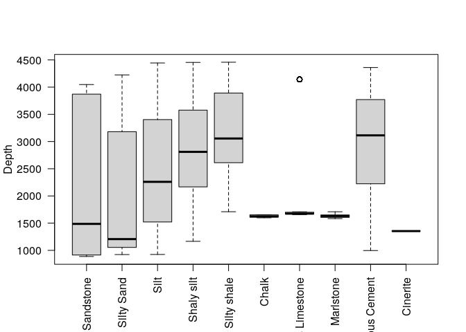
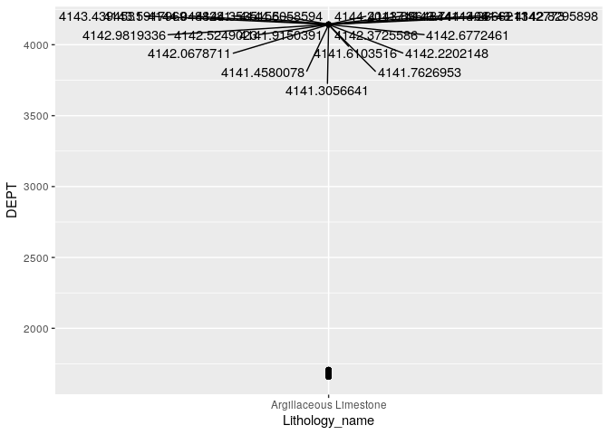
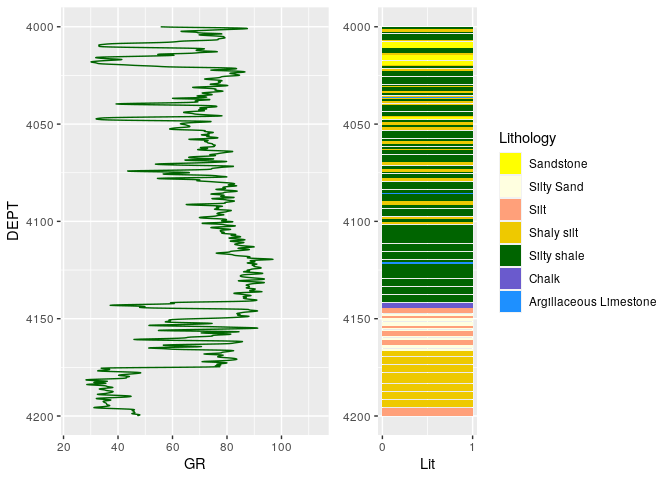
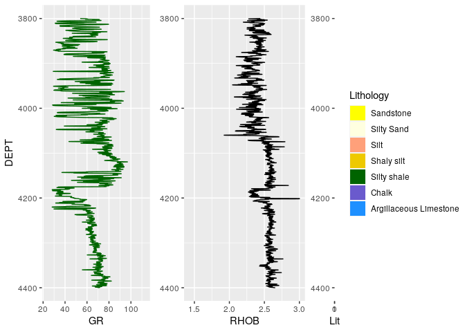
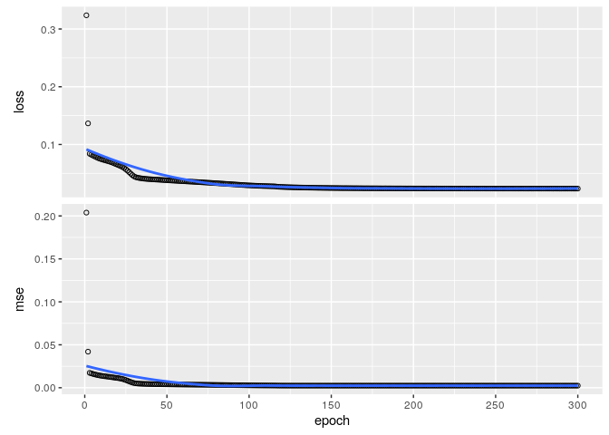
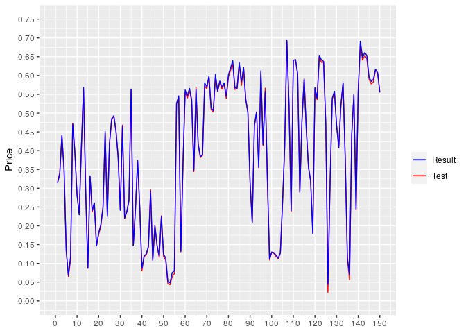

<div style="text align: justify">In this example we're gonna analize and use the data of a well log to feed an autoencoder with the aim to predic some values for the GR curve.</dev>

<div style="text align: justify">The dataset is called "North Sea" and is suplyed by the company <span style="color:green;">Geolink</span>.</dev>

# Loding the data

<div style="text align: justify">To read and manipulate the data, we're gonna use the <span style="color:red;">lastools</span> package, this package is listed in the <mark>Github</mark> repo of Gitmaxwell.</dev>


```r
library(keras)
library(lastools)
library(tidyverse)
```

```
## ── Attaching packages ─────────────────────────────────────── tidyverse 1.3.1 ──
```

```
## ✓ ggplot2 3.3.3     ✓ purrr   0.3.4
## ✓ tibble  3.1.1     ✓ dplyr   1.0.5
## ✓ tidyr   1.1.3     ✓ stringr 1.4.0
## ✓ readr   1.4.0     ✓ forcats 0.5.1
```

```
## ── Conflicts ────────────────────────────────────────── tidyverse_conflicts() ──
## x dplyr::filter() masks stats::filter()
## x dplyr::lag()    masks stats::lag()
```

```r
library(ggplot2)
library(gridExtra)
```

```
## 
## Attaching package: 'gridExtra'
```

```
## The following object is masked from 'package:dplyr':
## 
##     combine
```

```r
library(ggrepel)

well1 <- read_las(filepath = "https://github.com/csvkun/Rmarkdown-examples/raw/main/Data/35_3-1.las", replace_null = TRUE)
```

```
## [1] "https://github.com/csvkun/Rmarkdown-examples/raw/main/Data/35_3-1.las"
##  [1] 19 20 21 22 23 24 25 26 27 28 29 30
```

```
## Warning in data.table::fread(lines, showProgress = FALSE): Detected 1 column
## names but the data has 12 columns (i.e. invalid file). Added 11 extra default
## column names at the end.
```

# Exploring the data

```r
head(well1$LOG)
```

<div data-pagedtable="false">
  <script data-pagedtable-source type="application/json">
{"columns":[{"label":[""],"name":["_rn_"],"type":[""],"align":["left"]},{"label":["DEPT"],"name":[1],"type":["dbl"],"align":["right"]},{"label":["Lithology_geolink"],"name":[2],"type":["dbl"],"align":["right"]},{"label":["CALI"],"name":[3],"type":["dbl"],"align":["right"]},{"label":["DRHO"],"name":[4],"type":["dbl"],"align":["right"]},{"label":["NPHI"],"name":[5],"type":["dbl"],"align":["right"]},{"label":["RHOB"],"name":[6],"type":["dbl"],"align":["right"]},{"label":["GR"],"name":[7],"type":["dbl"],"align":["right"]},{"label":["DTC"],"name":[8],"type":["dbl"],"align":["right"]},{"label":["RDEP"],"name":[9],"type":["dbl"],"align":["right"]},{"label":["SP"],"name":[10],"type":["dbl"],"align":["right"]},{"label":["RSHA"],"name":[11],"type":["dbl"],"align":["right"]},{"label":["RMED"],"name":[12],"type":["dbl"],"align":["right"]}],"data":[{"1":"511.8991","2":"NA","3":"19.981","4":"0.13189726","5":"NA","6":"2.135","7":"53.75876","8":"187.929","9":"2.548965","10":"36.89725","11":"1.902004","12":"1.902000","_rn_":"1"},{"1":"512.0515","2":"NA","3":"19.277","4":"0.10493191","5":"NA","6":"2.104","7":"53.07347","8":"183.828","9":"2.373984","10":"36.96041","11":"1.922005","12":"1.922000","_rn_":"2"},{"1":"512.2039","2":"NA","3":"18.991","4":"0.08798398","5":"NA","6":"2.077","7":"52.31174","8":"190.956","9":"2.332967","10":"36.81390","11":"1.934004","12":"1.934000","_rn_":"3"},{"1":"512.3563","2":"NA","3":"18.919","4":"0.08395995","5":"NA","6":"2.066","7":"52.18380","8":"189.629","9":"2.250994","10":"36.54012","11":"1.945004","12":"1.945000","_rn_":"4"},{"1":"512.5087","2":"NA","3":"18.762","4":"0.07393192","5":"NA","6":"2.042","7":"53.08735","8":"187.120","9":"2.236021","10":"36.57061","11":"1.956004","12":"1.956000","_rn_":"5"},{"1":"512.6611","2":"NA","3":"18.583","4":"0.05691990","5":"NA","6":"2.025","7":"54.75865","8":"173.579","9":"2.287019","10":"36.93539","11":"1.967004","12":"1.967004","_rn_":"6"}],"options":{"columns":{"min":{},"max":[10]},"rows":{"min":[10],"max":[10]},"pages":{}}}
  </script>
</div>

<div style="text align: justify">We have 12 columns, that is to say we have 12 featurues, almost every feature is corresponing a log, except for the <mark>depth</mark> and <mark>lithology</mark> columns.</dev>

<div style="text align: justify">Now that we have the data loaded into our environment we can extract the log values into a data frame to process it without altering the original data.</dev>


```r
data <- well1$LOG
```

<div style="text align: justify">Once the dataframe is created, we're gonna explore it. At first sight we note that there is missing data into our data frame, denoteds with NA's in the output of the head command.</dev>


```r
## cheking for the presence of missing values
colSums(sapply(data, is.na))
```

```
##              DEPT Lithology_geolink              CALI              DRHO 
##                 0              2607                 0                 0 
##              NPHI              RHOB                GR               DTC 
##             23807                 0                 0                81 
##              RDEP                SP              RSHA              RMED 
##                42             13139             13146                42
```

```r
## saving the missing values indexes for the lithology variable
na_index <- which(is.na(data$Lithology_geolink))

## creating a data frame withouth missing values in lithology
lit_clean <- data[-na_index, ]

colSums(sapply(lit_clean, is.na)) ## verifying that our target is free of NA's
```

```
##              DEPT Lithology_geolink              CALI              DRHO 
##                 0                 0                 0                 0 
##              NPHI              RHOB                GR               DTC 
##             21345                 0                 0                40 
##              RDEP                SP              RSHA              RMED 
##                 0             12994             13001                 0
```


<div style="text align: justify">Now we have out lithology column cleaned of NA's. As the <mark>lithology</mark> column is a multilevel factor inidcating the type of lithology, based on the documentation of the dataset we're gonna make a column with the name of the lithology for every instance label, and a column with the colour sugested by the documntation, this way we can next plot a specie of lithology column next to each log we could graph.</dev>


```r
## generating a columng for the name of lithology and one for the colour, this by
## repeating the lithology column in the column bind command
lit_clean <- cbind(lit_clean[1:2], lit_clean[2], lit_clean[2], lit_clean[3:12])
names(lit_clean) <- c("DEPT","Lithology_label","Lithology_name","lit_color","CALI","DRHO","NPHI","RHOB","GR",
                      "DTC","RDEP","SP","RSHA","RMED")

## transforming it to a factor
lit_clean$Lithology_name <- factor(lit_clean$Lithology_name)
lit_clean$lit_color <- factor(lit_clean$lit_color)

## giving names to instances
levels(lit_clean$Lithology_name) <- list("Sandstone"= 1, 
                                         "Silty Sand"=2, 
                                         "Silt"=5,
                                         "Shaly silt"=6,
                                         "Silty shale"=7,
                                         "Chalk"=9,
                                         "Argillaceous Limestone"=12,
                                         "Marlstone"=13,
                                         "Calcareous Cement"=16,
                                         "Cinerite"=19)
## giving color to each instance
levels(lit_clean$lit_color) <- list("yellow"= 1, 
                                         "lightyellow"=2, 
                                         "lightsalmon"=5,
                                         "gold2"=6,
                                         "darkgreen"=7,
                                         "slateblue"=9,
                                         "dodgerblue"=12,
                                         "deepskyblue"=13,
                                         "cyan"=16,
                                         "cyan"=19)
```

<div style="text align: justify">Now we can plot some information to visualize it.</dev>

## Visualizing data


```r
## For the colors of lithology 

colors = c("yellow", "lightyellow", "lightsalmon", "gold2", "darkgreen", "slateblue", "dodgerblue",
           "deepskyblue", "cyan", "cyan")

## Plotting some info

p1 <- ggplot(data=lit_clean, aes(x=GR, y=DEPT))+
  geom_line(orientation = "y",color="darkgreen")+
  ylim(3650,3550)

col1 <- ggplot(lit_clean, aes(y=DEPT, fill=lit_color)) +
  geom_bar()+
  scale_y_reverse()+
  ylim(3650,3550) +
  labs(fill="Lithology", color=NULL, x="Lit")+
  scale_fill_discrete(labels = levels(lit_clean$Lithology_name), type = colors)

grid.arrange(p1,col1, ncol=2)
```

<!-- -->

<div style="text align: justify">Now let's make some visual exploration of the data, just to get some insights about it.</dev>


```r
boxplot(lit_clean$DEPT~lit_clean$Lithology_name, las=2,xlab = " ", ylab = "Depth")
```

<!-- -->

<div style="text align: justify">The box plot show that the're is some argillaceous limastones far from to the others, because of it, the box plot treat it like an outlier. Let's take a look at it.</dev>


```r
ggplot(data = lit_clean[lit_clean$Lithology_name=="Argillaceous Limestone",],
       aes(x=Lithology_name, y=DEPT))+
  geom_point()+
  geom_text_repel(data = lit_clean[lit_clean$Lithology_name=="Argillaceous Limestone",], max.overlaps = 60,
                  aes(label = ifelse(DEPT>4000,
                                     DEPT,
                                     "")))
```

<!-- -->
<div style="text align: justify">With the last plot we can view that the outliers are in the range of <mark>4100</mark> depth of the log, so we can check this specific zone.</dev>


```r
outplot1 <- ggplot(lit_clean, aes(y=DEPT, x=GR)) +
  geom_line(orientation = "y", color="darkgreen")+
  scale_y_reverse(limits=c(4200,4000))

outplot2 <- ggplot(lit_clean, aes(y=DEPT, fill=lit_color)) +
  geom_bar()+
  scale_y_reverse()+
  ylim(4200,4000) +
  labs(fill="Lithology", color=NULL, x="Lit", y=NULL)+
  scale_fill_discrete(labels = levels(lit_clean$Lithology_name), type = colors)+
  scale_x_continuous(breaks = c(0,1))

grid.arrange(outplot1, outplot2, ncol=2)
```

<!-- -->

<div style="text align: justify">Yes there are the argillaceous limestones in the range viewed from the dot plot. Once we have notticed the outliers we can explore a larger amoun of data, a little bit shallower and a bit deeper of the outliers range.</dev>


```r
GR_33 <- ggplot(lit_clean, aes(y=DEPT, x=GR)) +
  geom_line(orientation = "y", color="darkgreen")+
  scale_y_reverse(limits=c(4400,3800))

Lit_33 <- ggplot(lit_clean, aes(y=DEPT, fill=lit_color)) +
  geom_bar()+
  scale_y_reverse()+
  ylim(4400,3800) +
  labs(fill="Lithology", color=NULL, x="Lit", y=NULL)+
  scale_fill_discrete(labels = levels(lit_clean$Lithology_name), type = colors)+
  scale_x_continuous(breaks = c(0,1))

BD_33 <- ggplot(lit_clean, aes(y=DEPT, x=RHOB)) +
  geom_line(orientation = "y")+
  scale_y_reverse(limits=c(4400,3800))+
  labs(y=NULL)

grid.arrange(GR_33, BD_33,Lit_33, ncol=3)
```

<!-- -->

<div style="text align: justify">Let's choose this range for train our autoencoder.</dev>

# Selecting the data to use for train and test

<div style="text align: justify">These are the common steps to prepare the final data to use. </dev>


```r
data <- lit_clean[match(3800, as.integer(lit_clean$DEPT)):match(max(lit_clean$DEPT), lit_clean$DEPT),]

x <- data[5:14]

x <- x[,-c(3,8,9)]

summary(x)
```

```
##       CALI             DRHO                RHOB             GR        
##  Min.   : 8.849   Min.   :-0.290000   Min.   :1.925   Min.   : 28.23  
##  1st Qu.:11.016   1st Qu.:-0.003983   1st Qu.:2.382   1st Qu.: 59.81  
##  Median :13.014   Median : 0.009003   Median :2.530   Median : 69.29  
##  Mean   :12.838   Mean   : 0.014451   Mean   :2.479   Mean   : 66.11  
##  3rd Qu.:14.610   3rd Qu.: 0.041721   3rd Qu.:2.580   3rd Qu.: 76.10  
##  Max.   :18.469   Max.   : 0.225740   Max.   :3.001   Max.   :112.85  
##                                                                       
##       DTC              RDEP             RMED        
##  Min.   : 56.09   Min.   : 1.742   Min.   :  2.076  
##  1st Qu.: 80.49   1st Qu.: 3.393   1st Qu.:  3.848  
##  Median : 84.06   Median : 4.519   Median :  4.777  
##  Mean   : 83.11   Mean   : 4.678   Mean   :  5.519  
##  3rd Qu.: 86.28   3rd Qu.: 5.682   3rd Qu.:  6.343  
##  Max.   :127.72   Max.   :32.032   Max.   :156.291  
##  NA's   :40
```

<div style="text align: justify">We can note that there's an small amount of NA's in the DTC log, let's fix it.</dev>


```r
## imputing the mean in places where there's previous NA's
x$DTC[is.na(x$DTC)] <- 0
x$DTC[x$DTC==0] <- mean(x$DTC)
```

<div style="text align: justify">Once we have imputted the data, we can split data for training and test.</dev>


```r
##################
# splitting data #
##################
set.seed(2021)

train_index <- round(nrow(x)*(0.90), 0)

train_obs <- sample(1:nrow(x), train_index)

train <- x[train_obs,]
test <- x[-train_obs,]

################
# scaling data #
################

## min max scaling
max_train <- apply(train, 2, max) # number mean by columns
min_train <- apply(train, 2, min)


## scaling train by min-max
train_esc <- scale(train, center = min_train, 
                   scale = max_train - min_train)

## scaling the test set by the same factor of the train data
## with attr we can acces to the center and the scale of the
## scaled train data
test_esc <- scale(test, center = attr(train_esc, "scaled:center"),
                  scale = attr(train_esc, "scaled:scale"))
```

# Setting up our autoencoder

<div style="text align: justify">At this moment, we have our data ready to  feed an autoencoder, due to the fact that <mark>an autoencoder doesn't need a target objective</mark>, we will use the training and test set with all the extension of the features, and pass as <span style="color:blue;">y</span> the same training set.</dev>


```r
#######################
## autoencoder model ##
#######################

## creating the model

train_esc <- as.matrix(train_esc)
test_esc <- as.matrix(test_esc)


model <- keras_model_sequential()


model %>% layer_dense(units = 5, input_shape = ncol(x), 
                      activation = "relu") %>% 
  layer_dense(units = 3, activation = "relu") %>% 
  layer_dense(units = 5, activation = "sigmoid") %>% 
  layer_dense(units = ncol(x))

summary(model)
```

```
## Model: "sequential"
## ________________________________________________________________________________
## Layer (type)                        Output Shape                    Param #     
## ================================================================================
## dense_3 (Dense)                     (None, 5)                       40          
## ________________________________________________________________________________
## dense_2 (Dense)                     (None, 3)                       18          
## ________________________________________________________________________________
## dense_1 (Dense)                     (None, 5)                       20          
## ________________________________________________________________________________
## dense (Dense)                       (None, 7)                       42          
## ================================================================================
## Total params: 120
## Trainable params: 120
## Non-trainable params: 0
## ________________________________________________________________________________
```

```r
## compiling the model
model %>% compile(
  loss = "mae",
  metrics = c("mse"),
  optimizer = "rmsprop")

history <- model %>% fit(
  x = train_esc,
  y = train_esc,
  verbose = 0,
  epochs = 300,
  batch_size = 32)

plot(history)
```

<!-- -->

```r
## evaluate the model
mae  <- evaluate(model, train_esc, train_esc)
mae
```

```
##        loss         mse 
## 0.025994409 0.002940078
```

```r
## results
result_ae <- predict(model, test_esc)

ae_comp <- cbind(test_esc[,4], result_ae[,4])

ae_plot <- ggplot(data = as.data.frame(ae_comp), aes(
  x=seq(1, nrow(ae_comp), 1),
  y=ae_comp[,1], color = "red"
))+
  geom_line()+
  geom_line(aes(x=seq(1, nrow(ae_comp), 1), y=ae_comp[,2], color="blue"))+
  scale_x_continuous(limits = c(0,150), breaks = seq(0,300,10))+
  scale_y_continuous(limits = c(0,0.75),breaks = seq(0,0.8, .05))+
  labs(x=NULL, y="Price")+
  scale_colour_manual(name = '', 
                      values =c('blue'='blue','red'='red'), labels = c('Result','Test'))

ae_plot
```

<!-- -->
