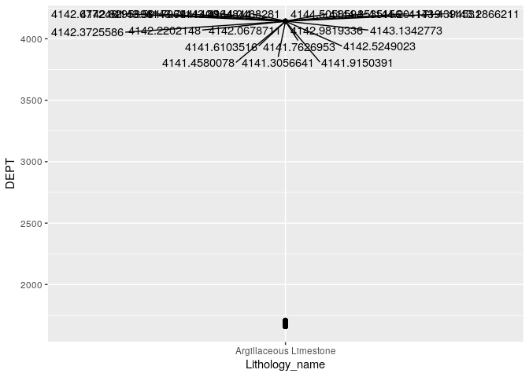
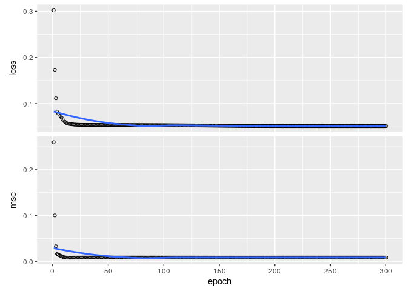
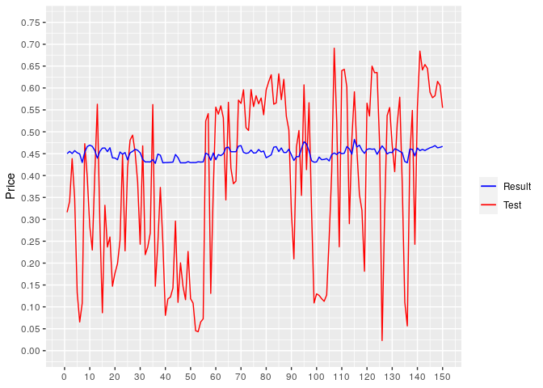
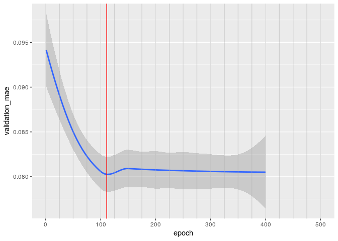
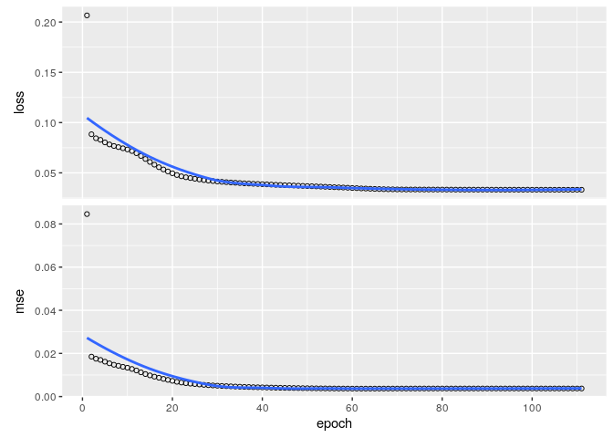
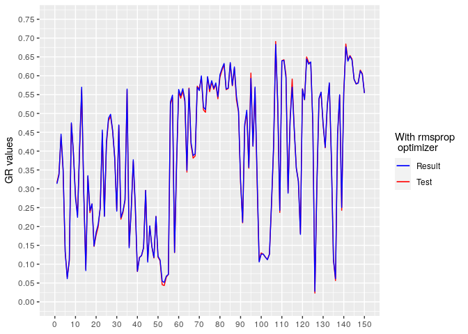
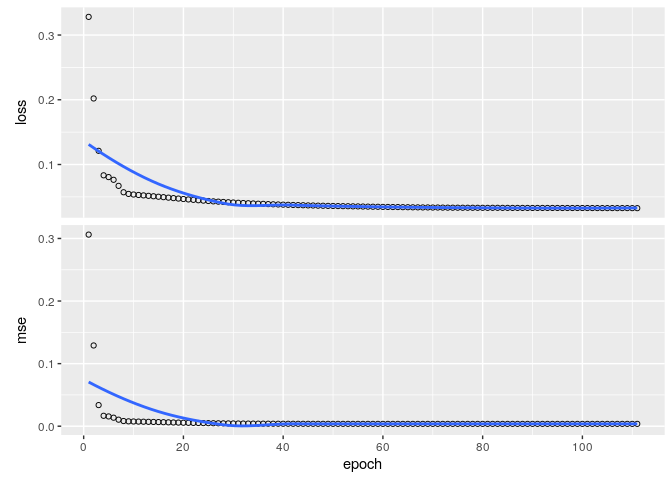

<div style="text align: justify">In this example we're gonna analize and use the data of a well log to feed an autoencoder with the aim to predic some values for the GR curve.</dev>

<div style="text align: justify">The dataset is called "North Sea" and is suplyed by the company <span style="color:green;">Geolink</span>.</dev>

# Loding the data

<div style="text align: justify">To read and manipulate the data, we're gonna use the <span style="color:red;">lastools</span> package, this package is listed in the <mark>Github</mark> repo of Gitmaxwell.</dev>


```r
library(keras)
library(lastools)
library(tidyverse)
library(ggplot2)
library(gridExtra)
library(ggrepel)
library(kableExtra)

well1 <- read_las(filepath = "https://github.com/csvkun/Rmarkdown-examples/raw/main/Data/35_3-1.las", replace_null = TRUE)
```

```
## [1] "https://github.com/csvkun/Rmarkdown-examples/raw/main/Data/35_3-1.las"
##  [1] 19 20 21 22 23 24 25 26 27 28 29 30
```

# Exploring the data

```r
kable(well1$LOG[1:5, ]) %>% kable_styling(bootstrap_options = c("condensed", "striped"), full_width = FALSE, font_size = 10) %>% scroll_box(width = "500px", height = "150px")
```

<div style="border: 1px solid #ddd; padding: 0px; overflow-y: scroll; height:150px; overflow-x: scroll; width:500px; "><table class="table table-condensed table-striped" style="font-size: 10px; width: auto !important; margin-left: auto; margin-right: auto;">
 <thead>
  <tr>
   <th style="text-align:right;position: sticky; top:0; background-color: #FFFFFF;"> DEPT </th>
   <th style="text-align:right;position: sticky; top:0; background-color: #FFFFFF;"> Lithology_geolink </th>
   <th style="text-align:right;position: sticky; top:0; background-color: #FFFFFF;"> CALI </th>
   <th style="text-align:right;position: sticky; top:0; background-color: #FFFFFF;"> DRHO </th>
   <th style="text-align:right;position: sticky; top:0; background-color: #FFFFFF;"> NPHI </th>
   <th style="text-align:right;position: sticky; top:0; background-color: #FFFFFF;"> RHOB </th>
   <th style="text-align:right;position: sticky; top:0; background-color: #FFFFFF;"> GR </th>
   <th style="text-align:right;position: sticky; top:0; background-color: #FFFFFF;"> DTC </th>
   <th style="text-align:right;position: sticky; top:0; background-color: #FFFFFF;"> RDEP </th>
   <th style="text-align:right;position: sticky; top:0; background-color: #FFFFFF;"> SP </th>
   <th style="text-align:right;position: sticky; top:0; background-color: #FFFFFF;"> RSHA </th>
   <th style="text-align:right;position: sticky; top:0; background-color: #FFFFFF;"> RMED </th>
  </tr>
 </thead>
<tbody>
  <tr>
   <td style="text-align:right;"> 511.8991 </td>
   <td style="text-align:right;"> NA </td>
   <td style="text-align:right;"> 19.981 </td>
   <td style="text-align:right;"> 0.1318973 </td>
   <td style="text-align:right;"> NA </td>
   <td style="text-align:right;"> 2.135 </td>
   <td style="text-align:right;"> 53.75876 </td>
   <td style="text-align:right;"> 187.929 </td>
   <td style="text-align:right;"> 2.548965 </td>
   <td style="text-align:right;"> 36.89725 </td>
   <td style="text-align:right;"> 1.902004 </td>
   <td style="text-align:right;"> 1.902 </td>
  </tr>
  <tr>
   <td style="text-align:right;"> 512.0515 </td>
   <td style="text-align:right;"> NA </td>
   <td style="text-align:right;"> 19.277 </td>
   <td style="text-align:right;"> 0.1049319 </td>
   <td style="text-align:right;"> NA </td>
   <td style="text-align:right;"> 2.104 </td>
   <td style="text-align:right;"> 53.07347 </td>
   <td style="text-align:right;"> 183.828 </td>
   <td style="text-align:right;"> 2.373984 </td>
   <td style="text-align:right;"> 36.96041 </td>
   <td style="text-align:right;"> 1.922005 </td>
   <td style="text-align:right;"> 1.922 </td>
  </tr>
  <tr>
   <td style="text-align:right;"> 512.2039 </td>
   <td style="text-align:right;"> NA </td>
   <td style="text-align:right;"> 18.991 </td>
   <td style="text-align:right;"> 0.0879840 </td>
   <td style="text-align:right;"> NA </td>
   <td style="text-align:right;"> 2.077 </td>
   <td style="text-align:right;"> 52.31174 </td>
   <td style="text-align:right;"> 190.956 </td>
   <td style="text-align:right;"> 2.332967 </td>
   <td style="text-align:right;"> 36.81390 </td>
   <td style="text-align:right;"> 1.934004 </td>
   <td style="text-align:right;"> 1.934 </td>
  </tr>
  <tr>
   <td style="text-align:right;"> 512.3563 </td>
   <td style="text-align:right;"> NA </td>
   <td style="text-align:right;"> 18.919 </td>
   <td style="text-align:right;"> 0.0839600 </td>
   <td style="text-align:right;"> NA </td>
   <td style="text-align:right;"> 2.066 </td>
   <td style="text-align:right;"> 52.18380 </td>
   <td style="text-align:right;"> 189.629 </td>
   <td style="text-align:right;"> 2.250994 </td>
   <td style="text-align:right;"> 36.54012 </td>
   <td style="text-align:right;"> 1.945005 </td>
   <td style="text-align:right;"> 1.945 </td>
  </tr>
  <tr>
   <td style="text-align:right;"> 512.5087 </td>
   <td style="text-align:right;"> NA </td>
   <td style="text-align:right;"> 18.762 </td>
   <td style="text-align:right;"> 0.0739319 </td>
   <td style="text-align:right;"> NA </td>
   <td style="text-align:right;"> 2.042 </td>
   <td style="text-align:right;"> 53.08735 </td>
   <td style="text-align:right;"> 187.120 </td>
   <td style="text-align:right;"> 2.236021 </td>
   <td style="text-align:right;"> 36.57061 </td>
   <td style="text-align:right;"> 1.956004 </td>
   <td style="text-align:right;"> 1.956 </td>
  </tr>
</tbody>
</table></div>

<div style="text align: justify">We have 12 columns, that is to say we have 12 featurues, almost every feature is corresponing a log, except for the <mark>depth</mark> and <mark>lithology</mark> columns.</dev>

<div style="text align: justify">Now that we have the data loaded into our environment we can extract the log values into a data frame to process it without altering the original data.</dev>


```r
data <- well1$LOG
```

<div style="text align: justify">Once the dataframe is created, we're gonna explore it. At first sight we note that there is missing data into our data frame, denoteds with NA's in the output of the head command.</dev>


```r
## cheking for the presence of missing values
colSums(sapply(data, is.na))
```

```
##              DEPT Lithology_geolink              CALI              DRHO 
##                 0              2607                 0                 0 
##              NPHI              RHOB                GR               DTC 
##             23807                 0                 0                81 
##              RDEP                SP              RSHA              RMED 
##                42             13139             13146                42
```

```r
## saving the missing values indexes for the lithology variable
na_index <- which(is.na(data$Lithology_geolink))

## creating a data frame withouth missing values in lithology
lit_clean <- data[-na_index, ]

colSums(sapply(lit_clean, is.na)) ## verifying that our target is free of NA's
```

```
##              DEPT Lithology_geolink              CALI              DRHO 
##                 0                 0                 0                 0 
##              NPHI              RHOB                GR               DTC 
##             21345                 0                 0                40 
##              RDEP                SP              RSHA              RMED 
##                 0             12994             13001                 0
```


<div style="text align: justify">Now we have out lithology column cleaned of NA's. As the <mark>lithology</mark> column is a multilevel factor inidcating the type of lithology, based on the documentation of the dataset we're gonna make a column with the name of the lithology for every instance label, and a column with the colour sugested by the documntation, this way we can next plot a specie of lithology column next to each log we could graph.</dev>


```r
## generating a columng for the name of lithology and one for the colour, this by
## repeating the lithology column in the column bind command
lit_clean <- cbind(lit_clean[1:2], lit_clean[2], lit_clean[2], lit_clean[3:12])
names(lit_clean) <- c("DEPT","Lithology_label","Lithology_name","lit_color","CALI","DRHO","NPHI","RHOB","GR",
                      "DTC","RDEP","SP","RSHA","RMED")

## transforming it to a factor
lit_clean$Lithology_name <- factor(lit_clean$Lithology_name)
lit_clean$lit_color <- factor(lit_clean$lit_color)

## giving names to instances
levels(lit_clean$Lithology_name) <- list("Sandstone"= 1, 
                                         "Silty Sand"=2, 
                                         "Silt"=5,
                                         "Shaly silt"=6,
                                         "Silty shale"=7,
                                         "Chalk"=9,
                                         "Argillaceous Limestone"=12,
                                         "Marlstone"=13,
                                         "Calcareous Cement"=16,
                                         "Cinerite"=19)
## giving color to each instance
levels(lit_clean$lit_color) <- list("yellow"= 1, 
                                         "lightyellow"=2, 
                                         "lightsalmon"=5,
                                         "gold2"=6,
                                         "darkgreen"=7,
                                         "slateblue"=9,
                                         "dodgerblue"=12,
                                         "deepskyblue"=13,
                                         "cyan"=16,
                                         "cyan"=19)
```

<div style="text align: justify">Now we can plot some information to visualize it.</dev>

## Visualizing data


```r
## For the colors of lithology 

colors = c("yellow", "lightyellow", "lightsalmon", "gold2", "darkgreen", "slateblue", "dodgerblue",
           "deepskyblue", "cyan", "cyan")

## Plotting some info

p1 <- ggplot(data=lit_clean, aes(x=GR, y=DEPT))+
  geom_line(orientation = "y",color="darkgreen")+
  ylim(3650,3550)

col1 <- ggplot(lit_clean, aes(y=DEPT, fill=lit_color)) +
  geom_bar()+
  scale_y_reverse()+
  ylim(3650,3550) +
  labs(fill="Lithology", color=NULL, x="Lit")+
  scale_fill_discrete(labels = levels(lit_clean$Lithology_name), type = colors)

grid.arrange(p1,col1, ncol=2)
```

<!-- -->

<div style="text align: justify">Now let's make some visual exploration of the data, just to get some insights about it.</dev>


```r
boxplot(lit_clean$DEPT~lit_clean$Lithology_name, las=2,xlab = " ", ylab = "Depth")
```

<!-- -->

<div style="text align: justify">The box plot show that the're is some argillaceous limastones far from to the others, because of it, the box plot treat it like an outlier. Let's take a look at it.</dev>


```r
ggplot(data = lit_clean[lit_clean$Lithology_name=="Argillaceous Limestone",],
       aes(x=Lithology_name, y=DEPT))+
  geom_point()+
  geom_text_repel(data = lit_clean[lit_clean$Lithology_name=="Argillaceous Limestone",], max.overlaps = 60,
                  aes(label = ifelse(DEPT>4000,
                                     DEPT,
                                     "")))
```

<!-- -->
<div style="text align: justify">With the last plot we can view that the outliers are in the range of <mark>4100</mark> depth of the log, so we can check this specific zone.</dev>


```r
outplot1 <- ggplot(lit_clean, aes(y=DEPT, x=GR)) +
  geom_line(orientation = "y", color="darkgreen")+
  scale_y_reverse(limits=c(4200,4000))

outplot2 <- ggplot(lit_clean, aes(y=DEPT, fill=lit_color)) +
  geom_bar()+
  scale_y_reverse()+
  ylim(4200,4000) +
  labs(fill="Lithology", color=NULL, x="Lit", y=NULL)+
  scale_fill_discrete(labels = levels(lit_clean$Lithology_name), type = colors)+
  scale_x_continuous(breaks = c(0,1))

grid.arrange(outplot1, outplot2, ncol=2)
```

<!-- -->

<div style="text align: justify">Yes there are the argillaceous limestones in the range viewed from the dot plot. Once we have notticed the outliers we can explore a larger amoun of data, a little bit shallower and a bit deeper of the outliers range.</dev>


```r
GR_33 <- ggplot(lit_clean, aes(y=DEPT, x=GR)) +
  geom_line(orientation = "y", color="darkgreen")+
  scale_y_reverse(limits=c(4400,3800))

Lit_33 <- ggplot(lit_clean, aes(y=DEPT, fill=lit_color)) +
  geom_bar()+
  scale_y_reverse()+
  ylim(4400,3800) +
  labs(fill="Lithology", color=NULL, x="Lit", y=NULL)+
  scale_fill_discrete(labels = levels(lit_clean$Lithology_name), type = colors)+
  scale_x_continuous(breaks = c(0,1))

BD_33 <- ggplot(lit_clean, aes(y=DEPT, x=RHOB)) +
  geom_line(orientation = "y")+
  scale_y_reverse(limits=c(4400,3800))+
  labs(y=NULL)

grid.arrange(GR_33, BD_33,Lit_33, ncol=3, widths=c(.7,.6,1))
```

<!-- -->

<div style="text align: justify">Let's choose this range for train our autoencoder.</dev>

# Selecting the data to use for train and test

<div style="text align: justify">These are the common steps to prepare the final data to use. </dev>


```r
data <- lit_clean[match(3800, as.integer(lit_clean$DEPT)):match(max(lit_clean$DEPT), lit_clean$DEPT),]

x <- data[5:14]

x <- x[,-c(3,8,9)]

summary(x)
```

```
##       CALI             DRHO                RHOB             GR        
##  Min.   : 8.849   Min.   :-0.290000   Min.   :1.925   Min.   : 28.23  
##  1st Qu.:11.016   1st Qu.:-0.003983   1st Qu.:2.382   1st Qu.: 59.81  
##  Median :13.014   Median : 0.009003   Median :2.530   Median : 69.29  
##  Mean   :12.838   Mean   : 0.014451   Mean   :2.479   Mean   : 66.11  
##  3rd Qu.:14.610   3rd Qu.: 0.041721   3rd Qu.:2.580   3rd Qu.: 76.10  
##  Max.   :18.469   Max.   : 0.225740   Max.   :3.001   Max.   :112.85  
##                                                                       
##       DTC              RDEP             RMED        
##  Min.   : 56.09   Min.   : 1.742   Min.   :  2.076  
##  1st Qu.: 80.49   1st Qu.: 3.393   1st Qu.:  3.848  
##  Median : 84.06   Median : 4.519   Median :  4.777  
##  Mean   : 83.11   Mean   : 4.678   Mean   :  5.519  
##  3rd Qu.: 86.28   3rd Qu.: 5.682   3rd Qu.:  6.343  
##  Max.   :127.72   Max.   :32.032   Max.   :156.291  
##  NA's   :40
```

<div style="text align: justify">We can note that there's an small amount of NA's in the DTC log, let's fix it.</dev>


```r
## imputing the mean in places where there's previous NA's
x$DTC[is.na(x$DTC)] <- 0
x$DTC[x$DTC==0] <- mean(x$DTC)
```

<div style="text align: justify">Once we have imputted the data, we can split data for training and test.</dev>


```r
##################
# splitting data #
##################
set.seed(2021)

train_index <- round(nrow(x)*(0.90), 0)

train_obs <- sample(1:nrow(x), train_index)

train <- x[train_obs,]
test <- x[-train_obs,]

################
# scaling data #
################

## min max scaling
max_train <- apply(train, 2, max) # number mean by columns
min_train <- apply(train, 2, min)


## scaling train by min-max
train_esc <- scale(train, center = min_train, 
                   scale = max_train - min_train)

## scaling the test set by the same factor of the train data
## with attr we can acces to the center and the scale of the
## scaled train data
test_esc <- scale(test, center = attr(train_esc, "scaled:center"),
                  scale = attr(train_esc, "scaled:scale"))
```

# Setting up our autoencoder

<div style="text align: justify">At this moment, we have our data ready to  feed an autoencoder, due to the fact that <mark>an autoencoder doesn't need a target objective</mark>, we will use the training and test set with all the extension of the features, and pass as <span style="color:blue;">y</span> the same training set.</dev>

## Autoencoder

```r
#######################
## autoencoder model ##
#######################

## creating the model

train_esc <- as.matrix(train_esc)
test_esc <- as.matrix(test_esc)


model <- keras_model_sequential()


model %>% layer_dense(units = 5, input_shape = ncol(x), 
                      activation = "relu") %>% 
  layer_dense(units = 3, activation = "relu") %>%
  layer_dense(units = 1, activation = "relu") %>% 
  layer_dense(units = 3, activation = "relu") %>% 
  layer_dense(units = 5, activation = "sigmoid") %>% 
  layer_dense(units = ncol(x))

summary(model)
```

```
## Model: "sequential"
## ________________________________________________________________________________
## Layer (type)                        Output Shape                    Param #     
## ================================================================================
## dense_5 (Dense)                     (None, 5)                       40          
## ________________________________________________________________________________
## dense_4 (Dense)                     (None, 3)                       18          
## ________________________________________________________________________________
## dense_3 (Dense)                     (None, 1)                       4           
## ________________________________________________________________________________
## dense_2 (Dense)                     (None, 3)                       6           
## ________________________________________________________________________________
## dense_1 (Dense)                     (None, 5)                       20          
## ________________________________________________________________________________
## dense (Dense)                       (None, 7)                       42          
## ================================================================================
## Total params: 130
## Trainable params: 130
## Non-trainable params: 0
## ________________________________________________________________________________
```

```r
## compiling the model
model %>% compile(
  loss = "mae",
  metrics = c("mse"),
  optimizer = "rmsprop")

history <- model %>% fit(
  x = train_esc,
  y = train_esc,
  verbose = 1,
  epochs = 300,
  batch_size = 32)

plot(history)
```

<!-- -->

```r
## evaluate the model
mae  <- evaluate(model, train_esc, train_esc)
mae
```

```
##       loss        mse 
## 0.08568274 0.01850842
```

```r
## results
result_ae <- predict(model, test_esc)

ae_comp <- cbind(test_esc[,4], result_ae[,4])

ae_plot <- ggplot(data = as.data.frame(ae_comp), aes(
  x=seq(1, nrow(ae_comp), 1),
  y=ae_comp[,1], color = "red"
))+
  geom_line()+
  geom_line(aes(x=seq(1, nrow(ae_comp), 1), y=ae_comp[,2], color="blue"))+
  scale_x_continuous(limits = c(0,150), breaks = seq(0,300,10))+
  scale_y_continuous(limits = c(0,0.75),breaks = seq(0,0.8, .05))+
  labs(x=NULL, y="Price")+
  scale_colour_manual(name = '', 
                      values =c('blue'='blue','red'='red'), labels = c('Result','Test'))

ae_plot
```

<!-- -->
<div style="text align: justify">The results are no good, as shown in the plot, the model trends to underfitting and the results leave it in clear, there's no need to say it, <span style="color:red;">the curve of the results don't adjust with the expectec values of test</span>,but with a little more exprimentation we can get a better model to reach our objectives.</dev>

### Cross validation

<div style="text align: justify">Next we'll use a cross validation approach, this to find an optimal number of epochs in out model to avoid overfitting.</dev>


```r
##################################
# k-fold cross validation for ae #
##################################

k <- 5
indices <- sample(1:nrow(train_esc))
folds <- cut(indices, breaks = k, labels = FALSE) 

################
## 400 epochs ##
################

num_epochs <- 400
# all_scores <- c()
all_mae_histories <- NULL

build_model <- function() {
  model <- keras_model_sequential() %>% 
    model %>% layer_dense(units = 5, input_shape = ncol(train_esc),
                          activation = "relu") %>%
    layer_dense(units = 3, activation = "relu") %>%
    layer_dense(units = 5, activation = "sigmoid") %>%
    layer_dense(units = ncol(x))
  model %>% compile(optimizer = "rmsprop",
                    loss = "mse",
                    metrics = c("mae")
  )
}

for (i in 1:5) {
  cat("processing fold #", i, "\n")
  
  val_indices <- which(folds == i, arr.ind = TRUE)
  val_data <- train_esc[val_indices,]
  val_targets <- train_esc[val_indices,]
  
  partial_train_data <- train_esc[-val_indices,]
  partial_train_targets <- train_esc[-val_indices,]
  
  model <- build_model()
  
  history <- model %>% fit(
    partial_train_data, partial_train_targets,
    validation_data = list(val_data, val_targets),
    epochs = num_epochs, batch_size = 32, verbose = 1
  )
  mae_history <- history$metrics$mae
  all_mae_histories <- rbind(all_mae_histories, mae_history)
}
```

```
## processing fold # 1 
## processing fold # 2 
## processing fold # 3 
## processing fold # 4 
## processing fold # 5
```

```r
average_mae_history <- data.frame(
  epoch = seq(1:ncol(all_mae_histories)),
  validation_mae = apply(all_mae_histories, 2, mean))
```

<div style="text align: justify">Now let's plot the mae's history to find the lower value and the number of epochs.</dev>


```r
## better number of epochs
ggplot(average_mae_history, aes(x = epoch, y = validation_mae)) + geom_smooth() +
  geom_vline(xintercept = seq(0,500,25), colour="darkgrey", alpha=0.4)+
  geom_vline(xintercept = 111, colour="red")
```

<!-- -->


<div style="text align: justify">The plot tell us that beyond the 111 epochs, the model starts to overfitting and then the curve flattens, so we can use this number as the optimal.</dev>

## Models with the optimal number of epochs.
<div style="text align: justify">Once we have defined an optimal number of epochs, we can check what optimizer gets a better result. The most populars for regression tasks are <mark>rmsprop</mark> and <mark>adam</mark> optimizer, so let's try whit these two. Aggregate to this we now reduce the number of <mark>neurons</mark> for the bottle neck of the autoencoder.</dev>

### Rmsprop optimizer


```r
## same as the first one model, but with optimal
## number of epochs
set.seed(2021)

epochs <- 111

model1 <- keras_model_sequential()

model1 %>% layer_dense(units = 5, input_shape = ncol(x), 
                       activation = "relu") %>% 
  layer_dense(units = 3, activation = "relu") %>% 
  layer_dense(units = 5, activation = "sigmoid") %>% 
  layer_dense(units = ncol(x))

summary(model1)
```

```
## Model: "sequential_6"
## ________________________________________________________________________________
## Layer (type)                        Output Shape                    Param #     
## ================================================================================
## dense_29 (Dense)                    (None, 5)                       40          
## ________________________________________________________________________________
## dense_28 (Dense)                    (None, 3)                       18          
## ________________________________________________________________________________
## dense_27 (Dense)                    (None, 5)                       20          
## ________________________________________________________________________________
## dense_26 (Dense)                    (None, 7)                       42          
## ================================================================================
## Total params: 120
## Trainable params: 120
## Non-trainable params: 0
## ________________________________________________________________________________
```

```r
## compiling the model
model1 %>% compile(
  loss = "mae",
  metrics = c("mse"),
  optimizer = "rmsprop")

history1 <- model1 %>% fit(
  x = train_esc,
  y = train_esc,
  verbose = 1,
  epochs = epochs,
  batch_size = 32)

plot(history1)
```

<!-- -->

```r
## evaluate the model
mae1  <- evaluate(model1, train_esc, train_esc)
mae1
```

```
##       loss        mse 
## 0.05374057 0.00838880
```

```r
## results
result_ae_1 <- predict(model1, test_esc)

ae_comp_1 <- cbind(test_esc[,4], result_ae_1[,4])

ae_plot_1 <- ggplot(data = as.data.frame(ae_comp_1), aes(
  x=seq(1, nrow(ae_comp_1), 1),
  y=ae_comp_1[,1], color = "red"
))+
  geom_line()+
  geom_line(aes(x=seq(1, nrow(ae_comp_1), 1), y=ae_comp_1[,2], color="blue"))+
  scale_x_continuous(limits = c(0,150), breaks = seq(0,300,10))+
  scale_y_continuous(limits = c(0,0.75),breaks = seq(0,0.8, .05))+
  labs(x=NULL, y="GR values")+
  scale_colour_manual(name = 'With rmsprop \n optimizer', 
                      values =c('blue'='blue','red'='red'), labels = c('Result','Test'))

ae_plot_1
```

<!-- -->

### Adam optimizer


```r
set.seed(2021)
model2 <- keras_model_sequential()

model2 %>% layer_dense(units = 5, input_shape = ncol(x), 
                       activation = "relu") %>% 
  layer_dense(units = 3, activation = "relu") %>% 
  layer_dense(units = 5, activation = "sigmoid") %>% 
  layer_dense(units = ncol(x))

summary(model2)
```

```
## Model: "sequential_7"
## ________________________________________________________________________________
## Layer (type)                        Output Shape                    Param #     
## ================================================================================
## dense_33 (Dense)                    (None, 5)                       40          
## ________________________________________________________________________________
## dense_32 (Dense)                    (None, 3)                       18          
## ________________________________________________________________________________
## dense_31 (Dense)                    (None, 5)                       20          
## ________________________________________________________________________________
## dense_30 (Dense)                    (None, 7)                       42          
## ================================================================================
## Total params: 120
## Trainable params: 120
## Non-trainable params: 0
## ________________________________________________________________________________
```

```r
## compiling the model
model2 %>% compile(
  loss = "mae",
  metrics = c("mse"),
  optimizer = "adam")

history2 <- model2 %>% fit(
  x = train_esc,
  y = train_esc,
  verbose = 1,
  epochs = epochs,
  batch_size = 32)

plot(history2)
```

```
## `geom_smooth()` using formula 'y ~ x'
```

<!-- -->

```r
## evaluate the model
mae2  <- evaluate(model2, train_esc, train_esc)
mae2
```

```
##        loss         mse 
## 0.032643124 0.003745955
```

```r
## results
result_ae_2 <- predict(model2, test_esc)

ae_comp_2 <- cbind(test_esc[,4], result_ae_2[,4])

ae_plot_2 <- ggplot(data = as.data.frame(ae_comp_2), aes(
  x=seq(1, nrow(ae_comp_2), 1),
  y=ae_comp_2[,1], color = "red"
))+
  geom_line()+
  geom_line(aes(x=seq(1, nrow(ae_comp_2), 1), y=ae_comp_2[,2], color="blue"))+
  scale_x_continuous(limits = c(0,150), breaks = seq(0,300,10))+
  scale_y_continuous(limits = c(0,0.75),breaks = seq(0,0.8, .05))+
  labs(x=NULL, y="GR values")+
  scale_colour_manual(name = 'With adam \n optimizer', 
                      values =c('blue'='blue','red'='red'), labels = c('Result','Test'))

ae_plot_2
```

```
## Warning: Removed 282 row(s) containing missing values (geom_path).

## Warning: Removed 282 row(s) containing missing values (geom_path).
```

<!-- -->

# Comparing results


```r
cat("The mae for the model of with rmsprops optimizer is:", mae1[1], 
    "\n and for the model with adam optimizer is:", mae2[1])
```

```
## The mae for the model of with rmsprops optimizer is: 0.05374057 
##  and for the model with adam optimizer is: 0.03264312
```


```r
grid.arrange(ae_plot_1, ae_plot_2)
```

<!-- -->
<div style="text align: justify">That's interesting, and as we can see the optimizer affects in a very strong way the learning of our model (beginning with the fact that we use the defauls params of each one), in the next table there's a listing of some of the paramaters:</dev>


Optimizer    param1      param2       param3         result
---------    --------    ---------    -----------    ---------------
rmsprop      lr=0.001    rho=0.9      decay=0        mae=0.0537406
adam         lr=0.001    beta1=0.9    beta2=0.999    mae=0.0326431


<div style="text align: justify">We can conclude that the adam optimizer give us better results than the rmsprop optimizer for this type of data. As shown in the last plot, the curve adjust with more accuracy in the adam optimizer plot. And the mae sugest that there's a better performance with it, although there is not a big difference between the two metrics, there is hardly 0.0210974.</dev>


